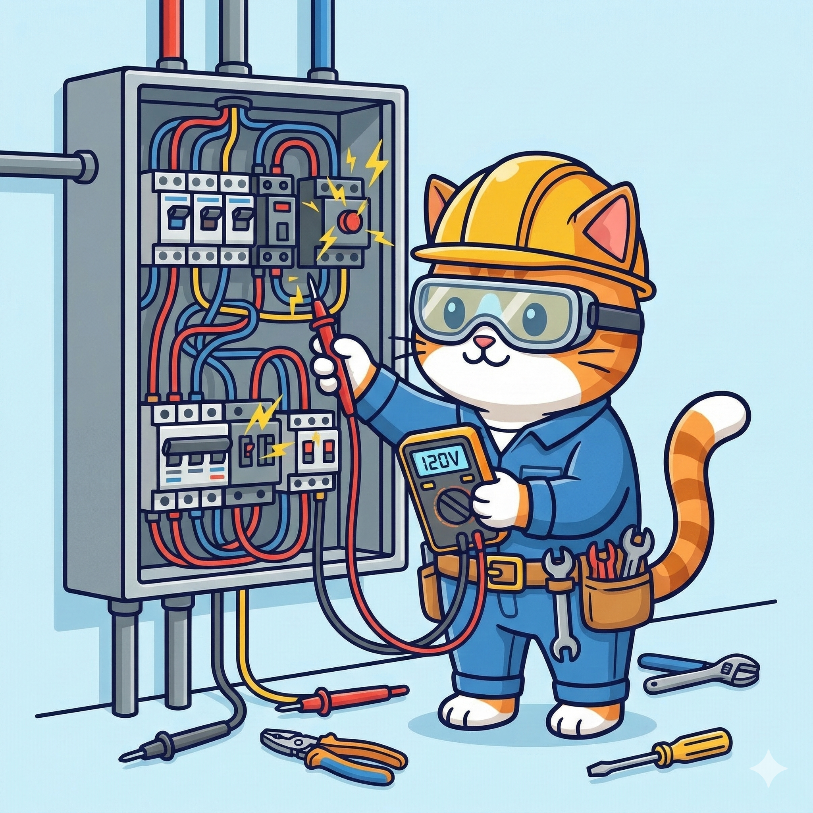

---
# --- INFORMAÇÕES DA AULA ---
title: "Eletricidade Instrumental"
# subtitle: ""
author: "Prof. Alcemy Severino"
license: "CC BY-NC"
copyright: "© 2026 Alcemy Gabriel"
institute: "IFRN"
lang: pt-br

# --- CONFIGURAÇÃO VISUAL E TÉCNICA ---
format:
  revealjs:
    # Aparência
    theme: [default, ifrn]             # Carrega o CSS padrão + nossa personalização
    footer: "EI"                      # Adiciona a nota de rodapé
    logo: img/ifrn-logo.png            # Certifique-se de ter essa imagem na pasta 'img'
    slide-number: true                 # Numeração de páginas no canto
    center: false                      # false = alinha conteúdo ao topo (melhor para aulas)
    
    # Interatividade (Lousa)
    chalkboard: 
      buttons: false                   # Botões ocultos (Use 'B' para lousa, 'C' para riscar slide)
    
    # Navegação
    preview-links: auto                # Tenta abrir links dentro do slide sem sair da aula
    controls: true                     # Mostra setas de navegação
    controlsLayout: edges              # Setas grandes nas laterais esquerda/direita
    controlsTutorial: true             # Pisca a seta para indicar navegação
    touch: true                        # Melhora o uso em tablets/celulares
    
    # Código (Para suas aulas de Programação)
    code-line-numbers: true            # Permite referenciar linhas de código
    highlight-style: github            # Estilo de cores do código (claro e limpo)
---

## Apresentação da disciplina

:::: {.columns}
::: {.column width="55%"}

> Carga horária: **60H**

> 1INF1M: **Quintas-feiras / 8h50 às 10h20**

> 1INF1V: **Quartas-feiras / 13h00 às 14h30**

> Duração: **40 semanas**

:::
::: {.column width="45%"}

{fig-align="center"}

:::
::::

---

### Ementa

* Estudo sobre a eletricidade como apoio ao exercício profissional do técnico em informática.
* Principais grandezas da eletricidade, como corrente, tensão, energia e potência, bem como conceitos iniciais, como fontes, resistores, capacitores e indutores, e técnicas básicas de análise de circuito em corrente contínua como as Leis de nós e malhas são apresentadas.

---

### Ementa

* Demonstração do uso de instrumentos de medições das grandezas elétricas: voltímetro, amperímetro e ohmímetro.
* Noções básicas de instalações elétricas e cuidados complementam a disciplina.

---

### Objetivos

::: {style="font-size: .9em"}
* Identificar as principais grandezas elétricas, fazendo a devida relação entre as mesmas.
* Identificar circuitos série, paralelo e misto visando à análise de circuitos elétricos.
* Identificar as especificidades de circuitos elétricos em CC e CA.
* Utilizar instrumentos de medição de grandezas elétricas.
* Utilizar regras gerais para operação e manuseio de equipamentos elétricos e eletrônicos.
:::

---

### Bases científico-tecnológicas

1. Introdução.
1. Conceitos iniciais.
1. Fonte de alimentação.
1. Instrumentos de medição.
1. Noções de instalações elétricas prediais.
1. Cuidados gerais e específicos.

---

### Métodos avaliativos

A avaliação se dará de forma contínua durante a disciplina, observando a assiduidade dos alunos em relação às aulas e a resolução de atividades.

{fig-align="center"}

---

## {background-image="img/gato_duvidas.png"}

---

