---
# --- INFORMAÇÕES DA AULA ---
title: "Principais Grandezas Elétricas"
subtitle: "Introdução"
author: "Prof. Alcemy Severino"
license: "CC BY-NC"
copyright: "© 2026 Alcemy Gabriel"
institute: "IFRN"
lang: pt-br

# --- CONFIGURAÇÃO VISUAL E TÉCNICA ---
format:
  revealjs:
    # Aparência
    theme: [default, ifrn]             # Carrega o CSS padrão + nossa personalização
    footer: "Eletricidade Instrumental" # Adiciona a nota de rodapé
    logo: img/ifrn-logo.png            # Certifique-se de ter essa imagem na pasta 'img'
    slide-number: true                 # Numeração de páginas no canto
    center: false                      # false = alinha conteúdo ao topo (melhor para aulas)
    
    # Interatividade (Lousa)
    chalkboard: 
      buttons: false                   # Botões ocultos (Use 'B' para lousa, 'C' para riscar slide)
    
    # Navegação
    preview-links: auto                # Tenta abrir links dentro do slide sem sair da aula
    controls: true                     # Mostra setas de navegação
    controlsLayout: edges              # Setas grandes nas laterais esquerda/direita
    controlsTutorial: true             # Pisca a seta para indicar navegação
    touch: true                        # Melhora o uso em tablets/celulares
    
    # Código (Para suas aulas de Programação)
    code-line-numbers: true            # Permite referenciar linhas de código
    highlight-style: github            # Estilo de cores do código (claro e limpo)
---

## Objetivos da aula

- Entender o que são as grandezas elétricas.
- Diferenciar condutores de isolantes.
- Conhecer os tipos de corrente e tensão.

# O Contexto e a Base Atômica

## Magia ou Ciência?

:::: {.columns}
::: {.column width="70%"}

- Há 200 anos, a eletricidade era vista como magia ou passatempo.
- Exemplo: Atrito entre vidro e pano atraindo papel.
- Hoje é a base de toda a nossa tecnologia e conforto.

:::
::: {.column width="30%"}

<iframe 
  data-autoplay 
  width="270" 
  height="480" 
  data-src="https://www.youtube.com/embed/FZt0ZFT3nUs?start=0&end=5&mute=1&autoplay=1" 
  allow="autoplay" 
  frameborder="0">
</iframe>

:::
::::

---

## Tudo começa no Átomo

:::: {.columns}
::: {.column width="60%"}

- Toda matéria (plástico, madeira, pele) é formada por átomos.
- *Analogia*: O átomo é o "bloco de construção" universal.

:::
::: {.column width="40%"}

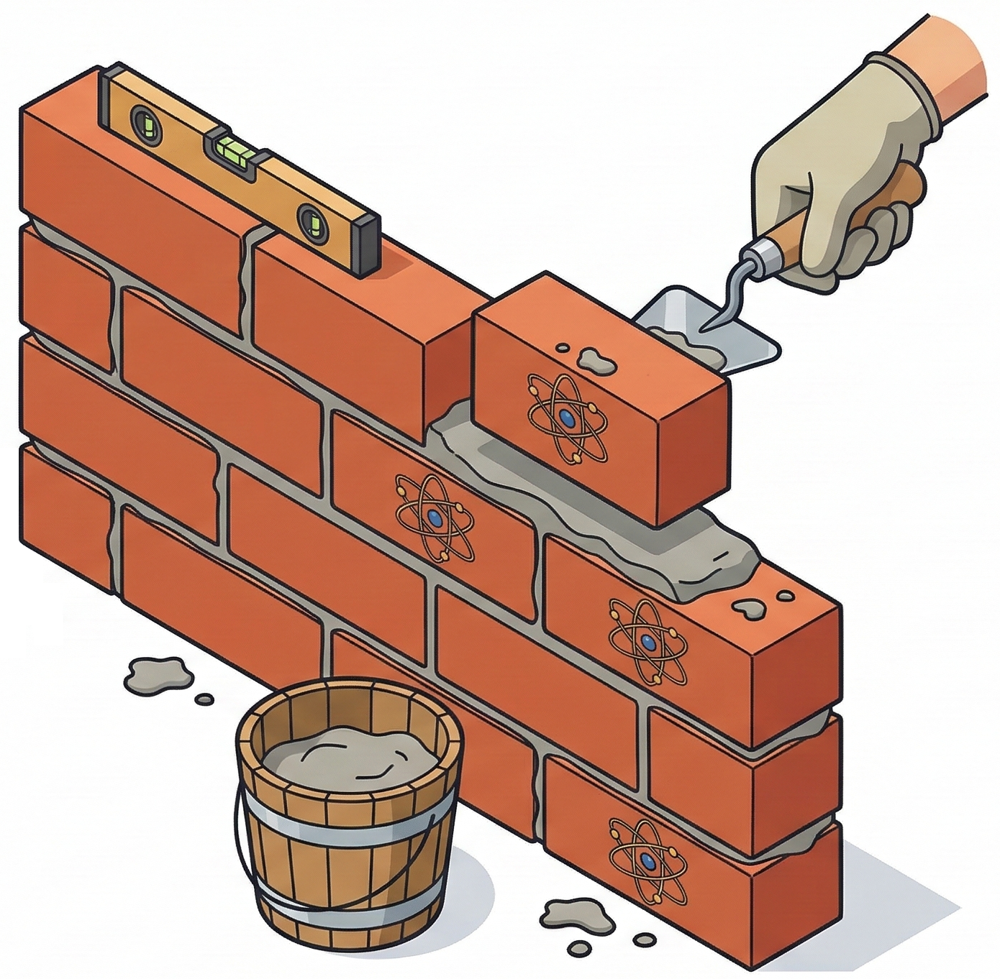

:::
::::

---

## A Anatomia do Átomo

:::: {.columns}
::: {.column width="50%"}

- **Núcleo**: Prótons (Carga $+$) e Nêutrons (Carga Neutra).
- **Eletrosfera**: Elétrons (Carga $-$) orbitando em movimento.

:::
::: {.column width="50%"}

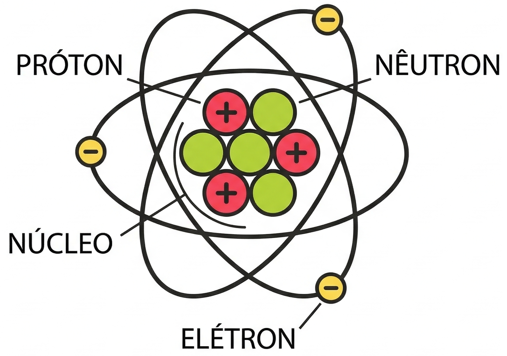

:::
::::

---

## O Protagonista: O Elétron Livre

:::: {.columns}
::: {.column width="50%"}

- Em alguns materiais, os elétrons da camada externa "fogem" facilmente.
- Esses elétrons livres são os responsáveis pela eletricidade que usamos.

:::
::: {.column width="50%"}

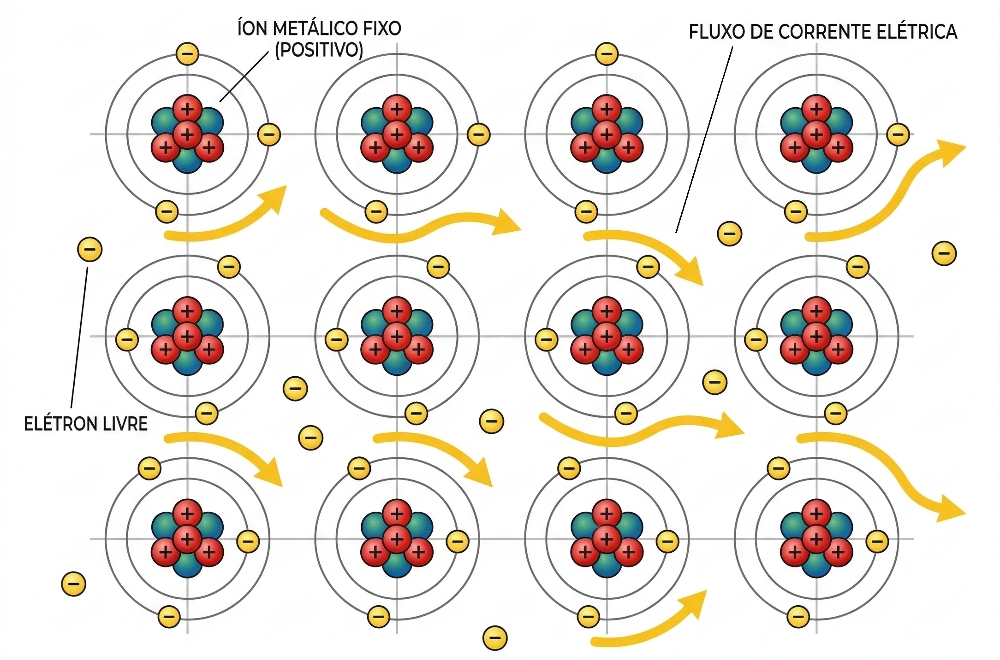

:::
::::

# As Grandezas Fundamentais

## Principais grandezas elétricas

* As principais grandezas elétricas são:
    * a **corrente**,
    * a **tensão**,
    * a **resistência**
    * e a **potência**.
* Essas grandezas estão presentes em qualquer circuito elétrico e são *interdependentes* — ou seja, a alteração em uma delas afeta diretamente as outras.

---

## O que é a Corrente Elétrica?

- **Definição**: A corrente elétrica é a movimentação de cargas ordenadas num condutor.
- *Analogia*: Uma multidão (elétrons) correndo organizada em um corredor (fio).

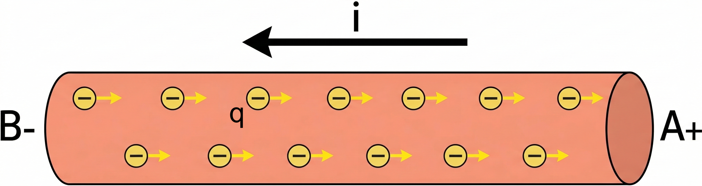

---

## Tipos de Corrente

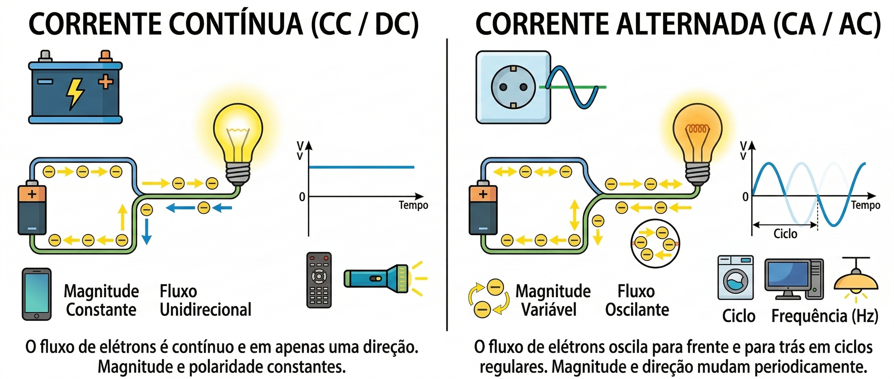

---

## Carga Elétrica ($Q$)

- Quantidade de eletricidade de um corpo.
    - Excesso de elétrons, carga negativa.
    - Mais prótons que elétrons, carga positiva.
- Unidade: Coulomb ($C$).
- Cargas iguais se repelem, cargas opostas se atraem.

---

## Medindo a Intensidade da Corrente

- Quantidade de carga que passa no fio por segundo.
- Fórmula: $I = \frac{\Delta Q}{\Delta t}$.
- Unidade: Ampère ($A$).
- Representada pela letra 
    - $I$, em maiúsculo, para sinais contínuos
    - e $i$, em minúsculo, para sinais alternados.

---

## Medindo a Intensidade da Corrente

:::: {.columns}
::: {.column width="50%"}

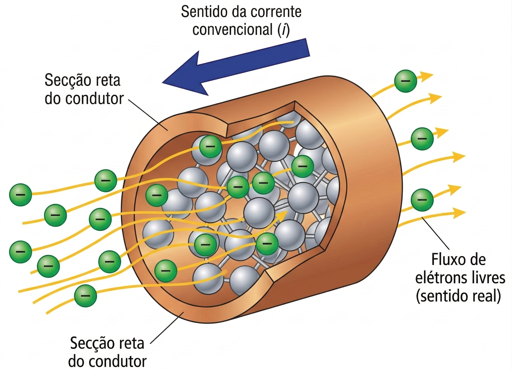

:::
::: {.column width="50%"}

$$
\begin{align}
1A &= \dfrac{6.2\times {10}^{18} \text{elétrons}}{1s} \\
&= \dfrac{1C}{1s} \\
I &= \dfrac{\Delta Q}{\Delta t}
\end{align}
$$

:::
::::

---

## Tensão Elétrica

- É a "força" que empurra os elétrons.
- Sem diferença de potencial (ddp), os elétrons não se movem de forma ordenada.
- Unidade: Volt (V).
- Representada pela letra 
    - $V$, em maiúsculo, para sinais contínuos
    - e $v$, em minúsculo, para sinais alternados.

---

## Resistência Elétrica ($R$)

- Oposição à passagem da corrente.
- Ocorre devido aos choques dos elétrons com os núcleos dos átomos.
- Unidade: Ohm ($\Omega$).

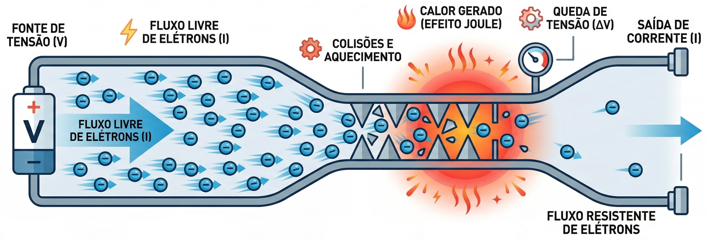{fig-align="center"}

---

## 1ª Lei de Ohm

:::: {.columns}
::: {.column width="65%"}

- A resistência é a relação entre a "força" aplicada e o "fluxo" obtido.
- Fórmula: $R = \frac{V}{I}$.

:::
::: {.column width="35%"}

](https://upload.wikimedia.org/wikipedia/commons/e/e6/Georg_Simon_Ohm_%281789-1854%29.jpg)

:::
::::

---

## 2ª Lei de Ohm

- A resistência depende do material, do comprimento e da espessura do fio.
- Fórmula: $R = \rho \times \frac{l}{A}$.

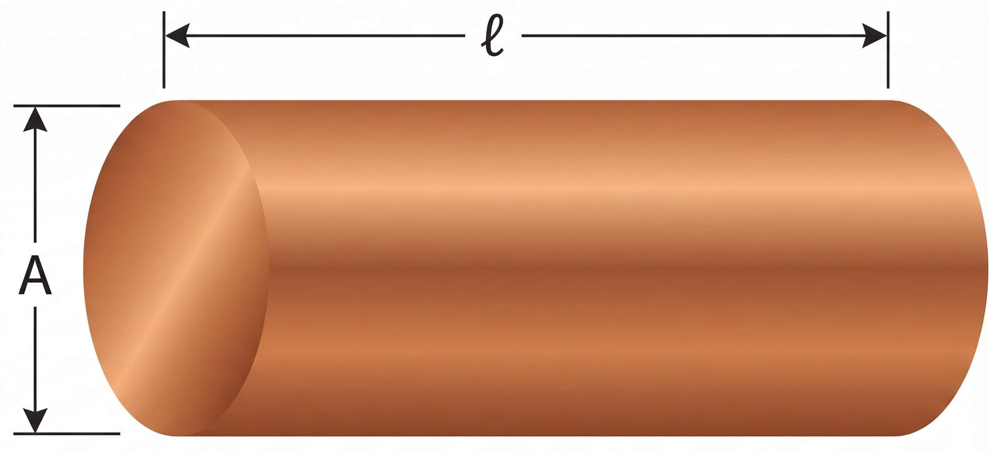{fig-align="center"}

---

## Efeito Joule

- Quando elétrons enfrentam resistência, geram calor.

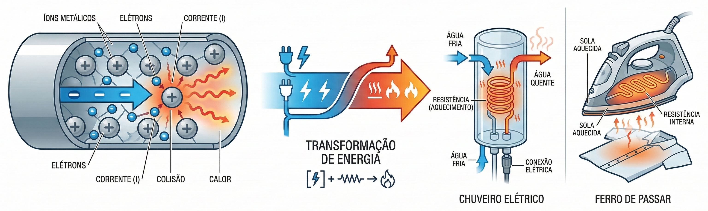{fig-align="center"}

---

## Potência Elétrica ($P$)

- Rapidez com que a energia elétrica é transformada (em luz, calor ou movimento).
- Unidade: Watt ($W$); Fórmula: $P = V \times I$.

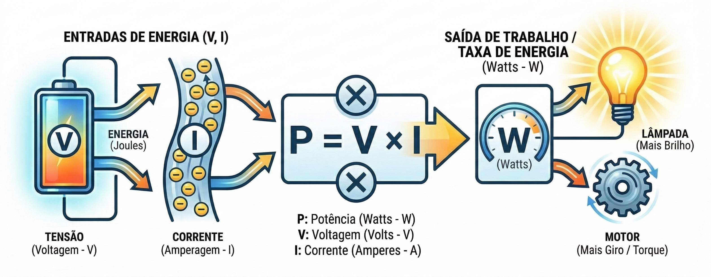{fig-align="center"}

---

## Energia Elétrica ($E$ ou $\tau$)

:::: {.columns}
::: {.column width="45%"}

- É o que a concessionária cobra no final do mês.
- Calculada pela potência multiplicada pelo tempo de uso.
- Unidade comercial: kWh.

:::
::: {.column width="55%"}

](img/a01_nova-fatura.jpg)

:::
::::

---

## Analogia da Caixa d'Água

:::: {.columns}
::: {.column width="50%"}

- Tensão ($U$): A altura da caixa d'água (pressão).
- Corrente ($i$): O fluxo de água saindo pelo cano.
- Resistência ($R$): O diâmetro do cano (dificuldade).
- Potência ($P$): O trabalho realizado.

:::
::: {.column width="50%"}

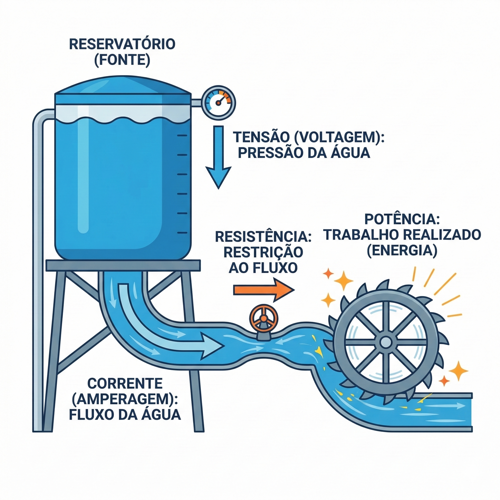

:::
::::

---

## Tabela Resumo de Grandezas

| Grandeza | Símbolo | Unidade | Abreviatura |
| :--- | :---: | :--- | :---: |
| Tensão | $v$ ou $V$ | Volt | $V$ |
| Corrente | $i$ ou $I$ | Ampère | $A$ |
| Resistência | $R$ | Ohm | $\Omega$ |
| Potência | $P$ | Watt | $W$ |
| Energia | $E$ | Quilowatt-hora | $kWh$ |

---

## {background-image="img/fry_1.png"}

---

