---
# --- INFORMAÇÕES DA AULA ---
title: "Classificação dos materiais quanto à condução de corrente elétrica"
subtitle: "Introdução"
author: "Prof. Alcemy Severino"
license: "CC BY-NC"
copyright: "© 2026 Alcemy Gabriel"
institute: "IFRN"
lang: pt-br

# --- CONFIGURAÇÃO VISUAL E TÉCNICA ---
format:
  revealjs:
    # Aparência
    theme: [default, ifrn]             # Carrega o CSS padrão + nossa personalização
    footer: "Eletricidade Instrumental" # Adiciona a nota de rodapé
    logo: img/ifrn-logo.png            # Certifique-se de ter essa imagem na pasta 'img'
    slide-number: true                 # Numeração de páginas no canto
    center: false                      # false = alinha conteúdo ao topo (melhor para aulas)
    
    # Interatividade (Lousa)
    chalkboard: 
      buttons: false                   # Botões ocultos (Use 'B' para lousa, 'C' para riscar slide)
    
    # Navegação
    preview-links: auto                # Tenta abrir links dentro do slide sem sair da aula
    controls: true                     # Mostra setas de navegação
    controlsLayout: edges              # Setas grandes nas laterais esquerda/direita
    controlsTutorial: true             # Pisca a seta para indicar navegação
    touch: true                        # Melhora o uso em tablets/celulares
    
    # Código (Para suas aulas de Programação)
    code-line-numbers: true            # Permite referenciar linhas de código
    highlight-style: github            # Estilo de cores do código (claro e limpo)
---

## Objetivos da aula

- Entender o arranjo molecular e a condução.
- Diferenciar condutores, isolantes (dielétricos) e semicondutores.
- Identificar componentes de controle (resistores) e carga.

# O Mundo Microscópico e a Condução

## Arranjos Moleculares

- A facilidade com que a eletricidade passa depende do estado da matéria:
  - **Sólidos**: Átomos compactos; alguns permitem o "salto" de elétrons.
  - **Líquidos**: Podem conduzir se houver íons (como água salgada).
  - **Gases**: Geralmente isolantes devido à distância entre átomos, a menos que ionizados.

---

## Arranjos Moleculares

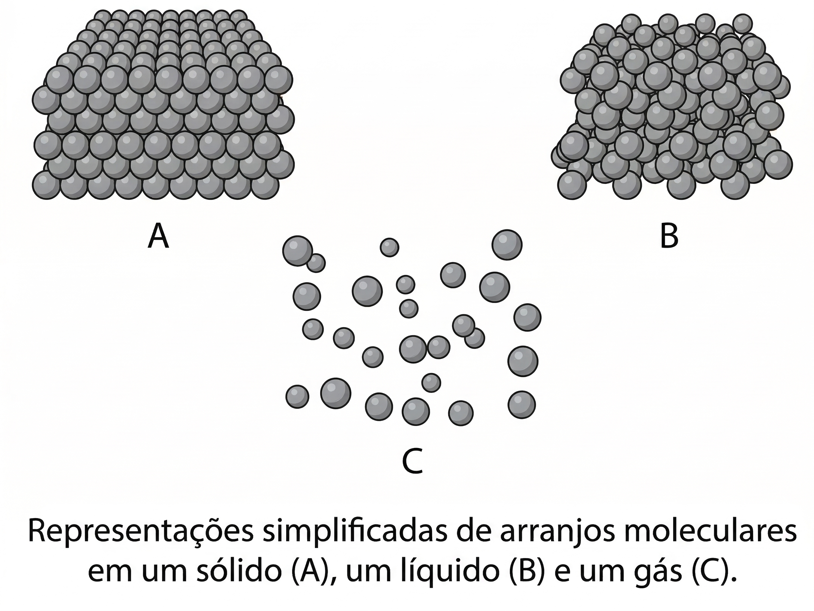{fig-align="center"}

---

## Condutores: o salto do elétron

- Em um condutor, os elétrons "pulam" de átomo em átomo.
- Esse movimento ocorre do local com carga negativa para o positivo.
- *Destaque*: Prata pura é o melhor condutor à temperatura ambiente.

---

## Condutores: o salto do elétron

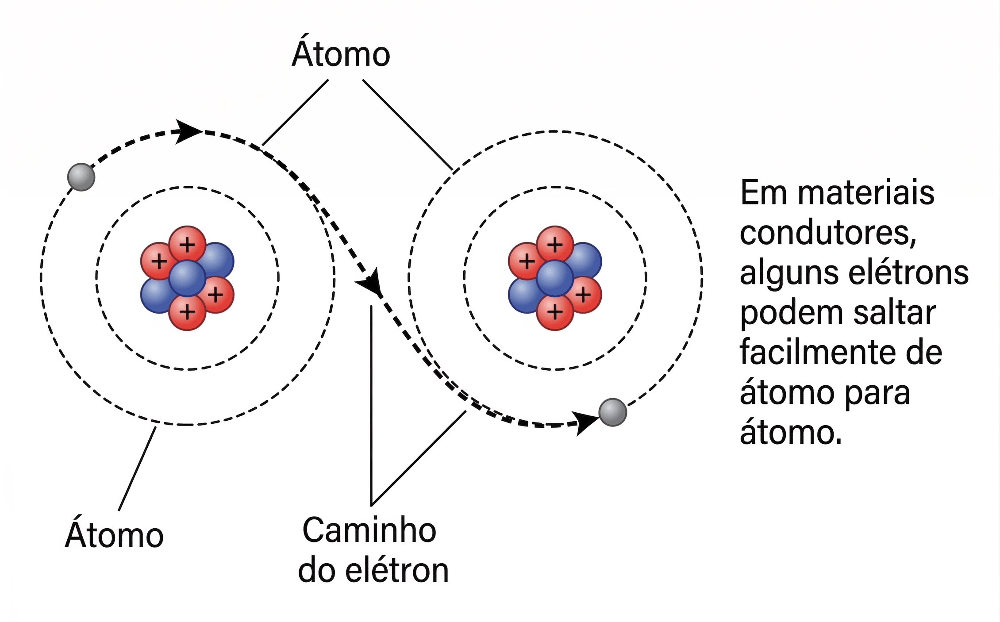{fig-align="center"}

---

## Condutores no Dia a Dia

- Cobre e Alumínio: Os mais comuns em fiações elétricas.
- Mercúrio: Um exemplo de metal líquido que conduz eletricidade.

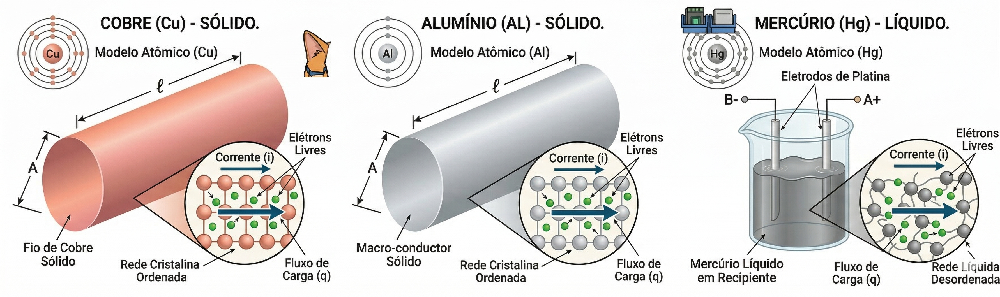{fig-align="center"}

---

## Por que o cobre é o mais usado?

- *Custo-benefício*: embora a prata seja melhor condutora, seu preço inviabiliza aplicações em larga escala.
- *Durabilidade*: o cobre resiste bem à oxidação e mantém desempenho estável.
- *Disponibilidade*: é abundante e fácil de extrair/refinar.
- *Segurança*: suporta altas correntes sem aquecer excessivamente.

---

## Aplicações práticas

- **Prata**: usada em contatos elétricos de alta precisão (relés, conectores especiais).
- **Cobre**: padrão em cabos residenciais, industriais e eletrônicos.
- **Alumínio**: preferido em linhas de transmissão de energia por ser leve e reduzir custos estruturais.
- **Ouro**: empregado em componentes eletrônicos de alta confiabilidade (chips, conectores) devido à resistência à corrosão.

---

## Isolantes

- **Definição**: Material que resiste ao fluxo de elétrons, não permitindo a condução de corrente elétrica.
- *Exemplos*: Borracha, vidro, porcelana, plásticos.
- *Função principal*: Garantir segurança elétrica, evitando choques e curto-circuitos.
- *Origem do nome*: "Isolar" significa separar ou impedir contato — no caso, impedir a passagem da eletricidade.

---

## Dielétricos

- **Definição**: Um isolante que pode ser polarizado quando submetido a um campo elétrico.
- *Propriedade chave*: As cargas internas se deslocam levemente em direções opostas, criando dipolos elétricos.
- *Função principal*: Armazenar energia elétrica em dispositivos como capacitores.

---

## Dielétricos

- *Exemplos*: Ar, papel, mica, cerâmica, óxidos metálicos.
- *Origem do nome*: O termo "dielétrico" vem do grego *dia* (através) + *eléktron* (âmbar, relacionado à eletricidade), indicando que o campo elétrico atravessa o material sem que haja condução de corrente.

---

## Por que diferenciar?

- Todo dielétrico é um isolante, mas nem todo isolante é um dielétrico.
- A diferença está na capacidade de polarização: isolantes comuns apenas bloqueiam corrente, enquanto dielétricos também interagem com o campo elétrico.
- Essa distinção é crucial em eletrônica e engenharia elétrica, especialmente no projeto de capacitores e sistemas de alta tensão.

---

## Isolantes/Dielétricos

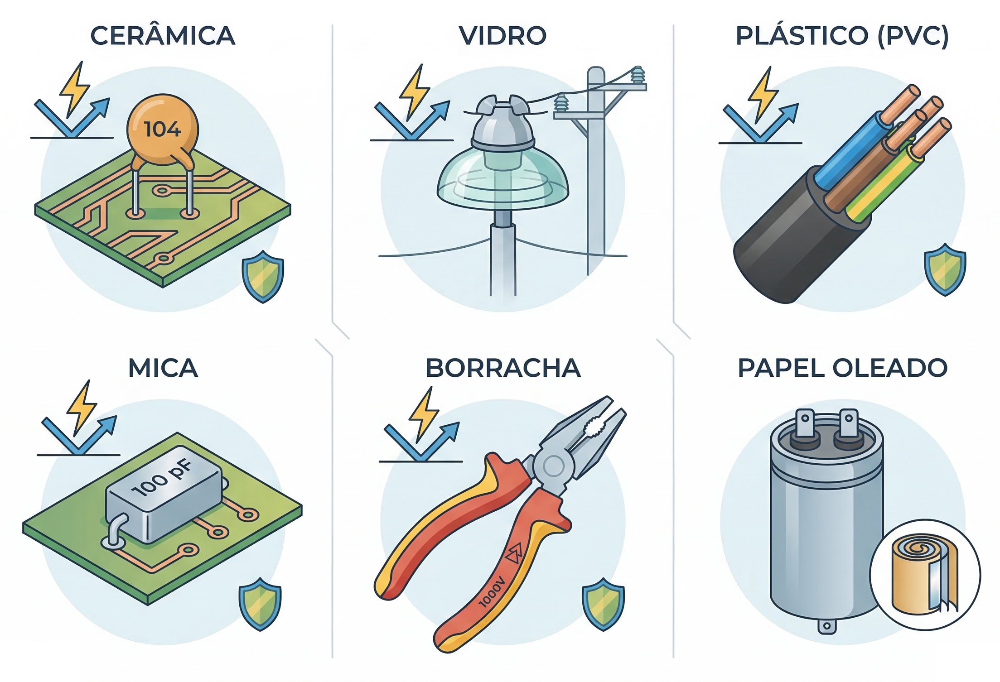{fig-align="center"}

---

## Falha do Isolante

- Se a força elétrica for extrema, qualquer isolante pode falhar.
- O material pode carbonizar, derreter ou ser perfurado por uma centelha.
- Quando isso ocorre, ele perde sua propriedade e deixa a corrente passar.

---

## Falha do Isolante

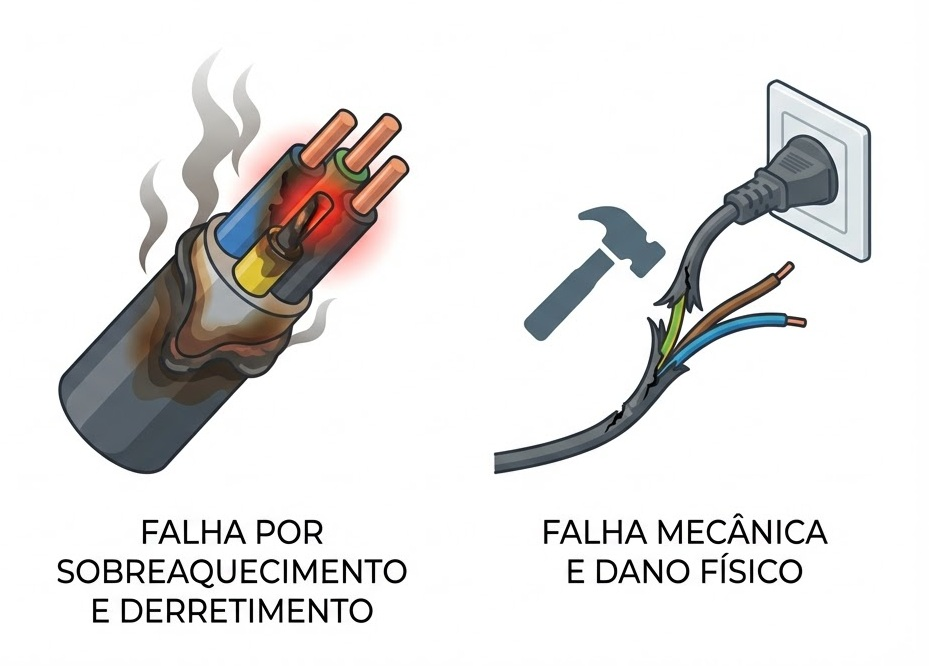{fig-align="center"}

---

## Onde Vemos Isolantes?

:::: {.columns}
::: {.column width="50%"}

- Nas linhas de transmissão de alta voltagem (porcelana ou vidro).
- Evitam curto-circuitos com torres de metal ou postes de madeira úmidos.

:::
::: {.column width="50%"}

:::
::::

# Semicondutores: o cérebro da Informática

## Semicondutores

- Conduzem facilmente sob certas condições e com dificuldade em outras.
- São quimicamente "dopados" (adição de impurezas como índio ou antimônio) para controlar sua condutividade.

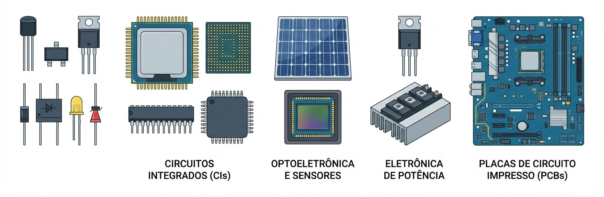{fig-align="center"}

---

## O Conceito de Lacuna

- Além do movimento de elétrons, falamos do movimento de lacunas.
- **Lacuna**: É a falta de um elétron onde ele deveria estar.
- Elas viajam no sentido oposto ao dos elétrons.

---

## Materiais Tipo-N e Tipo-P

- **Tipo-N**: Elétrons são a maioria das cargas.
- **Tipo-P**: Lacunas são as cargas majoritárias.
- *Exemplos*: Silício, Selênio e Arsenieto de Gálio.

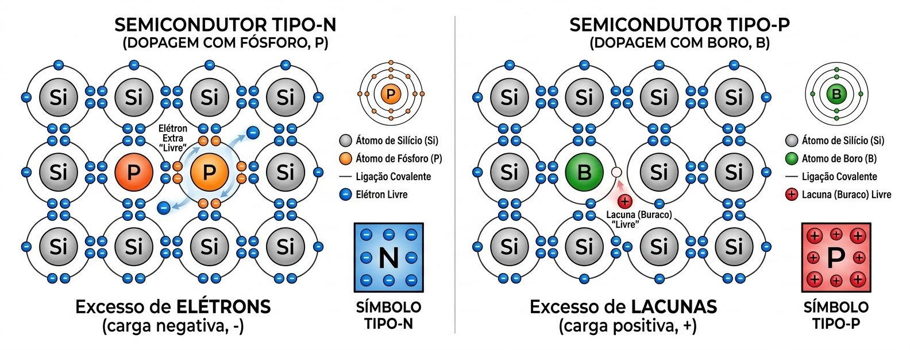{fig-align="center"}

# Controle e Cargas

## Resistores: Controlando o Fluxo

- Componentes fabricados com o intuito específico de limitar a corrente.
- Feitos de materiais como pasta de carbono e argila.
- *Regra*: Quanto maior a condutividade, menor a resistência (e vice-versa).

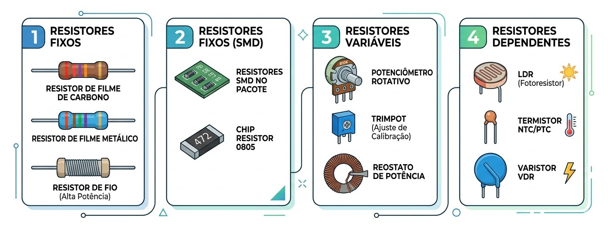{fig-align="center"}

---

## Fontes e Geradores

- Transformam outras formas de energia (química, mecânica) em energia elétrica.
- Fornecem a "pressão" para o movimento das cargas.

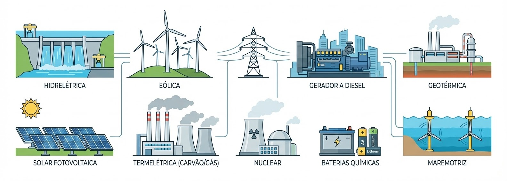{fig-align="center"}

---

## Cargas Térmicas: aquecedores

- Transformam eletricidade em calor por meio da resistência.
- Exemplos: Chuveiros e aquecedores de utilidade (que puxam de 10A a 12A).

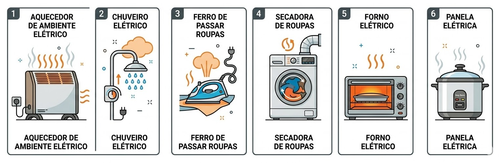{fig-align="center"}

---

## Cargas Mecânicas: motores

- Transformam eletricidade em movimento por campos magnéticos.
- Exemplos: Ventiladores e motores de indução.

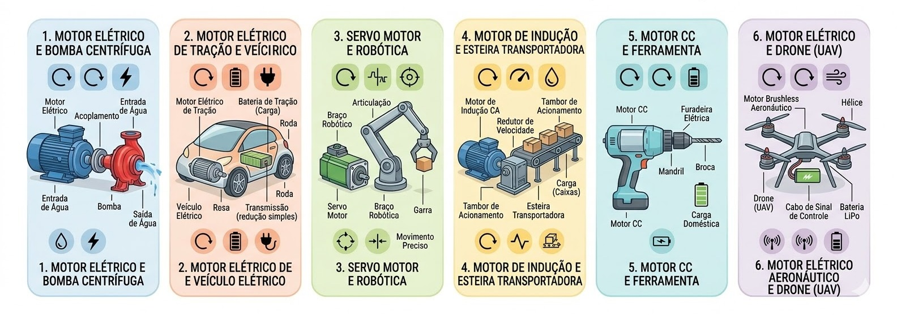{fig-align="center"}

---

## Cargas Luminosas: lâmpadas

- Transformam eletricidade em luz.
- Uma lâmpada de 60W consome cerca de 0,5A de corrente.

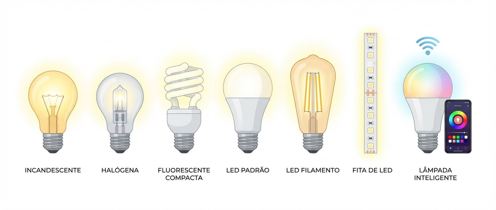{fig-align="center"}

---

## Tabela Resumo Final

| Material | Exemplo | Papel no Circuito |
| :--- | :--- | :--- |
| Condutor | Cobre, Prata | Caminho livre para cargas. |
| Isolante | Vidro, Plástico | Proteção e separação. |
| Semicondutor | Silício | Controle inteligente (Chave). |
| Resistor | Carbono | Limita a corrente. |

---

## {background-image="img/fry_1.png"}

---



<!--# Materiais e Movimento

## Condutores: A "Autoestrada" dos Elétrons 

- Materiais que possuem muitos elétrons livres.
- Exemplos: Metais como cobre, alumínio e ouro.

---

## Isolantes: A "Barreira"
- Materiais com ligações fortes que não permitem elétrons livres.
- Exemplos: Borracha, vidro e plástico.
- Função: Segurança e proteção contra choques.

---

## Semicondutores: O Coração da Informática
- Materiais que podem se comportar como condutores ou isolantes sob certas condições.
- Exemplo: Silício e Germânio (bases dos chips de computador).--->