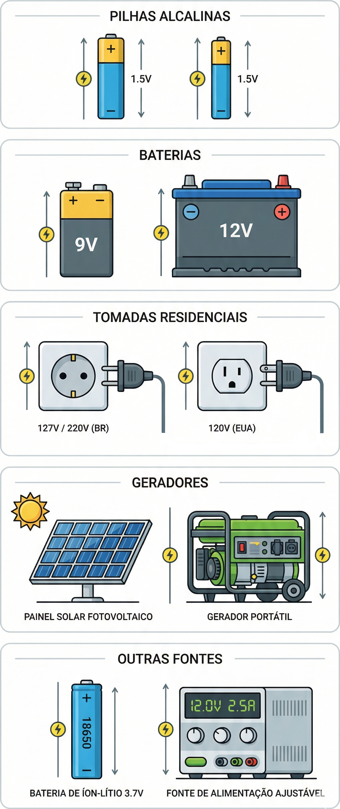
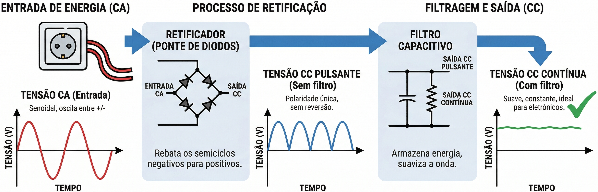
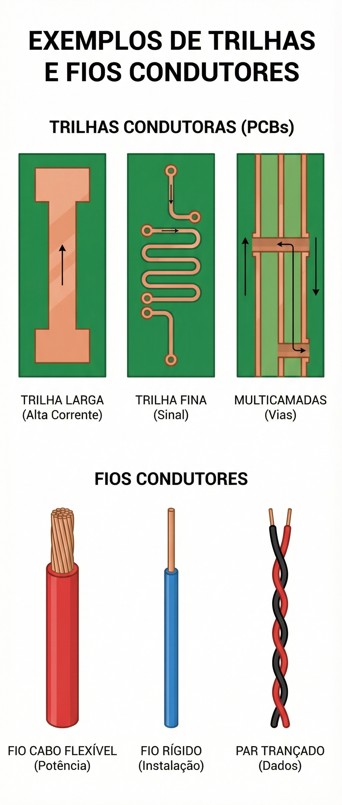

---
# --- INFORMAÇÕES DA AULA ---
title: "Principais componentes elétricos e suas grandezas associadas"
subtitle: "Conceitos iniciais"
author: "Prof. Alcemy Severino"
license: "CC BY-NC"
copyright: "© 2026 Alcemy Gabriel"
institute: "IFRN"
lang: pt-br

# --- CONFIGURAÇÃO VISUAL E TÉCNICA ---
format:
  revealjs:
    # Aparência
    theme: [default, ifrn]             # Carrega o CSS padrão + nossa personalização
    footer: "Eletricidade Instrumental" # Adiciona a nota de rodapé
    logo: img/ifrn-logo.png            # Certifique-se de ter essa imagem na pasta 'img'
    slide-number: true                 # Numeração de páginas no canto
    center: false                      # false = alinha conteúdo ao topo (melhor para aulas)
    
    # Interatividade (Lousa)
    chalkboard: 
      buttons: false                   # Botões ocultos (Use 'B' para lousa, 'C' para riscar slide)
    lightbox: true                     # Permite ampliar imagens para detalhes (útil para diagramas)
    
    # Navegação
    preview-links: auto                # Tenta abrir links dentro do slide sem sair da aula
    controls: true                     # Mostra setas de navegação
    controlsLayout: edges              # Setas grandes nas laterais esquerda/direita
    controlsTutorial: true             # Pisca a seta para indicar navegação
    touch: true                        # Melhora o uso em tablets/celulares
    
    # Código (Para suas aulas de Programação)
    code-line-numbers: true            # Permite referenciar linhas de código
    highlight-style: github            # Estilo de cores do código (claro e limpo)
---

## Objetivos da aula

* Relacionar os componentes físicos dos circuitos às suas grandezas elétricas.
* Compreender as unidades de medida padrão e seus múltiplos.
* Diferenciar conceitos cruciais.

---

## Fontes e Geradores {background-image="img/fontes_eletricidade.png" background-size="cover" background-opacity="0.2"}

Para que os elétrons se movam, precisamos de uma força motriz. As fontes e geradores criam uma diferença de potencial (ddp) entre dois pontos, conhecidos como polos.

* O polo positivo possui menos elétrons que o polo negativo.
* Isso cria um "dipolo elétrico" e um campo de força invisível.

---

### A Grandeza: Tensão Elétrica

:::: {.columns}
::: {.column width="77%"}

* **Unidade de medida:** Volt ($V$).
* É a "pressão" que impulsiona os portadores de carga.
* Exemplos do dia a dia:
    * Pilhas comuns: 1,2 $V$ a 1,7 $V$.
    * Baterias de carro: 12 $V$ a 14 $V$.
    * Tomadas residenciais: 117 $V$ ou 234 $V$ (aprox. 110/220$V$).

:::
::: {.column width="23%"}

:::
::::

---

### Corrente Contínua

Nas pilhas e baterias, a tensão é constante ao longo do tempo.

* A corrente flui sempre na mesma direção.
* O gráfico da tensão por tempo é uma linha reta horizontal.

---

### Corrente Alternada

Nas tomadas das nossas casas, a corrente reverte sua direção em intervalos regulares.

* **Grandeza associada:** Frequência.
* **Unidade de medida:** Hertz ($Hz$), que representa um ciclo completo por segundo.
* No Brasil e nos EUA, o padrão é 60 $Hz$.

---

### Atenção à Tensão Alternada!

> Você sabia que a tomada de "220 $V$" na verdade atinge picos maiores?

* O valor de 220 $V$ é a tensão *efetiva*.
* A tensão *de pico* (máxima instantânea) chega perto de 311 $V$.
* A tensão de pico é aproximadamente 1,414 vezes maior que a efetiva.

---

### Diodos e Retificação

* Equipamentos de informática não funcionam com CA puro. Eles precisam converter CA para CC. O processo de transformação se chama **retificação**.
* Utilizamos componentes semicondutores chamados **diodos** para permitir que a corrente flua em apenas um sentido.

{fig-align="center" width="60%"}

---

## Trilhas, Fios e a Corrente Elétrica

:::: {.columns}
::: {.column width="75%"}

Quando interligamos os polos de uma fonte com um material condutor, as cargas começam a fluir para igualar a diferença.

* **Grandeza associada:** Corrente Elétrica.
* **Unidade de medida:** Ampère ($A$).

:::
::: {.column width="25%"}

{fig-align="center"}

:::
::::

---

### O que é 1 Ampère?

É uma quantidade gigantesca de elétrons em movimento!

* 1 Ampère equivale a 1 Coulomb ($C$) de cargas passando por um ponto a cada segundo.
* Isso significa $6,24 \times 10^{18}$ (mais de 6 quintilhões) de elétrons por segundo.
* Uma simples lâmpada de 60W puxa cerca de 0,5 $A$.

---

## Resistores {background-image="img/resistores.png" background-size="cover" background-opacity="0.2"}

A resistência quantifica a oposição que um circuito impõe ao fluxo de corrente. Componentes fabricados para ter uma oposição específica são os resistores.

* **Unidade de medida:** Ohm ($\Omega$).
* Fios longos e finos têm maior resistência que fios curtos e grossos.

---

### A Lei de Ohm na Prática

* Para uma tensão constante, a corrente varia em proporção inversa à resistência.
* Se você reduzir a resistência pela metade, a corrente dobra.

{fig-align="center" width="60%"}

---

### A Condutância

Em vez de falar sobre a "dificuldade" (Resistência), técnicos frequentemente falam sobre a "facilidade" da passagem da corrente.

* **Grandeza associada:** Condutância ($G$).
* **Unidade de medida:** Siemens ($S$).
* A condutância é exatamente o inverso da resistência ($G = 1/R$).

---

## Indutores {background-image="img/indutores.png" background-size="cover" background-opacity="0.2"}

Sempre que uma corrente elétrica flui por um fio, um campo magnético aparece ao seu redor. 

* Se enrolarmos o fio em uma bobina bem apertada, o fluxo magnético cria dois polos bem definidos (Norte e Sul).
* Isso forma um **Eletroímã** ou **Indutor**.

---

### Grandezas Magnéticas

Os indutores são medidos por sua capacidade de gerar e armazenar campos magnéticos.

* O fluxo magnético total é medido em **Webers ($Wb$)**.
* A densidade desse fluxo (intensidade) é medida em **Teslas ($T$)**, onde 1 Tesla equivale a 1 Weber por metro quadrado.

---

### O Núcleo do Indutor

* Para aumentar a intensidade do campo magnético sem mudar a corrente, adicionamos um núcleo ao indutor.
* Materiais como ferro e aço (ferromagnéticos) são ideais para isso.
* É assim que funcionam os grandes transformadores de energia.

---

## Capacitores {background-image="img/capacitores.png" background-size="cover" background-opacity="0.2"}

São componentes que mantêm as cargas elétricas separadas, armazenando energia em um campo elétrico estático (dipolo elétrico).

* **Grandeza associada:** Capacitância.
* **Unidade de medida:** Farad ($F$).
* **Estrutura:** Duas placas condutoras isoladas por um material Dielétrico (isolante).

---

## Cargas e o Consumo de Energia

Qualquer componente que ofereça resistência transforma parte da eletricidade em calor.

* A intensidade desse aquecimento (ou trabalho realizado) é a **Potência**.
* **Unidade de medida:** Watt ($W$).

---

### Calculando a Potência

A potência consumida ($P$) por um componente é o produto da tensão ($V$) pela corrente ($I$).

$$P = V \times I$$

* Exemplo: Uma lâmpada em 220 V puxando 0,4 A.
* $P = 220 \times 0,4 = 88$ Watts.

---

### Potência vs. Energia

Esses termos NÃO são a mesma coisa!

* **Potência:** É a taxa instantânea de gasto em um momento exato.
* **Energia:** É a potência dissipada ao longo de um período de tempo.

---

### Grandezas de Energia

* Físicos medem energia em **Joules ($J$)**.
* Um Joule equivale a um Watt-segundo (1 $W$ dissipado por 1 segundo).
* Na eletricidade prática e informática, usamos o **Watt-hora ($Wh$)** ou o **Quilowatt-hora ($kWh$)**.

---

### O Medidor da Concessionária

* O "relógio de luz" na sua casa é um medidor de energia, e não um medidor de potência.
* Ele soma automaticamente o total de **Quilowatts-hora ($kWh$)** consumidos.
* Uma lâmpada de 60 $W$ deixada ligada por 1 hora consome 60 $Wh$ de energia.

---

### Múltiplos Importantes (Revisão)

Na informática e eletrônica, trabalhamos com valores extremos.

* **Tera ($T$):** 1.000.000.000.000 (Ex: Terabyte - $TB$).
* **Giga ($G$):** 1.000.000.000 (Ex: Gigabyte - $GB$).
* **Mega ($M$):** 1.000.000 (Ex: Megahertz - $MHz$).
* **Kilo ($k$):** 1.000 (Ex: Kilovolt - $kV$).
* **Mili ($m$):** 0,001 (Ex: Miliampère - $mA$).
* **Micro ($\mu$):** 0,000.001 (Ex: Microfarad - $\mu F$).
* **Nano ($n$):** 0,000.000.001 (Ex: Nanosegundo - $ns$).

---

### Aviso de Segurança!

* Tensão suficiente para gerar apenas 50 $mA$ pode causar choques severos.
* 100 $mA$ circulando pelo coração pode ser letal.
* A rede de 110 $V$ ou 220 $V$ das nossas casas é mais que suficiente para ser fatal se a corrente passar pela cavidade torácica.

---

### Regra de Ouro da Profissão

* Se houver dúvida se um circuito é seguro para manipular, presuma que **não é**.
* Solicite ajuda de um eletricista profissional.

---

## Resumo das Principais Grandezas

:::{style="font-size: 0.9em"}

| Componente | Grandeza | Unidade |
| :--- | :--- | :--- |
| **Fonte** | Tensão (ddp) | Volt ($V$) |
| **Fio/Trilha** | Corrente | Ampère ($A$) |
| **Resistor** | Resistência / Condutância | Ohm ($\Omega$) / Siemens ($S$) |
| **Capacitor**| Capacitância | Farad ($F$) |
| **Indutor** | Fluxo Magnético | Weber ($Wb$) / Tesla ($T$) |
| **Carga** | Potência / Energia | Watt ($W$) / Watt-hora ($Wh$) |

:::

---

### Desafio Final

* Um computador fica ligado 10 horas por dia, e sua fonte consome em média 300 $W$ (Potência) de forma constante. 
* Qual será a **Energia** total consumida por esse computador ao final de 30 dias (em $kWh$)?

---

### Resolução do Desafio

1. Potência diária: 300 $W$ $\times$ 10 horas = 3000 $Wh$/dia
2. Potência mensal: 3000 $Wh$ $\times$ 30 dias = 90.000 $Wh$
3. Convertendo para $kWh$ (dividindo por 1000): **90 $kWh$**.

---

## {background-image="img/fry_1.png"}

---

