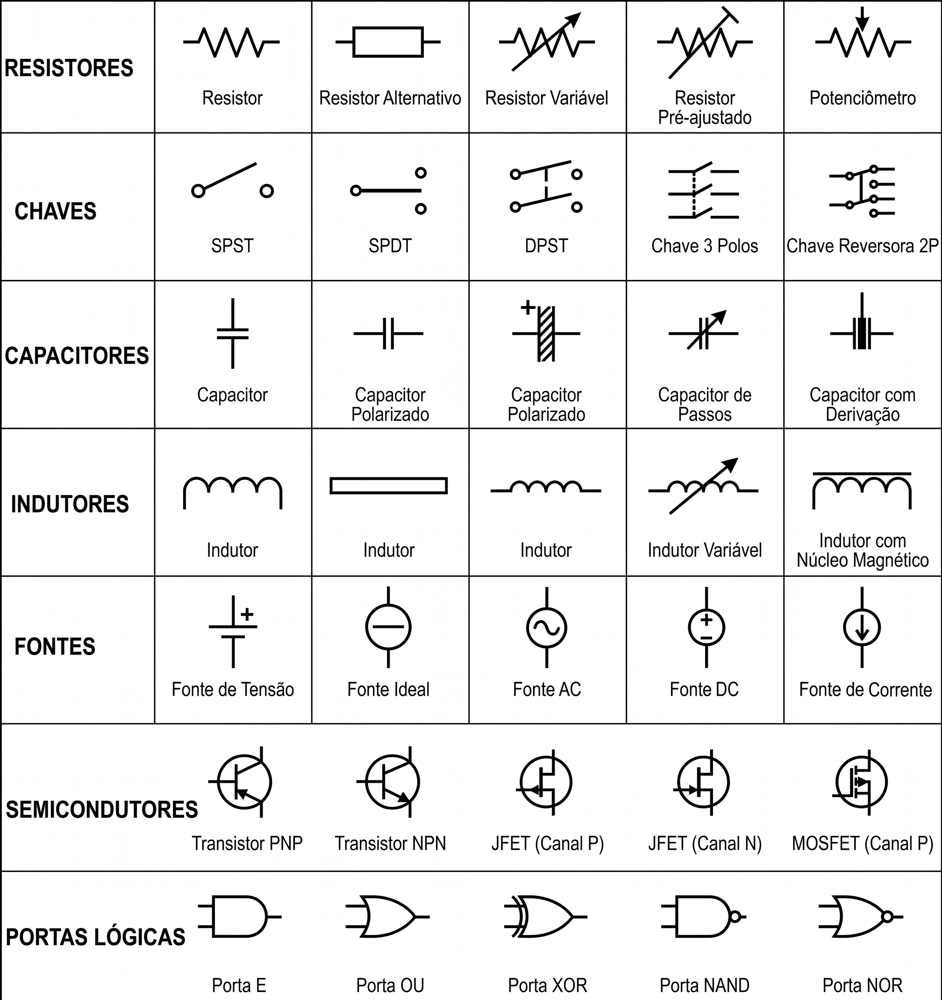

---
# --- INFORMAÇÕES DA AULA ---
title: "Nós, Ramos e Malhas"
subtitle: "Conceitos iniciais"
author: "Prof. Alcemy Severino"
license: "CC BY-NC"
copyright: "© 2026 Alcemy Gabriel"
institute: "IFRN"
lang: pt-br

# --- CONFIGURAÇÃO VISUAL E TÉCNICA ---
format:
  revealjs:
    # Aparência
    theme: [default, ifrn]             # Carrega o CSS padrão + nossa personalização
    footer: "Eletricidade Instrumental" # Adiciona a nota de rodapé
    logo: img/ifrn-logo.png            # Certifique-se de ter essa imagem na pasta 'img'
    slide-number: true                 # Numeração de páginas no canto
    center: false                      # false = alinha conteúdo ao topo (melhor para aulas)
    
    # Interatividade (Lousa)
    chalkboard: 
      buttons: false                   # Botões ocultos (Use 'B' para lousa, 'C' para riscar slide)
    lightbox: true                     # Permite ampliar imagens para detalhes (útil para diagramas)
    
    # Navegação
    preview-links: auto                # Tenta abrir links dentro do slide sem sair da aula
    controls: true                     # Mostra setas de navegação
    controlsLayout: edges              # Setas grandes nas laterais esquerda/direita
    controlsTutorial: true             # Pisca a seta para indicar navegação
    touch: true                        # Melhora o uso em tablets/celulares
    
    # Código (Para suas aulas de Programação)
    code-line-numbers: true            # Permite referenciar linhas de código
    highlight-style: github            # Estilo de cores do código (claro e limpo)
---

## Objetivos da Aula

* Compreender as limitações da Lei de Ohm básica na análise de circuitos complexos.
* Definir e identificar corretamente os três elementos topológicos de um circuito: **Ramos**, **Nós** e **Malhas**.
* Relacionar a estrutura física do circuito (cruzamentos e caminhos) com o fluxo da corrente elétrica.
* Construir a base teórica e visual necessária para a aplicação das Leis de Kirchhoff nas próximas aulas.

---

## O Limite da Lei de Ohm

Até agora, estudamos circuitos simples usando a Lei de Ohm:

$$V = R \times I$$

* Funciona perfeitamente para um circuito com **uma fonte** e **um resistor**.

---

* Mas o que acontece quando abrimos um computador e olhamos a placa-mãe?

{fig-align="center" width="45%"}

* Encontramos dezenas de componentes interligados de formas complexas!

---

## O Desafio dos Circuitos Reais

* A Lei de Ohm pura não é suficiente para resolver circuitos com múltiplos caminhos e várias fontes de energia.
* Para entender o caos, precisamos de um **mapa**.
* Hoje, vamos aprender a ler a "anatomia" de um circuito elétrico.

---

## A Anatomia do Circuito

Para analisar qualquer circuito, por mais complexo que seja, precisamos dividi-lo em três partes fundamentais:

1. **Ramos**
2. **Nós**
3. **Malhas**

Entender esses três conceitos é o passaporte para desvendar qualquer esquema elétrico.

---

## 1. O Ramo (Branch)

Um **Ramo** representa um único caminho de fluxo para os elétrons.

* É qualquer trecho do circuito que contém pelo menos um elemento (fonte, resistor, capacitor, etc.).
* **Regra de ouro:** A corrente elétrica é **a mesma** em todos os pontos de um único ramo.
* **Analogia:** Pense no ramo como uma rua de mão única sem nenhum desvio.

---

## 2. O Nó (Node)
Um **Nó** é o ponto de conexão entre dois ou mais ramos.

* É onde a fiação se encontra.
* **Nó Simples:** Une apenas dois ramos (a corrente não se divide, apenas segue).
* **Nó Principal:** Une três ou mais ramos (aqui, a corrente elétrica obrigatoriamente se divide ou se soma).
* **Analogia:** O nó é um **cruzamento** de ruas.

---

## Atenção aos Fios "Vazios"

Muitas vezes, em diagramas elétricos, um fio longo une vários componentes sem nenhum resistor no meio.

* Eletricamente, **todo fio sem resistência é considerado o mesmo nó**, não importa o quão longo ele seja desenhado.
* Se não há queda de tensão (sem resistor/carga), ainda estamos no mesmo "ponto" elétrico.

---

## 3. A Malha (Loop)

Uma **Malha** é qualquer caminho fechado em um circuito.

* Se você "caminhar" pelos ramos, passando pelos nós, e conseguir voltar ao ponto de partida sem passar duas vezes pelo mesmo nó, você traçou uma malha.
* **Analogia:** É como dar uma volta no quarteirão e parar exatamente onde começou.

---

## Malhas Independentes (Janelas)

* Em circuitos complexos, podemos ter várias malhas se sobrepondo.
* Para os cálculos que faremos nas próximas aulas, focaremos nas **Malhas Independentes**.
* Uma malha independente é aquela que se parece com o "vidro de uma janela" — não contém nenhuma outra malha dentro dela.

---

## Resumo Analógico

Para nunca mais esquecer:

| Termo Elétrico | O que é? | Analogia de Trânsito |
| :--- | :--- | :--- |
| **Componente** | Peça do circuito | Um carro |
| **Ramo** | Caminho com componentes | Uma rua (quarteirão) |
| **Nó** | Ponto de conexão | Um cruzamento |
| **Malha** | Caminho fechado | Uma volta no quarteirão |

---

## Por que isso é importante?

* Identificar os **Nós** nos permitirá entender como a corrente se divide (Lei dos Nós - próxima aula).
* Identificar as **Malhas** nos permitirá entender como a tensão se distribui (Lei das Malhas).
* Na informática, a placa-mãe é projetada baseada nesses caminhos fechados e cruzamentos.

---

## Símbolos dos elementos de um circuito

{fig-align="center" width="50%"}

---

## Exercício Prático

Vamos observar o circuito desenhado no quadro.

1. Quantos cruzamentos (Nós principais) você consegue achar?
2. Quantas "ruas" (Ramos) conectam esses nós?
3. Quantos "vidros de janela" (Malhas independentes) formam o circuito?

---

## Próximos Passos

* Agora que sabemos o que é um cruzamento (Nó)...
* O que acontece com os elétrons quando chegam lá? Eles batem de frente? Eles somem?
* Descobriremos isso na nossa próxima aula com a **Primeira Lei de Kirchhoff (Lei dos Nós)**!

---

## {background-image="img/fry_1.png"}

---

