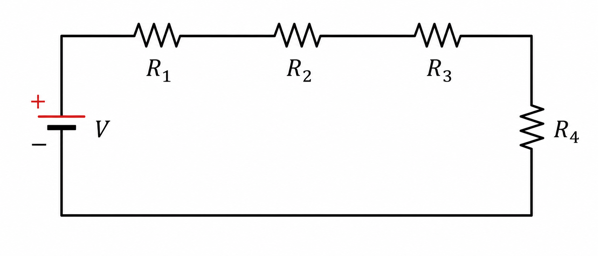
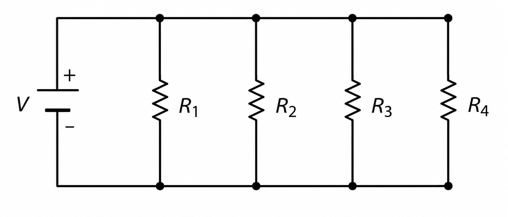
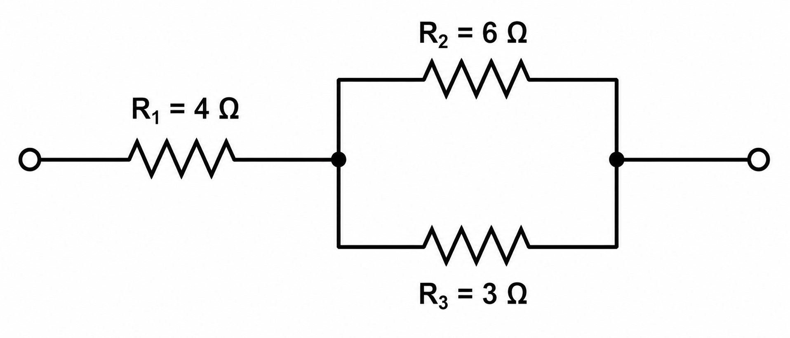

---
# --- INFORMAÇÕES DA AULA ---
title: "Associação de Resistores"
subtitle: "Conceitos iniciais"
author: "Prof. Alcemy Severino"
license: "CC BY-NC"
copyright: "© 2026 Alcemy Gabriel"
institute: "IFRN"
lang: pt-br

# --- CONFIGURAÇÃO VISUAL E TÉCNICA ---
format:
  revealjs:
    # Aparência
    theme: [default, ifrn_2]            # Carrega o CSS padrão + nossa personalização
    footer: "Eletricidade Instrumental" # Adiciona a nota de rodapé
    logo: img/ifrn-logo.png             # Certifique-se de ter essa imagem na pasta 'img'
    slide-number: true                  # Numeração de páginas no canto
    center: false                       # false = alinha conteúdo ao topo (melhor para aulas)
    
    # Interatividade (Lousa)
    chalkboard: 
      buttons: false                   # Botões ocultos (Use 'B' para lousa, 'C' para riscar slide)
    lightbox: true                     # Permite ampliar imagens para detalhes (útil para diagramas)
    
    # Navegação
    preview-links: auto                # Tenta abrir links dentro do slide sem sair da aula
    controls: true                     # Mostra setas de navegação
    controls-layout: edges             # Setas grandes nas laterais esquerda/direita
    controls-tutorial: true            # Pisca a seta para indicar navegação
    touch: true                        # Melhora o uso em tablets/celulares
    
    # Código (Para suas aulas de Programação)
    code-line-numbers: true            # Permite referenciar linhas de código
    highlight-style: github            # Estilo de cores do código (claro e limpo)
---

## Retomando a aula anterior

Na aula 04, vimos que circuitos reais podem parecer complexos porque possuem vários caminhos e conexões.

Para organizar a análise, usamos três ideias:

::: {.grid3}
::: {.box}
**Ramos**

Caminhos por onde a corrente circula.
:::

::: {.box}
**Nós**

Pontos de conexão entre dois ou mais ramos.
:::

::: {.box}
**Malhas**

Caminhos fechados dentro do circuito.
:::
:::

::: notes
Esta aula faz a ponte entre a identificação topológica da aula 04 e o cálculo elétrico. Antes de aplicar Kirchhoff, o aluno precisa dominar Lei de Ohm e simplificação de resistores.
:::

---

## O problema de hoje

Na próxima etapa, queremos chegar em:

::: {.box}
**Análise de circuitos por nós e por malhas.**
:::

Mas antes disso precisamos dominar uma habilidade essencial:

::: {.formula}
**substituir vários resistores por um único resistor equivalente.**
:::

Isso simplifica o circuito e facilita o cálculo de corrente e tensão.

---

## Objetivos da aula

Ao final desta aula, você deverá ser capaz de:

- aplicar a Lei de Ohm em circuitos resistivos simples;
- diferenciar associações em série, paralelo e mista;
- calcular a resistência equivalente de associações de resistores;
- usar a resistência equivalente para calcular corrente e tensão;
- preparar a base para as Leis de Kirchhoff.

---

## As três grandezas fundamentais

::: {.grid3}
::: {.box}
**Tensão elétrica**

Símbolo: $U$ ou $V$  
Unidade: volt $(V)$

É a “força” que impulsiona as cargas elétricas.
:::

::: {.box}
**Corrente elétrica**

Símbolo: $I$  
Unidade: ampere $(A)$

É o fluxo ordenado de cargas elétricas.
:::

::: {.box}
**Resistência elétrica**

Símbolo: $R$  
Unidade: ohm $(\Omega)$

É a oposição à passagem da corrente.
:::
:::

---

## Lei de Ohm

A Lei de Ohm relaciona tensão, corrente e resistência:

::: {.formula}
$$U = R \cdot I$$
:::

---

## Lei de Ohm

A partir dela, podemos reorganizar:

::: {.grid2}
::: {.box}
$$I = \frac{U}{R}$$

Usada quando queremos calcular a corrente.
:::

::: {.box}
$$R = \frac{U}{I}$$

Usada quando queremos calcular a resistência.
:::
:::

::: {.tiny}
Observação: alguns materiais usam $V$ para tensão; nesta aula, usaremos $U$, mantendo a unidade em volts $(V)$.
:::

---

## Ex1 — aplicando a Lei de Ohm

Um resistor de $10\,\Omega$ é percorrido por uma corrente de $2\,A$.

Qual é a tensão aplicada sobre ele?

::: {.formula}
$$U = R \cdot I$$

$$U = 10 \cdot 2 = 20\,V$$
:::

::: {.box}
**Resposta:** a tensão aplicada é de **20 V**.
:::

---

## Ex2 — calculando corrente

Um circuito possui uma fonte de $12\,V$ ligada a um resistor de $6\,\Omega$. Qual corrente circula no circuito?

::: {.formula}
$$I = \frac{U}{R} = \frac{12}{6} = 2\,A$$
:::

::: {.box}
**Resposta:** a corrente é de **2 A**.
:::

---

## O que é associação de resistores?

Quando temos mais de um resistor em um circuito, eles podem estar ligados de diferentes formas.

Mesmo com vários resistores, o conjunto pode ser substituído por uma única resistência:

::: {.formula}
$$R_{eq} = \text{resistência equivalente}$$
:::

::: {.box}
A resistência equivalente representa o efeito elétrico total do conjunto de resistores.
:::

---

## Associação em série

Na associação em série, os resistores estão no mesmo caminho.

{fig-align="center" width="60%"}

::: {.box}
**Regra principal:** a corrente é a mesma em todos os resistores.
:::

---

## Resistência equivalente em série

Em série, somamos todas as resistências:

::: {.formula}
$$R_{eq} = R_1 + R_2 + R_3 + \cdots + R_n$$
:::

::: {.box}
A resistência equivalente sempre será maior que cada resistor individual.
:::

---

## Ex3 — resistores em série

Três resistores estão em série:

$$R_1 = 10\,\Omega \quad R_2 = 20\,\Omega \quad R_3 = 30\,\Omega$$

::: {.formula}
$$R_{eq} = R_1 + R_2 + R_3$$

$$R_{eq} = 10 + 20 + 30 = 60\,\Omega$$
:::

::: {.box}
**Resposta:** $R_{eq} = 60\,\Omega$.
:::

---

## Série: consequência prática

Se ligarmos essa associação a uma fonte de $12\,V$:

::: {.formula}
$$I = \frac{U}{R_{eq}} = \frac{12}{60} = 0{,}2\,A$$
:::

Como a associação é em série:

::: {.box}
A corrente de **0,2 A** passa por $R_1$, $R_2$ e $R_3$.
:::

---

## Associação em paralelo

Na associação em paralelo, os resistores compartilham os mesmos dois nós.

{fig-align="center" width="60%"}

::: {.box}
**Regra principal:** a tensão é a mesma em todos os resistores.
:::

---

## Resistência equivalente em paralelo

Em paralelo, somamos os inversos das resistências:

::: {.formula}
$$\frac{1}{R_{eq}} = \frac{1}{R_1} + \frac{1}{R_2} + \frac{1}{R_3} + \cdots + \frac{1}{R_n}$$
:::

::: {.box}
A resistência equivalente sempre será menor que a menor resistência do conjunto.
:::

---

## Casos particulares do paralelo

::: {.grid2}
::: {.box}
**Dois resistores em paralelo**

$$R_{eq} = \frac{R_1 \cdot R_2}{R_1 + R_2}$$
:::

::: {.box}
**Resistores iguais**

Se há $n$ resistores iguais:

$$R_{eq} = \frac{R}{n}$$
:::
:::

---

## Ex4 — dois resistores em paralelo

Dois resistores estão em paralelo:

$$R_1 = 20\,\Omega \quad R_2 = 30\,\Omega$$

::: {.formula}
$$R_{eq} = \frac{R_1 \cdot R_2}{R_1 + R_2} = \frac{20 \cdot 30}{20 + 30} = \frac{600}{50} = 12\,\Omega$$
:::

::: {.box}
**Resposta:** $R_{eq} = 12\,\Omega$.
:::

---

## Paralelo: consequência prática

Se a associação anterior for ligada a uma fonte de $12\,V$:

::: {.formula}
$$I_T = \frac{U}{R_{eq}} = \frac{12}{12} = 1\,A$$
:::

---

## Paralelo: consequência prática

A tensão em cada resistor é a mesma:

::: {.grid2}
::: {.box}
$$I_1 = \frac{12}{20} = 0{,}6\,A$$
:::

::: {.box}
$$I_2 = \frac{12}{30} = 0{,}4\,A$$
:::
:::

::: {.box}
Observe: $I_T = I_1 + I_2 = 1\,A$.
:::

---

## Série × paralelo

::: {.grid2}
::: {.box}
**Série**

- mesmo caminho;
- mesma corrente;
- tensões se dividem;
- $R_{eq}$ é soma das resistências.
:::

::: {.box}
**Paralelo**

- mesmos dois nós;
- mesma tensão;
- correntes se dividem;
- somamos os inversos das resistências.
:::
:::

---

## Associação mista

A associação mista combina trechos em série e em paralelo.

{fig-align="center" width="70%"}

::: {.box}
Para resolver, simplificamos o circuito por partes.
:::

---

## Estratégia para associação mista

::: {.box}
1. Identifique blocos em série ou paralelo.
2. Calcule a resistência equivalente do bloco mais evidente.
3. Redesenhe mentalmente o circuito simplificado.
4. Repita até restar apenas uma resistência equivalente.
:::

---

## Ex5 — associação mista

No circuito:

- $R_1 = 4\,\Omega$ está em série com o bloco paralelo;
- $R_2 = 6\,\Omega$ está em paralelo com $R_3 = 3\,\Omega$.

{fig-align="center" width="60%"}

---

## Ex5 — associação mista

Primeiro, resolvemos o paralelo:

::: {.formula}
$$R_{23} = \frac{R_2 \cdot R_3}{R_2 + R_3}$$

$$R_{23} = \frac{6 \cdot 3}{6 + 3} = \frac{18}{9} = 2\,\Omega$$
:::

---

## Ex5 — associação mista

Agora o circuito virou uma associação em série:

$$R_1 = 4\,\Omega \quad \text{e} \quad R_{23} = 2\,\Omega$$

::: {.formula}
$$R_{eq} = R_1 + R_{23}$$

$$R_{eq} = 4 + 2 = 6\,\Omega$$
:::

::: {.box}
**Resposta:** a resistência equivalente do circuito é **6 Ω**.
:::

---

## Como saber se é série ou paralelo?

::: {.grid2}
::: {.box}
**Está em série quando:**

Dois resistores estão no mesmo caminho e não há divisão de corrente entre eles.
:::

::: {.box}
**Está em paralelo quando:**

Dois resistores estão ligados exatamente entre os mesmos dois nós.
:::
:::

::: {.warning}
Cuidado: resistores desenhados “lado a lado” nem sempre estão em paralelo. O que define o paralelo são os nós.
:::

---

## Erros comuns

- Somar resistores em paralelo como se fossem série.
- Aplicar a fórmula do paralelo sem identificar os nós.
- Esquecer de converter unidades: $1\,k\Omega = 1000\,\Omega$.
- Resolver o circuito todo de uma vez sem simplificar por blocos.
- Confundir corrente total com corrente em cada ramo.

---

## Ponte para nós e malhas

A resistência equivalente ajuda muito, mas nem todo circuito pode ser reduzido apenas por série e paralelo.

Quando o circuito tiver vários ramos, nós principais e malhas independentes, usaremos:

::: {.grid2}
::: {.box}
**Lei dos Nós**

Estuda como a corrente se divide e se soma nos nós.
:::

::: {.box}
**Lei das Malhas**

Estuda como as tensões se distribuem nos caminhos fechados.
:::
:::

---

## Atividade prática 1

Calcule a resistência equivalente:

1. Três resistores em série: $10\,\Omega$, $15\,\Omega$ e $25\,\Omega$.
2. Dois resistores em paralelo: $10\,\Omega$ e $20\,\Omega$.
3. Três resistores iguais de $90\,\Omega$ em paralelo.
4. Um resistor de $5\,\Omega$ em série com dois resistores de $12\,\Omega$ em paralelo.

::: notes
Gabarito: 1) 50 Ω. 2) 6,67 Ω aproximadamente. 3) 30 Ω. 4) 11 Ω, pois 12||12 = 6 Ω e 5 + 6 = 11 Ω.
:::

---

## Atividade prática 2

Observe o circuito desenhado pelo professor no quadro e responda:

1. Quais resistores estão em série?
2. Quais resistores estão em paralelo?
3. Existe alguma associação mista?
4. Qual deve ser o primeiro bloco simplificado?
5. Depois da simplificação, quantos nós principais permanecem?

::: {.box}
Esta atividade prepara a análise por nós e malhas.
:::

---

## Resumo da aula

::: {.grid2}
::: {.box}
**Lei de Ohm**

$$U = R \cdot I$$

Relaciona tensão, corrente e resistência.
:::

::: {.box}
**Série**

$$R_{eq} = R_1 + R_2 + \cdots + R_n$$

A corrente é a mesma.
:::
:::

---

## Resumo da aula

::: {.grid2}
::: {.box}
**Paralelo**

$$\frac{1}{R_{eq}} = \frac{1}{R_1} + \frac{1}{R_2} + \cdots + \frac{1}{R_n}$$

A tensão é a mesma.
:::

::: {.box}
**Mista**

Resolver por blocos e simplificar o circuito passo a passo.
:::
:::

---

## Fechamento

Agora já sabemos calcular a resistência equivalente de circuitos resistivos simples.

Na próxima aula, vamos avançar:

::: {.formula}
**Lei dos Nós de Kirchhoff**
:::

Vamos entender o que acontece com a corrente elétrica quando ela chega a um nó principal.

---

## {background-image="img/fry_1.png"}

---


