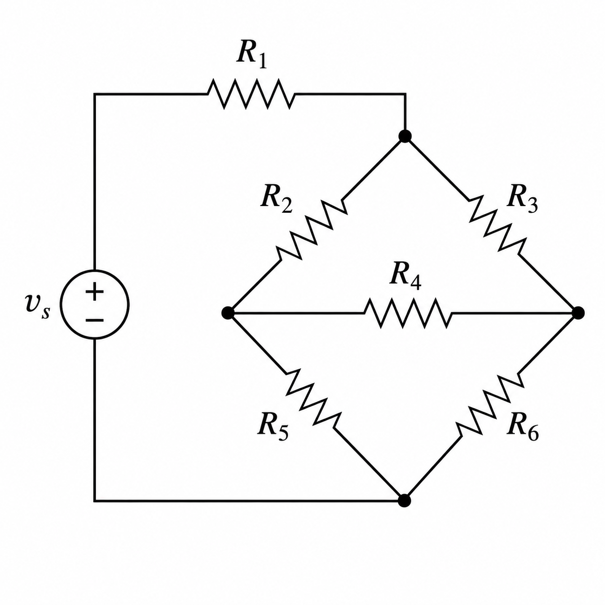
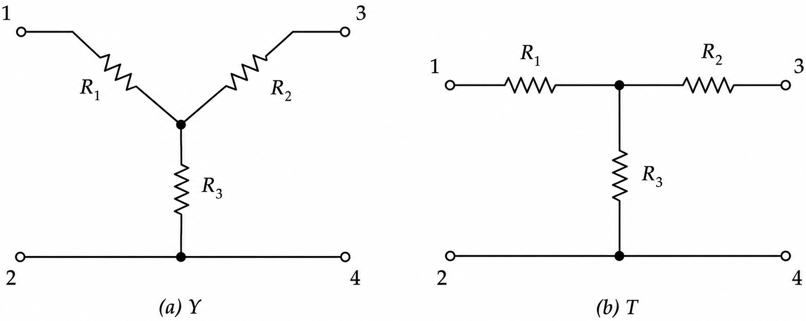
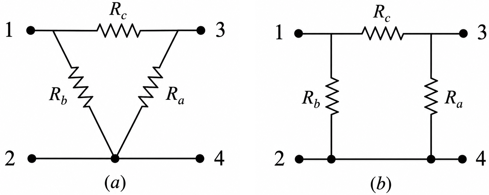
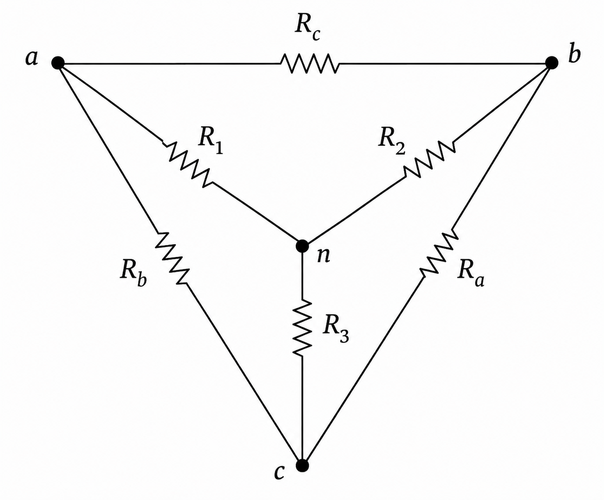
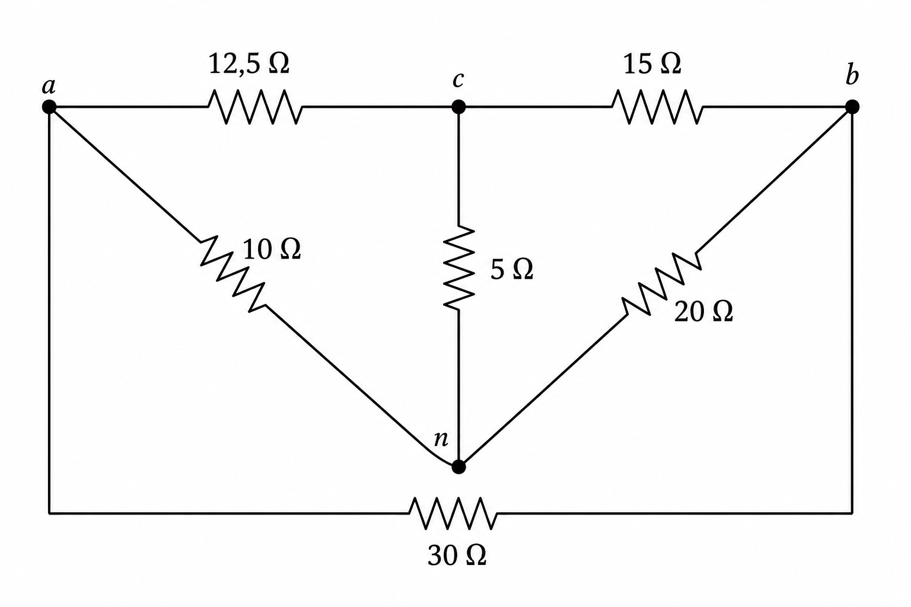
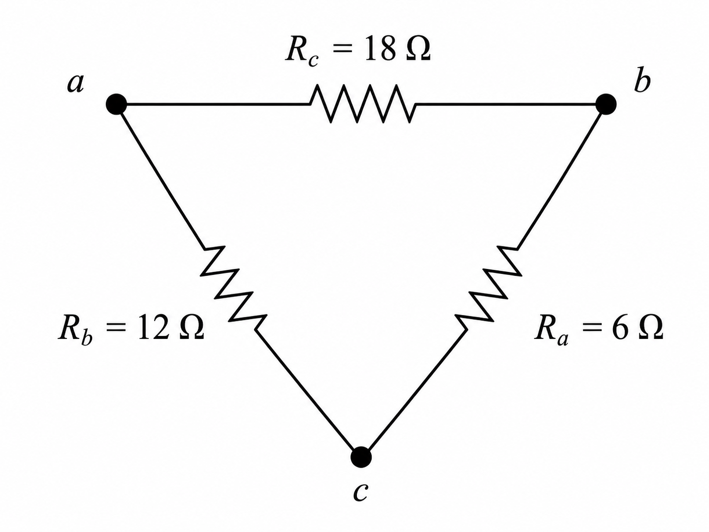
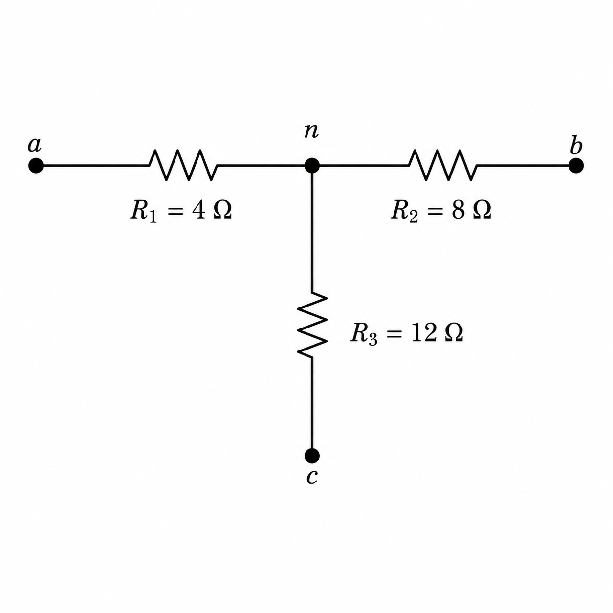

---
# --- INFORMAÇÕES DA AULA ---
title: "Redes de Resistores em Estrela e Delta"
subtitle: "Conceitos iniciais"
author: "Prof. Alcemy Severino"
license: "CC BY-NC"
copyright: "© 2026 Alcemy Gabriel"
institute: "IFRN"
lang: pt-br

# --- CONFIGURAÇÃO VISUAL E TÉCNICA ---
format:
  revealjs:
    # Aparência
    theme: [default, ifrn_2]            # Carrega o CSS padrão + nossa personalização
    footer: "Eletricidade Instrumental" # Adiciona a nota de rodapé
    logo: img/ifrn-logo.png             # Certifique-se de ter essa imagem na pasta 'img'
    slide-number: true                  # Numeração de páginas no canto
    center: false                       # false = alinha conteúdo ao topo (melhor para aulas)
    
    # Interatividade (Lousa)
    chalkboard: 
      buttons: false                   # Botões ocultos (Use 'B' para lousa, 'C' para riscar slide)
    lightbox: true                     # Permite ampliar imagens para detalhes (útil para diagramas)
    
    # Navegação
    preview-links: auto                # Tenta abrir links dentro do slide sem sair da aula
    controls: true                     # Mostra setas de navegação
    controls-layout: edges             # Setas grandes nas laterais esquerda/direita
    controls-tutorial: true            # Pisca a seta para indicar navegação
    touch: true                        # Melhora o uso em tablets/celulares
    
    # Código (Para suas aulas de Programação)
    code-line-numbers: true            # Permite referenciar linhas de código
    highlight-style: github            # Estilo de cores do código (claro e limpo)
---

## Objetivos da aula

Ao final desta aula, o estudante deverá ser capaz de:

- identificar redes em **estrela ($Y$)** e **triângulo ($\Delta$)**;
- compreender por que alguns circuitos não podem ser reduzidos diretamente por série/paralelo;
- aplicar as transformações **$\Delta \rightarrow Y$** e **$Y \rightarrow \Delta$**;
- deduzir as principais fórmulas de conversão;
- resolver circuitos mistos usando transformação estrela-triângulo.

---

## O problema: nem tudo é série/paralelo

:::: {.columns}
::: {.column width="50%"}

Em muitos circuitos, os resistores não estão claramente em série nem em paralelo.

Se não conseguimos identificar pares em série ou paralelo, precisamos de outra estratégia.

:::
::: {.column width="50%"}

{fig-align="center" width="100%"}

:::
::::

---

## Rede em estrela: $Y$ ou $T$

- A rede **Y** possui três resistores ligados a um ponto comum central.
- Também pode aparecer desenhada como uma rede em **T**.

{fig-align="center" width="60%}

---

## Rede em triângulo: $\Delta$ ou $\Pi$

- A rede Δ possui três resistores formando um caminho fechado entre três terminais.
- Também pode aparecer desenhada como uma rede em **$\Pi$**.

{fig-align="center" width="60%}

---

## Ideia central

- A transformação $Y-\Delta$ permite substituir uma rede de três resistores por outra equivalente.
- Duas redes são equivalentes quando apresentam a mesma resistência entre os mesmos terminais externos.
- Assim, para os terminais 1, 2 e 3:

$$R_{12}^{(Y)} = R_{12}^{(\Delta)}$$

$$R_{13}^{(Y)} = R_{13}^{(\Delta)}$$

$$R_{23}^{(Y)} = R_{23}^{(\Delta)}$$

---

## O que significa converter?

- Converter não significa retirar resistores do circuito.
- Significa substituir uma rede por outra que, vista de fora, se comporta da mesma forma.

::: {.box}
A transformação conserva o comportamento elétrico nos terminais externos, mas muda a forma interna da rede.
:::

---

## Conversão $\Delta \rightarrow Y$

:::: {.columns}
::: {.column width="60%"}

- Partimos de uma rede em triângulo e queremos chegar a uma rede em estrela.
- Na rede Y, entre os terminais 1 e 2, a corrente passa por $R_1$ e depois por $R_3$.
- Logo:

$$R_{12}^{(Y)} = R_1 + R_3$$

:::
::: {.column width="40%"}

:::
::::

---

## Conversão $\Delta \rightarrow Y$

:::: {.columns}
::: {.column width="60%"}

- Na rede $\Delta$, entre 1 e 2, existem dois caminhos:
  - caminho direto: $R_b$;
  - caminho alternativo: $R_c + R_a$.

Esses caminhos estão em paralelo:

$$R_{12}^{(\Delta)} = R_b \parallel (R_c + R_a)$$

$$R_{12}^{(\Delta)} = \frac{R_b(R_c+R_a)}{R_a+(R_b+R_c)}$$

:::
::: {.column width="40%"}

:::
::::

---

## Igualando as redes

Como as redes devem ser equivalentes:

$$R_{12}^{(Y)} = R_{12}^{(\Delta)}$$

Então:

$$R_1 + R_3 = \frac{R_b(R_c+R_a)}{R_a+R_b+R_c}$$

---

## Igualando as redes

De forma semelhante:

$$R_1 + R_2 = \frac{R_c(R_a+R_b)}{R_a+R_b+R_c}$$

$$R_2 + R_3 = \frac{R_a(R_b+R_c)}{R_a+R_b+R_c}$$

---

## Fórmulas $\Delta \rightarrow Y$

Temos:

$$R_1 = \frac{R_bR_c}{R_a + R_b + R_c}, \quad R_2 = \frac{R_cR_a}{R_a + R_b + R_c}$$
$$R_3 = \frac{R_aR_b}{R_a + R_b + R_c}$$

::: {.box}
Cada resistor da estrela é o produto dos dois resistores adjacentes do triângulo dividido pela soma dos três resistores do triângulo.
:::

---

## Como memorizar $\Delta \rightarrow Y$

:::: {.columns}
::: {.column width="60%"}

- Observe o resistor $R_1$, que é o resistor da estrela ligado ao terminal 1.
- No triângulo, os resistores que encostam no terminal 1 são $R_b$ e $R_c$.
- Logo:

$$R_1 = \frac{R_bR_c}{R_a+R_b+R_c}$$

:::
::: {.column width="40%"}

:::
::::

---

## Conversão $Y \rightarrow \Delta$

- Agora fazemos o processo inverso.
- Partimos da rede $Y$ e queremos encontrar a rede $\Delta$ equivalente.
- A partir das fórmulas da conversão $\Delta \rightarrow Y$:

$$R_1 = \frac{R_bR_c}{R_a+R_b+R_c}, \quad R_2 = \frac{R_cR_a}{R_a+R_b+R_c}$$

$$R_3 = \frac{R_aR_b}{R_a+R_b+R_c}$$

---

## Soma dos produtos da rede $Y$

- Manipulando essas relações, obtemos a soma dos produtos dois a dois da rede $Y$. Definimos:

$$P = R_1R_2 + R_2R_3 + R_3R_1$$

- Então, os resistores do triângulo são obtidos dividindo $P$ pelo resistor oposto na estrela.

::: {.box}
Na conversão $Y \rightarrow \Delta$, cada resistor do triângulo é a soma dos produtos dois a dois da estrela, dividida pelo resistor $Y$ oposto.
:::

---

## Fórmulas $Y \rightarrow \Delta$

$$R_a = \frac{R_1R_2+R_2R_3+R_3R_1}{R_1}$$

$$R_b = \frac{R_1R_2+R_2R_3+R_3R_1}{R_2}$$

$$R_c = \frac{R_1R_2+R_2R_3+R_3R_1}{R_3}$$

::: {.warning}
**Cuidado:** o denominador é o resistor oposto ao lado do triângulo que está sendo calculado.
:::

---

## Como memorizar $Y \rightarrow \Delta$

- Para calcular $R_a$, sabemos que ele fica no lado oposto a $R_1$.
- Por isso:
$$R_a = \frac{R_1R_2+R_2R_3+R_3R_1}{R_1}$$

---

## Caso especial: redes balanceadas

- Uma rede é balanceada quando todos os resistores são iguais.

:::: {.columns}
::: {.column width="50%"}

- Na estrela:

$$R_1 = R_2 = R_3 = R_Y$$
:::
::: {.column width="50%"}

- No triângulo:

$$R_a = R_b = R_c = R_\Delta$$

:::
::::

- Nesse caso:

$$R_Y = \frac{R_\Delta}{3} \quad \text{ou} \quad R_\Delta = 3R_Y$$

---

## Quando usar $Y-\Delta$?

Use quando:

- o circuito possui uma ponte ou malha interna;
- não há resistores claramente em série ou paralelo;
- há uma rede de três terminais que pode ser convertida;
- a conversão cria novas associações em série ou paralelo.

::: {.alerta}
Não é obrigatório usar $Y-\Delta$ em todos os circuitos. Use quando ela simplificar a análise.
:::

---

## Estratégia para resolver circuitos com $Y-\Delta$

1. Identifique redes em $Y$ ou $\Delta$.
2. Escolha a conversão que simplifica o circuito.
3. Substitua a rede original pela equivalente.
4. Procure novas associações série/paralelo.
5. Calcule a resistência equivalente.
6. Se houver fonte, determine corrente e tensões.

---

## Exemplo de aplicação

Circuito em ponte:

{fig-align="center" width="50%"}

Neste tipo de circuito, uma transformação $Y-\Delta$ pode gerar novas associações em paralelo.

---

## Exemplo de aplicação: ideia de solução

Podemos transformar uma rede $Y$ interna em $\Delta$.

Depois da conversão, podem surgir pares em paralelo, por exemplo:

$$70\Omega \parallel 30\Omega$$

$$12,5\Omega \parallel 17,5\Omega$$

$$15\Omega \parallel 35\Omega$$

Após isso, o circuito pode ser simplificado por série e paralelo.

---

## Erros comuns

::: {.alerta}
**Erro 1:** aplicar série/paralelo onde os resistores não compartilham os mesmos nós.
:::

::: {.alerta}
**Erro 2:** confundir resistor adjacente com resistor oposto.
:::

::: {.alerta}
**Erro 3:** converter uma rede que não simplifica o circuito.
:::

---

## Resumo: $\Delta \rightarrow Y$

Se a rede original é $\Delta$:

Então:

$$R_1 = \frac{R_bR_c}{R_a+R_b+R_c}$$

$$R_2 = \frac{R_cR_a}{R_a+R_b+R_c}$$

$$R_3 = \frac{R_aR_b}{R_a+R_b+R_c}$$

---

## Resumo: $Y \rightarrow \Delta$

Se a rede original é $Y$:

Então:

$$R_a = \frac{R_1R_2+R_2R_3+R_3R_1}{R_1}$$

$$R_b = \frac{R_1R_2+R_2R_3+R_3R_1}{R_2}$$

$$R_c = \frac{R_1R_2+R_2R_3+R_3R_1}{R_3}$$

---

## Exercício 1

:::: {.columns}
::: {.column width="50%"}

Converta a rede $\Delta$ abaixo para $Y$.

Determine:

$$R_1, \quad R_2, \quad R_3$$

:::
::: {.column width="50%"}

{fig-align="center"}

:::
::::

---

## Exercício 2

:::: {.columns}
::: {.column width="50%"}

Converta a rede $Y$ abaixo para $\Delta$.

Determine:

$$R_a, \quad R_b, \quad R_c$$

:::
::: {.column width="50%"}

{fig-align="center"}

:::
::::

---

## Exercício 3

Uma rede $\Delta$ balanceada possui três resistores de $45\Omega$.

Determine a rede $Y$ equivalente.

---

## Exercício 4

Explique com suas palavras por que a transformação $Y-\Delta$ é útil na análise de circuitos em ponte.

---

## Gabarito: Exercício 1

$$S = 6+12+18 = 36\Omega$$

$$R_1=\frac{12\cdot18}{36}=6\Omega$$

$$R_2=\frac{18\cdot6}{36}=3\Omega$$

$$R_3=\frac{6\cdot12}{36}=2\Omega$$

---

## Gabarito: Exercício 2

$$P = (4)(8)+(8)(12)+(12)(4)$$

$$P = 32+96+48 = 176$$

$$R_a=\frac{176}{4}=44\Omega$$

$$R_b=\frac{176}{8}=22\Omega$$

$$R_c=\frac{176}{12}=14,67\Omega$$

---

## Gabarito: Exercício 3

Para rede balanceada:

$$R_Y=\frac{R_\Delta}{3}$$

$$R_Y=\frac{45}{3}=15\Omega$$

Portanto:

$$R_1=R_2=R_3=15\Omega$$

---

## Gabarito: Exercício 4

Resposta esperada:

::: {.box}
A transformação $Y-\Delta$ é útil porque permite substituir uma parte do circuito por uma rede equivalente. Isso pode revelar novas associações em série e paralelo, tornando possível calcular resistência equivalente, correntes e tensões em circuitos que inicialmente não podem ser simplificados diretamente.
:::

---

## Fechamento

A transformação $Y-\Delta$ é uma ferramenta intermediária entre a análise simples por série/paralelo e métodos mais gerais, como Kirchhoff.

::: {.warning}
Ela não altera o circuito do ponto de vista dos terminais externos, mas muda sua forma interna para facilitar a análise.
:::

---

## {background-image="img/fry_1.png"}

---

