---
# --- INFORMAÇÕES DA AULA ---
title: "Leis de Kirchhoff: dos nós e das malhas"
subtitle: "Conceitos iniciais"
author: "Prof. Alcemy Severino"
license: "CC BY-NC"
copyright: "© 2026 Alcemy Gabriel"
institute: "IFRN"
lang: pt-br

# --- CONFIGURAÇÃO VISUAL E TÉCNICA ---
format:
  revealjs:
    # Aparência
    theme: [default, ifrn_2]            # Carrega o CSS padrão + nossa personalização
    footer: "Eletricidade Instrumental" # Adiciona a nota de rodapé
    logo: img/ifrn-logo.png             # Certifique-se de ter essa imagem na pasta 'img'
    slide-number: true                  # Numeração de páginas no canto
    center: false                       # false = alinha conteúdo ao topo (melhor para aulas)
    
    # Interatividade (Lousa)
    chalkboard: 
      buttons: false                   # Botões ocultos (Use 'B' para lousa, 'C' para riscar slide)
    lightbox: true                     # Permite ampliar imagens para detalhes (útil para diagramas)
    
    # Navegação
    preview-links: auto                # Tenta abrir links dentro do slide sem sair da aula
    controls: true                     # Mostra setas de navegação
    controls-layout: edges             # Setas grandes nas laterais esquerda/direita
    controls-tutorial: true            # Pisca a seta para indicar navegação
    touch: true                        # Melhora o uso em tablets/celulares
    
    # Código (Para suas aulas de Programação)
    code-line-numbers: true            # Permite referenciar linhas de código
    highlight-style: github            # Estilo de cores do código (claro e limpo)
---

## Objetivos da aula

Ao final desta aula, o estudante deverá ser capaz de:

- compreender a **Lei dos Nós** e a **Lei das Malhas**;
- aplicar as leis de Kirchhoff em circuitos resistivos de corrente contínua;
- montar equações para determinar correntes e tensões;
- interpretar resultados físicos, verificando sinais e sentidos de corrente.

---

## Por que estudar Kirchhoff?

- Em circuitos simples, muitas vezes basta identificar resistores em série ou paralelo.
- Mas em circuitos com **vários caminhos**, **fontes diferentes** ou **pontos de derivação**, precisamos de um método sistemático.

::: {.box}
As leis de Kirchhoff são ferramentas fundamentais para analisar circuitos que não podem ser resolvidos apenas por associação série/paralelo direta e permitem transformar um circuito elétrico em um conjunto de equações.
:::

---

## Ideia central

As leis de Kirchhoff são baseadas em dois princípios físicos:

1. **Conservação da carga elétrica**  
   A carga não desaparece em um nó.

2. **Conservação da energia**  
   Ao percorrer uma malha fechada, a soma das elevações e quedas de tensão é zero.

::: {.center}
$$\text{Carga se conserva} \Rightarrow \text{Lei dos Nós}$$
$$\text{Energia se conserva} \Rightarrow \text{Lei das Malhas}$$
:::

---

## Elementos importantes

- **Nó:** ponto de encontro entre dois ou mais ramos.
- **Ramo:** caminho por onde passa uma corrente.
- **Malha:** caminho fechado dentro do circuito.
- **Sentido de corrente:** pode ser escolhido livremente no início da análise.

::: {.warning}
Se o resultado da corrente for negativo, isso não significa erro. Significa apenas que o sentido real é oposto ao sentido escolhido.
:::

---

## Lei dos Nós de Kirchhoff

Também chamada de **Lei das Correntes de Kirchhoff**.

::: {.box}
Em qualquer nó de um circuito, a soma das correntes que entram é igual à soma das correntes que saem.
:::

$$\sum I_{entrando} = \sum I_{saindo}$$

Ou, de forma algébrica:

$$\sum I = 0$$

## Representação de um nó

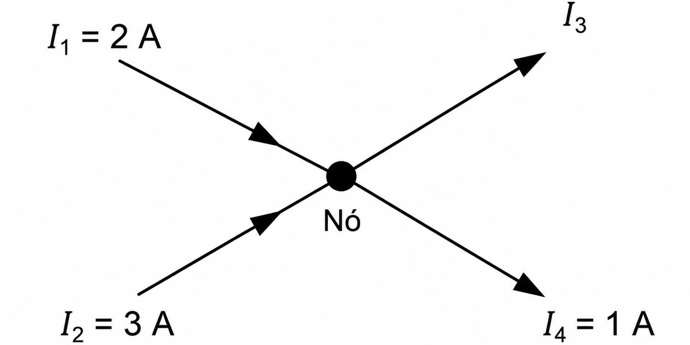{fig-align="center" width="50%"}

Pela Lei dos Nós:

$$I_1 + I_2 = I_3 + I_4$$

$$2 + 3 = I_3 + 1$$

$$I_3 = 4\ A$$

---

## Analogia hidráulica

:::: {.columns}
::: {.column width="50%"}

- Imagine um encontro de tubulações de água.
- A quantidade de água que chega ao ponto de encontro deve ser igual à quantidade que sai.

:::
::: {.column width="50%"}

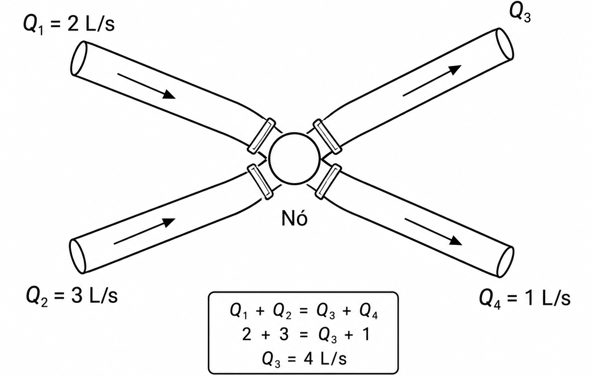{fig-align="center" width="85%"}

:::
::::

::: {.box}
No circuito elétrico, a corrente representa o fluxo de cargas elétricas. Assim, o nó não “armazena” corrente.
:::

---

## Exercício 1 — Lei dos Nós

::: {.exercicio}
Em um nó, entram duas correntes: $I_1 = 5\ A$ e $I_2 = 2\ A$. Saem duas correntes: $I_3 = 4\ A$ e $I_4$. Determine $I_4$.
:::

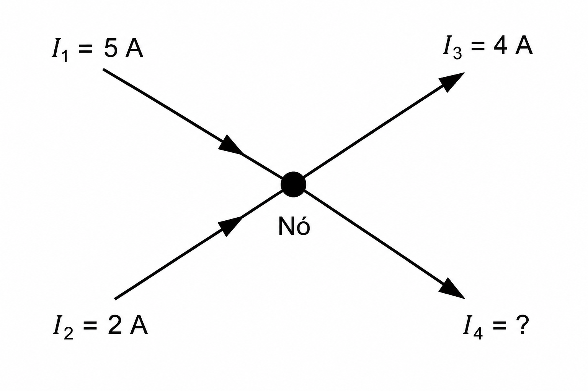{fig-align="center" width="70%"}

---

## Resolução do Exercício 1

Pela Lei dos Nós:

$$I_1 + I_2 = I_3 + I_4$$

Substituindo:

$$5 + 2 = 4 + I_4$$

$$7 = 4 + I_4$$

$$I_4 = 3\ A$$

::: {.box}
Resposta: $I_4 = 3\ A$.
:::

---

## Lei das Malhas de Kirchhoff

Também chamada de **Lei das Tensões de Kirchhoff**.

::: {.box}
Em qualquer malha fechada de um circuito, a soma algébrica das tensões é igual a zero.
:::

$$\sum V = 0$$

Isso significa que a energia fornecida pelas fontes é consumida pelos elementos do circuito, como resistores.

---

## Representação de uma malha simples

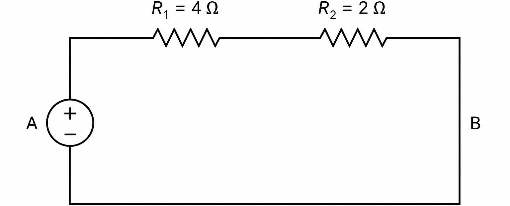{fig-align="center" width="60%"}

Se uma fonte de $12\ V$ alimenta os resistores em série:

$$V_{fonte} - V_{R1} - V_{R2} = 0$$

$$12 - V_{R1} - V_{R2} = 0$$

---

## Queda de tensão no resistor

Em um resistor, usamos a Lei de Ohm:

$$V_R = R \cdot I$$

Assim, em uma malha com fonte e resistores:

$$V_{fonte} - R_1I - R_2I = 0$$

ou:

$$V_{fonte} = I(R_1 + R_2)$$

---

## Convenção de sinais

Uma forma prática de percorrer uma malha:

- ao passar por uma fonte do terminal $-$ para o terminal $+$: **ganho de tensão**;
- ao passar por um resistor no sentido da corrente: **queda de tensão**;
- ao passar por um resistor contra o sentido da corrente: **elevação de tensão**.

::: {.warning}
O mais importante é manter a convenção escolhida de forma consistente em toda a resolução.
:::

---

## Exemplo 1 — Uma malha

Circuito com fonte de $12\ V$, $R_1 = 4\Omega$ e $R_2 = 2\Omega$ em série.

{fig-align="center" width="50%"}

Pela Lei das Malhas:

$$12 - 4I - 2I = 0$$

$$12 = 6I$$

$$I = 2\ A$$

---

## Exercício 2 — Uma malha

Uma fonte de $18\ V$ alimenta dois resistores em série: $R_1 = 3\Omega$ e $R_2 = 6\Omega$. Determine a corrente do circuito e a queda de tensão em cada resistor.

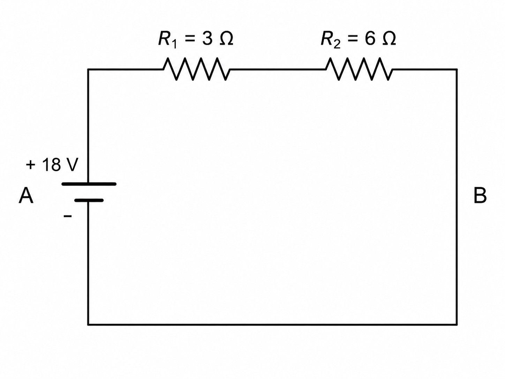{fig-align="center" width="60%"}

---

## Resolução do Exercício 2

Resistência total:

$$R_T = 3 + 6 = 9\Omega$$

Corrente:

$$I = \frac{V}{R_T} = \frac{18}{9} = 2\ A$$

Quedas de tensão:

$$V_{R1} = 3 \cdot 2 = 6\ V$$

$$V_{R2} = 6 \cdot 2 = 12\ V$$

---

## Circuito com nó e ramos paralelos

Agora temos uma corrente total que se divide em dois caminhos.

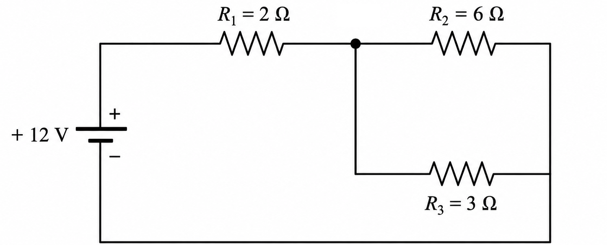{fig-align="center" width="50%"}

. . .

Neste circuito:

- $R_1$ está em série com o bloco paralelo;
- $R_2$ e $R_3$ estão em paralelo;
- a corrente se divide no nó.

---

## Análise por associação e Kirchhoff

Primeiro, calculamos o paralelo:

$$R_{23} = \frac{R_2 \cdot R_3}{R_2 + R_3} = \frac{6 \cdot 3}{6 + 3} = 2\Omega$$

Depois:

$$R_T = R_1 + R_{23} = 2 + 2 = 4\Omega$$

Corrente total:

$$I_T = \frac{12}{4} = 3\ A$$

---

## Correntes nos ramos paralelos

A queda de tensão em $R_1$ é:

$$V_{R1} = R_1 \cdot I_T = 2 \cdot 3 = 6\ V$$

Logo, a tensão no paralelo é:

$$V_{paralelo} = 12 - 6 = 6\ V$$

Correntes:

$$I_2 = \frac{6}{6} = 1\ A$$

$$I_3 = \frac{6}{3} = 2\ A$$

---

## Exercício 3 — Série com paralelo

No circuito abaixo, uma fonte de $20\ V$ alimenta $R_1 = 4\Omega$ em série com um bloco paralelo formado por $R_2 = 12\Omega$ e $R_3 = 6\Omega$. Determine $R_T$, $I_T$, $I_2$ e $I_3$.

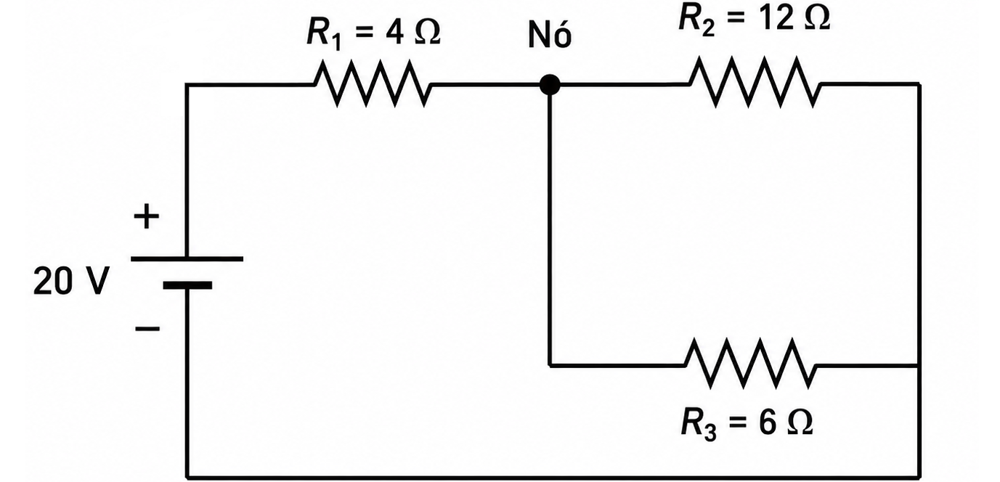{fig-align="center" width="70%"}

---

## Resolução do Exercício 3

Paralelo:

$$R_{23} = \frac{12 \cdot 6}{12 + 6} = 4\Omega$$

Resistência total:

$$R_T = 4 + 4 = 8\Omega$$

Corrente total:

$$I_T = \frac{20}{8} = 2{,}5\ A$$

---

## Resolução do Exercício 3 (cont.)

Queda em $R_1$:

$$V_{R1} = 4 \cdot 2{,}5 = 10\ V$$

Tensão no paralelo:

$$V_{paralelo} = 20 - 10 = 10\ V$$

Correntes:

$$I_2 = \frac{10}{12} \approx 0{,}83\ A$$

$$I_3 = \frac{10}{6} \approx 1{,}67\ A$$

---

## Análise por malhas: quando usar?

A análise por malhas é útil quando o circuito possui mais de uma fonte ou quando a associação direta não é evidente.

O procedimento geral é:

1. identificar as malhas;
2. escolher um sentido para cada corrente de malha;
3. escrever uma equação de tensão para cada malha;
4. resolver o sistema de equações.

---

## Exemplo 2 — Duas malhas com resistor comum

:::: {.columns}
::: {.column width="50%"}

Neste tipo de circuito, um resistor pode ser compartilhado por duas malhas.

:::
::: {.column width="50%"}

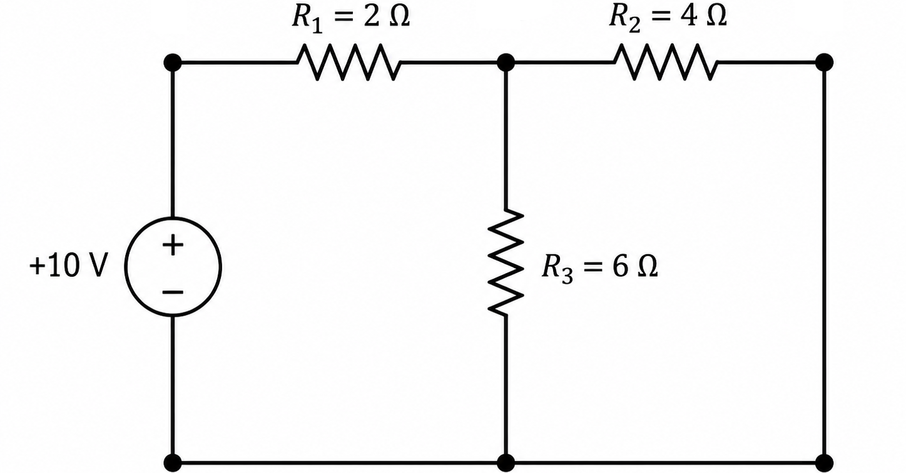{fig-align="center" width="95%"}

:::
::::

::: {.box}
Quando um resistor é comum a duas malhas, a corrente nele depende da diferença entre as correntes de malha.
:::

---

## Montagem de equações de malha

Suponha duas correntes de malha: $I_1$ e $I_2$.

Em um resistor compartilhado, a queda pode ser escrita como:

$$R(I_1 - I_2)$$

ou:

$$R(I_2 - I_1)$$

A escolha depende do sentido percorrido na malha.

::: {.warning}
O ponto crítico é manter coerência entre o sentido da malha e a corrente assumida.
:::

## Exercício 4 — Leitura conceitual

Explique, com suas palavras, o que acontece com a corrente elétrica quando ela chega a um nó onde existem dois caminhos possíveis.

. . .

::: {.box}
Pistas para responder:

- a corrente total se divide;
- os ramos com menor resistência tendem a conduzir maior corrente;
- a soma das correntes dos ramos deve ser igual à corrente total.
:::

---

## Exercício 5 — Identificação de nós e malhas

Observe o circuito e responda:

1. Quantos nós principais existem?
2. Quantas malhas podem ser identificadas?
3. Quais resistores estão em paralelo?

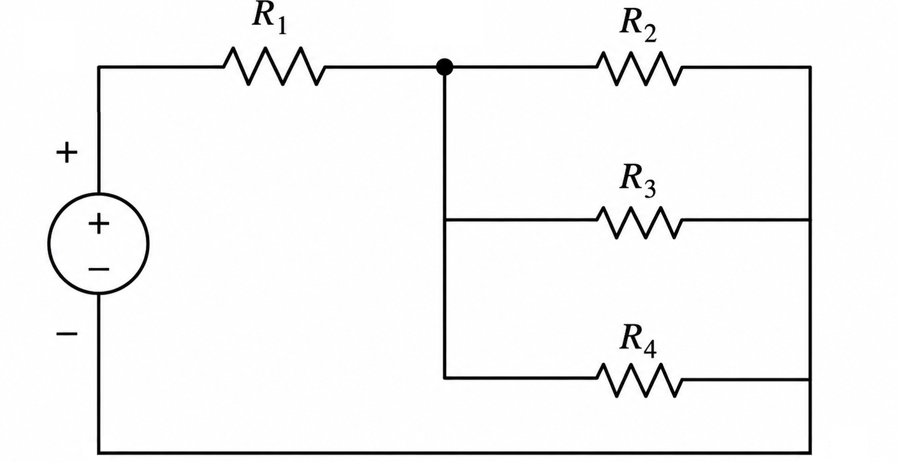{fig-align="center" width="50%"}

---

## Exercício 6 — Corrente em nó

No nó abaixo, determine a corrente desconhecida $I_x$.

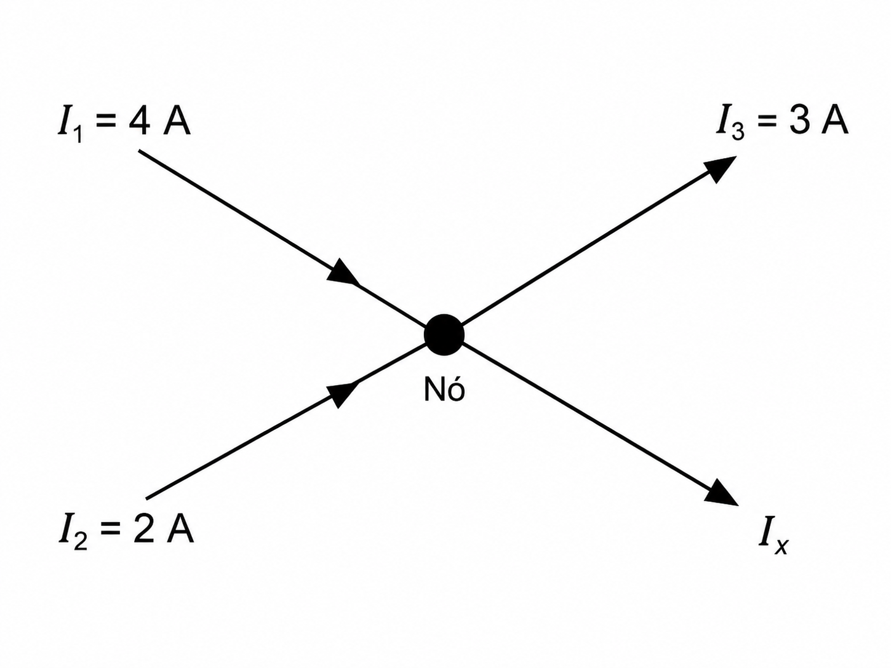{fig-align="center" width="50%"}

$$4 + 2 = 3 + I_x$$

---

## Exercício 7 — Malha simples

Em uma malha com fonte de $24\ V$ e resistores $R_1 = 4\Omega$, $R_2 = 8\Omega$ e $R_3 = 12\Omega$ em série, determine:

1. a resistência equivalente;
2. a corrente do circuito;
3. a queda de tensão em cada resistor.

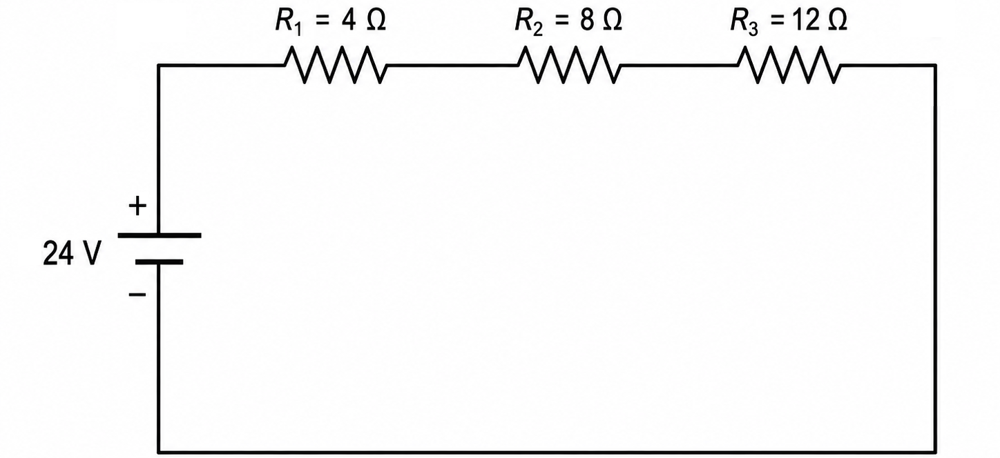{fig-align="center" width="50%"}

---

## Exercício 8 — Circuito misto

Uma fonte de $30\ V$ alimenta $R_1 = 5\Omega$ em série com o paralelo de $R_2 = 10\Omega$ e $R_3 = 15\Omega$. Determine:

:::: {.columns}
::: {.column width="50%"}

1. a resistência equivalente;
2. a corrente total;
3. a corrente em $R_2$;
4. a corrente em $R_3$.

:::
::: {.column width="50%"}

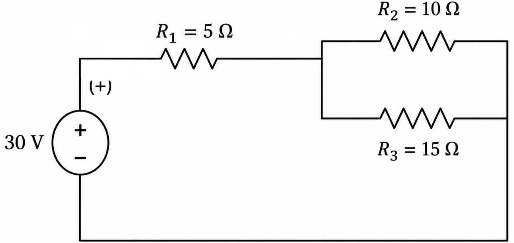{fig-align="center" width="95%"}

:::
::::

---

## Exercício 9 — Verificação de Kirchhoff

Em um circuito, uma fonte de $18\ V$ alimenta três resistores em série. As quedas de tensão medidas foram:

- $V_{R1} = 5\ V$;
- $V_{R2} = 7\ V$;
- $V_{R3} = 6\ V$.

Verifique se os valores respeitam a Lei das Malhas de Kirchhoff.

---

## Exercício 10 — Desafio orientado

No circuito abaixo, determine a corrente total e verifique a divisão de corrente nos ramos paralelos.

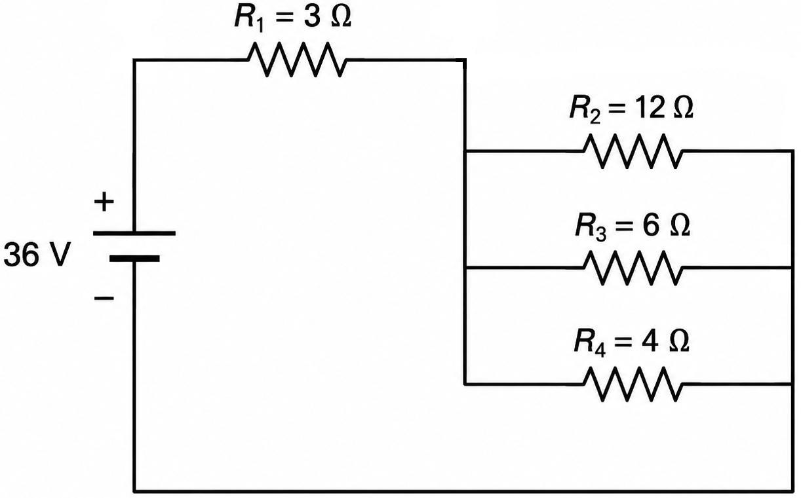{fig-align="center" width="70%"}

---

## Gabarito resumido

::: {.small}
**Exercício 1:** $I_4 = 3\ A$  
**Exercício 2:** $I = 2\ A$; $V_{R1}=6\ V$; $V_{R2}=12\ V$  
**Exercício 3:** $R_T=8\Omega$; $I_T=2{,}5\ A$; $I_2\approx0{,}83\ A$; $I_3\approx1{,}67\ A$  
**Exercício 6:** $I_x=3\ A$  
**Exercício 7:** $R_T=24\Omega$; $I=1\ A$; quedas: $4\ V$, $8\ V$, $12\ V$  
**Exercício 8:** $R_{23}=6\Omega$; $R_T=11\Omega$; $I_T\approx2{,}73\ A$; $V_{paralelo}\approx16{,}36\ V$; $I_2\approx1{,}64\ A$; $I_3\approx1{,}09\ A$  
**Exercício 9:** Sim, pois $5 + 7 + 6 = 18\ V$  
**Exercício 10:** $R_p=2\Omega$; $R_T=5\Omega$; $I_T=7{,}2\ A$; $V_p=14{,}4\ V$; $I_2=1{,}2\ A$; $I_3=2{,}4\ A$; $I_4=3{,}6\ A$
:::

---

## Fechamento {style="font-size: 0.9em;"}

As leis de Kirchhoff são fundamentais porque permitem analisar circuitos além das associações simples.

::: {.box}
**Lei dos Nós:** conserva a carga elétrica.  
**Lei das Malhas:** conserva a energia elétrica.
:::

Para resolver circuitos:

1. identifique nós e malhas;
2. escolha sentidos de corrente;
3. aplique Lei de Ohm;
4. escreva as equações;
5. verifique se os resultados fazem sentido físico.

---

## {background-image="img/fry_1.png"}

---

