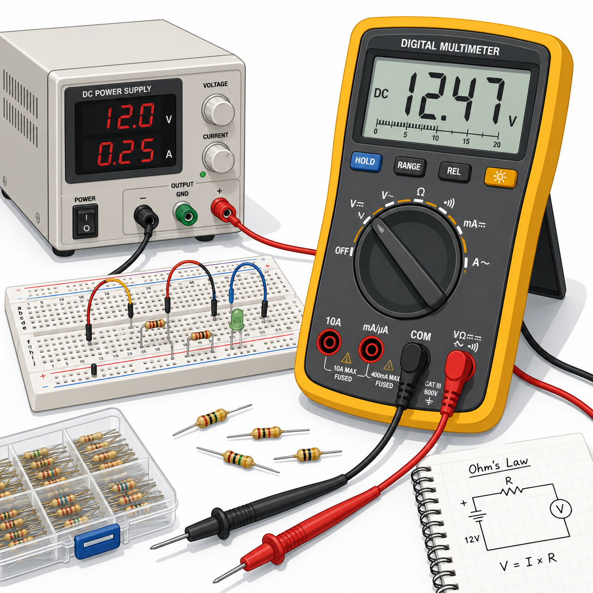
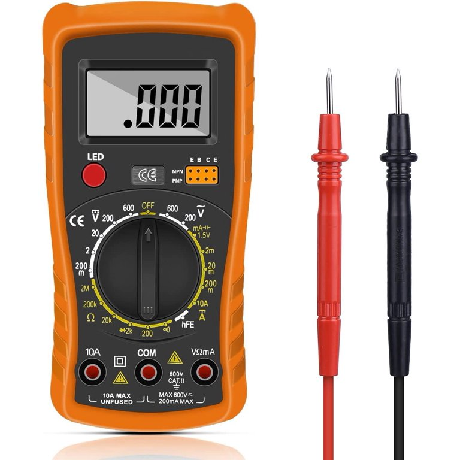
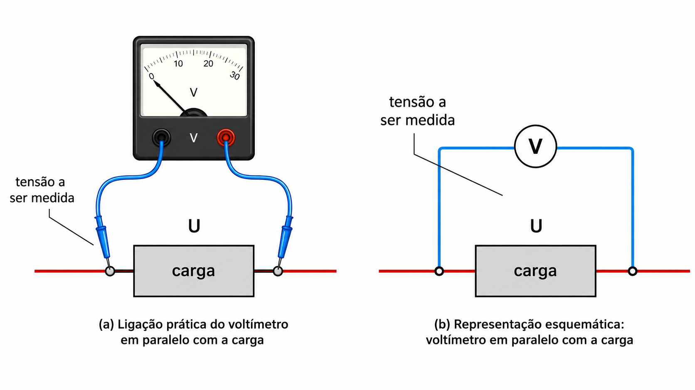
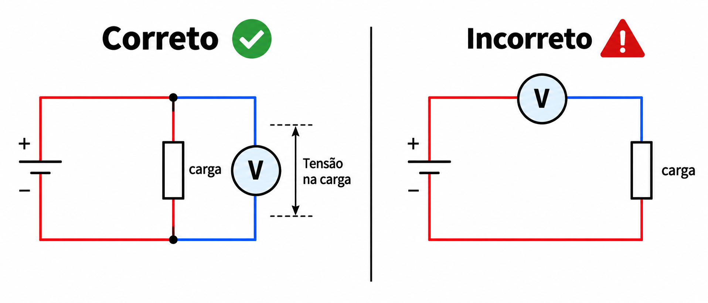
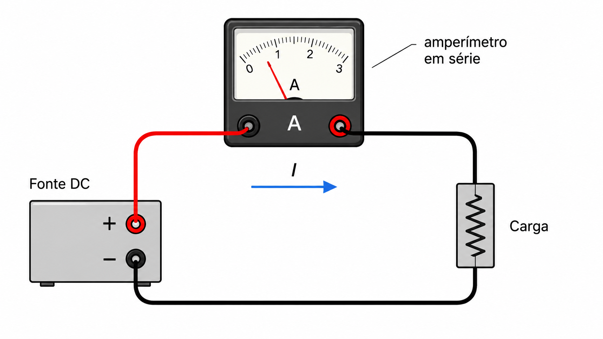
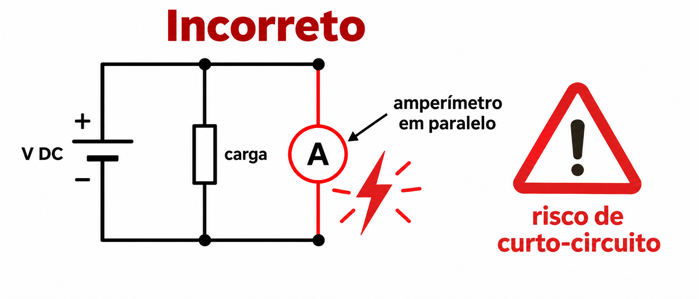
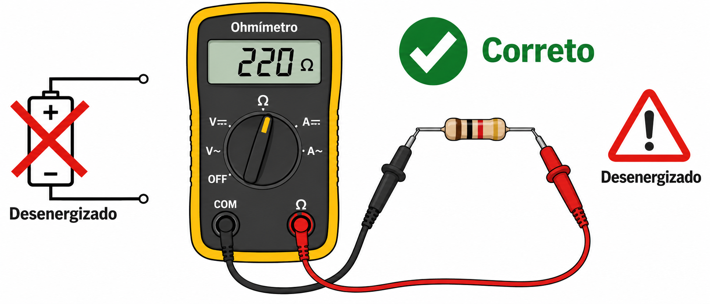
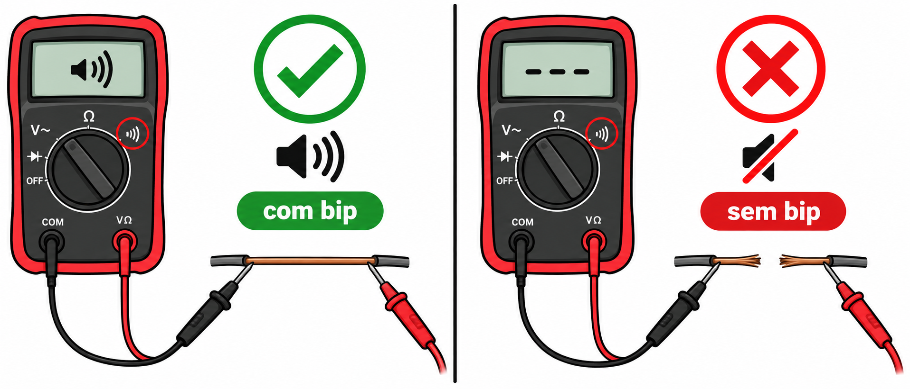

---
# --- INFORMAÇÕES DA AULA ---
title: "Instrumentos de Medição"
subtitle: "Voltímetro, amperímetro, ohmímetro e multímetro"
author: "Prof. Alcemy Severino"
license: "CC BY-NC"
copyright: "© 2026 Alcemy Gabriel"
institute: "IFRN"
lang: pt-br

# --- CONFIGURAÇÃO VISUAL E TÉCNICA ---
format:
  revealjs:
    # Aparência
    theme: [default, ifrn_2]            # Carrega o CSS padrão + nossa personalização
    footer: "Eletricidade Instrumental" # Adiciona a nota de rodapé
    logo: img/ifrn-logo.png             # Certifique-se de ter essa imagem na pasta 'img'
    slide-number: true                  # Numeração de páginas no canto
    center: false                       # false = alinha conteúdo ao topo (melhor para aulas)
    
    # Interatividade (Lousa)
    chalkboard: 
      buttons: false                   # Botões ocultos (Use 'B' para lousa, 'C' para riscar slide)
    lightbox: true                     # Permite ampliar imagens para detalhes (útil para diagramas)
    
    # Navegação
    preview-links: auto                # Tenta abrir links dentro do slide sem sair da aula
    controls: true                     # Mostra setas de navegação
    controls-layout: edges             # Setas grandes nas laterais esquerda/direita
    controls-tutorial: true            # Pisca a seta para indicar navegação
    touch: true                        # Melhora o uso em tablets/celulares
    
    # Código (Para suas aulas de Programação)
    code-line-numbers: true            # Permite referenciar linhas de código
    highlight-style: github            # Estilo de cores do código (claro e limpo)
---

## Situação inicial

:::: {.columns}
::: {.column width="52%"}

Em atividades práticas de eletricidade, não basta **montar** o circuito. Também precisamos **medir** para verificar se o circuito está funcionando conforme o esperado.

::: {.box}
Medir é comparar uma grandeza elétrica com uma unidade de referência.
:::

:::
::: {.column width="48%"}

{fig-align="center" width="95%"}

:::
::::

---

## Objetivos da aula

Ao final desta aula, o estudante deverá ser capaz de:

- identificar as grandezas elétricas medidas por cada instrumento;
- diferenciar medição de **tensão**, **corrente** e **resistência**;
- compreender a ligação correta do voltímetro, amperímetro e ohmímetro;
- selecionar escalas adequadas no multímetro;
- realizar medições básicas com segurança;
- interpretar leituras e possíveis erros de medição.

---

## Antes de medir: grandezas e unidades

::: {.small}
| Grandeza | Símbolo | Unidade | Símbolo da unidade |
|---|:---:|:---:|:---:|
| Corrente elétrica | $I$ | ampère | A |
| Tensão elétrica | $V$ ou $U$ | volt | V |
| Resistência elétrica | $R$ | ohm | $\Omega$ |
| Potência elétrica | $P$ | watt | W |
| Energia elétrica | $E$ | joule | J |
:::

::: {.box}
O instrumento deve ser escolhido de acordo com a grandeza que se deseja medir.
:::

---

## Múltiplos e submúltiplos

Em eletricidade, é comum trabalhar com valores muito grandes ou muito pequenos.

::: {.small}
| Prefixo | Símbolo | Fator | Exemplo |
|---|---:|---:|---|
| quilo | k | $10^3$ | $1\,k\Omega = 1000\,\Omega$ |
| mega | M | $10^6$ | $1\,M\Omega = 1.000.000\,\Omega$ |
| mili | m | $10^{-3}$ | $1\,mA = 0,001\,A$ |
| micro | $\mu$ | $10^{-6}$ | $1\,\mu A = 0,000001\,A$ |
:::

::: {.box}
**Pergunta rápida:**  
Quanto vale $2,2\,k\Omega$ em ohms?  
Quanto vale $350\,mA$ em ampères?
:::

## Medição direta e indireta

:::: {.columns}
::: {.column width="50%"}
### Medição direta

O valor é obtido diretamente no mostrador ou na escala do instrumento.

Exemplos:

- medir tensão com voltímetro;
- medir corrente com amperímetro;
- medir resistência com ohmímetro.
:::

::: {.column width="50%"}
### Medição indireta

O valor é obtido a partir de outras medições e de uma fórmula.

Exemplo:

$$P = V \cdot I$$

Mede-se tensão e corrente para calcular a potência.
:::
::::

---

## Erro de medição

Toda medição está sujeita a algum erro.

Mesmo usando um bom instrumento, podem ocorrer diferenças por causa de:

:::: {.columns}
::: {.column width="50%"}

- precisão do aparelho;
- escala escolhida;
- resistência interna do instrumento;

:::
::: {.column width="50%"}

- mau contato nas pontas de prova;
- leitura inadequada da escala;
- tolerância dos componentes.

:::
::::

::: {.formula .small}
$$\text{Erro absoluto} = |\text{valor medido} - \text{valor esperado}|$$
:::

---

## Tipos de instrumentos de medida

:::: {.columns}
::: {.column width="50%"}
### Analógicos

- Possuem ponteiro.
- A leitura é feita em uma escala graduada.
- Podem apresentar erro de paralaxe.

{fig-align="center" width="60%"}

:::
::: {.column width="50%"}
### Digitais

- Apresentam o valor em números no display.
- Facilitam a leitura.
- São comuns em multímetros digitais.

{fig-align="center" width="60%"}
:::
::::

---

## Simbologia básica

::: {.small}
| Instrumento | Grandeza medida | Símbolo usual no circuito |
|---|:---:|:---:|
| Voltímetro | tensão ou d.d.p. | círculo com **V** |
| Amperímetro | corrente elétrica | círculo com **A** |
| Ohmímetro | resistência elétrica | círculo com **$\Omega$** |
| Multímetro | tensão, corrente, resistência e continuidade | depende da função selecionada |
:::

---

## Cuidados gerais antes de medir

::: {.warning}
Antes de ligar qualquer instrumento ao circuito, verifique:
:::

- Qual grandeza será medida?
- A medição será em corrente contínua ou alternada?
- Qual escala deve ser selecionada?
- As pontas de prova estão nos bornes corretos?
- O circuito precisa estar ligado ou desligado?
- O componente pode ser medido dentro do circuito ou deve ser removido?

---

## Regra de segurança sobre escala

:::: {.columns}
::: {.column width="60%"}

Quando o valor da grandeza é desconhecido:

::: {.box}
Comece pela **maior escala** disponível e reduza gradualmente até obter uma leitura adequada.
:::

Essa regra reduz o risco de danificar o instrumento e aumenta a segurança durante a prática.

:::
::: {.column width="40%"}

{fig-align="center" width="95%"}

:::
::::

# Voltímetro

## O que o voltímetro mede?

O voltímetro mede a **tensão elétrica**, também chamada de **diferença de potencial**.

::: {.formula}
$$V = \frac{E}{q}$$
:::

De forma prática, a tensão indica a “força elétrica” disponível para movimentar cargas elétricas em um circuito.

::: {.box}
Unidade de tensão: **volt**, representada por **V**.
:::

---

## Como ligar o voltímetro?

O voltímetro deve ser ligado **em paralelo** com o elemento em que se deseja medir a tensão.

{fig-align="center" width="40%"}

::: {.box}
Para medir a tensão em um resistor, ligamos uma ponta de prova em cada terminal do resistor.
:::

---

## Por que o voltímetro é ligado em paralelo?

A tensão é medida entre **dois pontos** do circuito.

Por isso, o voltímetro precisa comparar o potencial elétrico de um ponto com o potencial elétrico de outro ponto.

::: {.formula}
$$V_{AB} = V_A - V_B$$
:::

::: {.box}
Um voltímetro ideal possui resistência interna muito alta, para que quase nenhuma corrente passe por ele.
:::

---

## Medindo tensão em um resistor

Considere um resistor de $6\,\Omega$ percorrido por uma corrente de $2\,A$.

Pela Lei de Ohm:

$$V = R \cdot I$$

$$V = 6 \cdot 2 = 12\,V$$

::: {.box}
Se o voltímetro for ligado aos terminais desse resistor, a leitura esperada será **12 V**.
:::

---

## Erro comum com o voltímetro

::: {.warning}
Não ligue o voltímetro em série para medir tensão de um componente.
:::

Como sua resistência interna é muito alta, ele dificulta a passagem de corrente e pode alterar o funcionamento do circuito.

{fig-align="center" width="60%"}

# Amperímetro

## O que o amperímetro mede?

O amperímetro mede a **intensidade da corrente elétrica**.

::: {.formula}
$$I = \frac{\Delta q}{\Delta t}$$
:::

Em termos simples, a corrente elétrica indica a quantidade de carga que passa por um ponto do circuito a cada segundo.

::: {.box}
Unidade de corrente: **ampère**, representada por **A**.
:::

---

## Como ligar o amperímetro?

O amperímetro deve ser ligado **em série** com o trecho do circuito onde se deseja medir a corrente.

{fig-align="center" width="40%"}

::: {.box}
Para medir corrente, é necessário que a corrente passe pelo instrumento.
:::

---

## Por que o amperímetro é ligado em série?

A corrente elétrica representa o fluxo de cargas em um ramo do circuito. Para saber quanta corrente passa em um ramo, o amperímetro precisa fazer parte desse caminho.

::: {.box}
Um amperímetro ideal possui resistência interna muito baixa, para alterar o mínimo possível o circuito.
:::

---

## Exemplo: medindo corrente em série

Considere uma fonte de $12\,V$ ligada a um resistor de $4\,\Omega$.

Pela Lei de Ohm:

$$I = \frac{V}{R}$$

$$I = \frac{12}{4} = 3\,A$$

::: {.box}
Se o amperímetro estiver corretamente em série, a leitura esperada será **3 A**.
:::

---

## Erro comum com o amperímetro

::: {.warning}
Não ligue o amperímetro diretamente em paralelo com uma fonte de tensão.
:::

Como o amperímetro tem baixa resistência interna, essa ligação pode criar um **curto-circuito** e danificar o instrumento.

{fig-align="center" width="60%"}

# Ohmímetro

## O que o ohmímetro mede?

O ohmímetro mede a **resistência elétrica**.

::: {.box}
Unidade de resistência: **ohm**, representada por $\Omega$.
:::

Ele também pode ser usado para verificar continuidade, dependendo do instrumento.

::: {.box}
Quanto menor a resistência, maior a facilidade de passagem da corrente elétrica.
:::

---

## Como ligar o ohmímetro?

O ohmímetro deve ser ligado aos terminais do componente.

::: {.warning}
A resistência deve ser medida com o circuito **desenergizado**. Preferencialmente, o componente deve estar desconectado do circuito ou isolado de outros caminhos elétricos.
:::

{fig-align="center" width="40%"}

---

## Por que o circuito deve estar desligado?

O ohmímetro possui uma fonte interna, geralmente uma pilha ou bateria.

Essa fonte envia uma pequena corrente pelo componente para estimar sua resistência.

::: {.warning}
Se o circuito estiver energizado, a tensão externa pode interferir na leitura ou danificar o instrumento.
:::

---

## Continuidade elétrica

A função de continuidade verifica se existe caminho condutor entre dois pontos.

:::: {.columns}
::: {.column width="40%"}

**Com continuidade**

- resistência baixa;
- circuito fechado;
- o multímetro pode emitir som.

:::
::: {.column width="60%"}

**Sem continuidade**

- resistência muito alta ou infinita;
- circuito aberto;
- não há caminho para corrente.

:::
::::

{fig-align="center" width="40%"}

# Multímetro

## O que é o multímetro?

O multímetro reúne várias funções em um único instrumento.

Com ele, podemos medir:

- tensão contínua e alternada;
- corrente contínua e alternada, conforme o modelo;
- resistência elétrica;
- continuidade;
- diodos e junções PN, em alguns modelos.

::: {.box}
O multímetro é o instrumento mais usado em práticas introdutórias de eletricidade e eletrônica.
:::

---

## Partes principais do multímetro digital

:::: {.columns}
::: {.column width="50%"}

- Display.
- Chave seletora.
- Entrada comum: **COM**.
- Entrada para tensão, resistência e continuidade.
- Entrada específica para corrente, quando disponível.
- Pontas de prova.

:::
::: {.column width="50%"}

{fig-align="center" width="80%"}

:::
::::

---

## Bornes do multímetro

::: {.small}
| Borne | Uso comum | Observação |
|---|---|---|
| COM | ponta preta | referência comum |
| V/$\Omega$ | tensão, resistência e continuidade | usado na maior parte das medições |
| mA/$\mu$A | correntes pequenas | exige atenção à escala |
| A ou 10A | correntes maiores | geralmente possui limite de tempo e proteção |
:::

::: {.warning}
Um erro comum é tentar medir tensão com a ponta vermelha conectada no borne de corrente.
:::

---

## Selecionando a função correta

Antes de medir, escolha:

::: {.small}
| Medição | Função no multímetro | Ligação |
|---|---|---|
| Tensão DC | V⎓ ou VDC | paralelo |
| Tensão AC | V~ ou VAC | paralelo |
| Corrente DC | A⎓ ou ADC | série |
| Corrente AC | A~ ou AAC | série |
| Resistência | $\Omega$ | circuito desligado |
| Continuidade | símbolo sonoro ou diodo | circuito desligado |
:::

---

## CC e CA na medição

:::: {.columns}
::: {.column width="50%"}

**Corrente contínua — CC/DC**

- Polaridade definida.
- Exemplos: pilhas, baterias, fontes DC.
- É importante observar positivo e negativo.

:::
::: {.column width="50%"}

**Corrente alternada — CA/AC**

- Polaridade alterna no tempo.
- Exemplo: rede elétrica residencial.
- Exige mais cuidado por envolver tensões perigosas.

:::
::::

::: {.warning}
Nunca realize medições na rede elétrica sem orientação, autorização e equipamentos adequados.
:::

---

## Sequência segura de medição

1. Identifique a grandeza a ser medida.
2. Escolha a função correta no multímetro.
3. Conecte as pontas de prova nos bornes corretos.
4. Se o valor for desconhecido, selecione a maior escala.
5. Faça a ligação correta no circuito.
6. Leia o valor no display.
7. Ajuste a escala, se necessário.
8. Desligue o instrumento após o uso.

---

## Comparação dos instrumentos

::: {.Tiny}
| Instrumento | Mede | Unidade | Ligação correta | Resistência interna ideal |
|---|:---:|:---:|---|---|
| Voltímetro | tensão | V | paralelo | muito alta |
| Amperímetro | corrente | A | série | muito baixa |
| Ohmímetro | resistência | $\Omega$ | nos terminais do componente | possui fonte interna |
| Multímetro | várias grandezas | depende da função | depende da medição | depende da função selecionada |
:::

# Exercícios de fixação

## Exercício 1

Associe cada instrumento à sua forma correta de ligação.

::: {.table-medium}
| Instrumento | Ligação |
|---|---|
| Voltímetro | ( ) em série |
| Amperímetro | ( ) em paralelo |
| Ohmímetro | ( ) nos terminais do componente desligado |
:::

---

## Exercício 2

Um resistor de $10\,\Omega$ está ligado a uma fonte de $20\,V$.

1. Qual é a corrente no resistor?
2. Qual instrumento deve ser usado para medir essa corrente?
3. Como esse instrumento deve ser ligado?

::: {.formula}
$$I=\frac{V}{R}$$
:::

---

## Exercício 3

- Um estudante deseja medir a tensão em um resistor de um circuito energizado. Ele liga o multímetro em série com o resistor.

Responda:

1. A ligação está correta?
2. Qual é o modo correto de ligação?
3. Por que o instrumento deve ser ligado dessa forma?

---

## Exercício 4

- Um estudante deseja medir a resistência de um resistor ainda conectado ao circuito e com a fonte ligada.

Responda:

1. Qual é o erro cometido?
2. O que deve ser feito antes de medir resistência?
3. Por que essa medição pode ser incorreta ou perigosa?

---

## Exercício 5

Um circuito possui uma fonte de $12\,V$ e dois resistores em série:

$$R_1=2\,\Omega$$

$$R_2=4\,\Omega$$

Calcule:

1. A resistência equivalente.
2. A corrente total.
3. A tensão em cada resistor.
4. O instrumento usado para conferir cada valor.

---

## Exercício 6

Observe a situação:

- o multímetro está em escala de corrente;
- a ponta vermelha está no borne A;
- o estudante tenta medir tensão nos terminais da fonte.

Explique o risco dessa ligação.

::: {.warning}
Dica: pense na resistência interna do amperímetro.
:::

---

## Resumo da aula

::: {.box}
- Voltímetro mede tensão e é ligado em paralelo.
- Amperímetro mede corrente e é ligado em série.
- Ohmímetro mede resistência com o circuito desligado.
- Multímetro reúne várias funções, mas exige seleção correta de escala e bornes.
- Toda medição envolve cuidado, interpretação e possibilidade de erro.
:::

---

## Checklist antes de sair do laboratório

- O multímetro foi desligado?
- As pontas de prova foram guardadas?
- A fonte foi desligada?
- Os resistores foram recolocados no local correto?
- A bancada ficou organizada?
- Valores medidos e calculados foram registrados?

---

## Referências e base de elaboração

- GAMBOA, António. **Aparelhos de medida**. UFCD 1289 — Eletricidade e eletrónica: eletricidade e medidas elétricas.
- IFRN. **Projeto Pedagógico do Curso Técnico de Nível Médio em Informática, na Forma Integrada — Disciplina Eletricidade Instrumental**. 2024.
- GUSSOW, Milton. **Eletricidade Básica**. 2. ed. São Paulo: Makron Books, 2008.
- ALEXANDER, Charles K.; SADIKU, Matthew. **Fundamentos de Circuitos Elétricos**. 5. ed. Porto Alegre: AMGH, 2013.

---

## {background-image="img/fry_1.png"}

---

