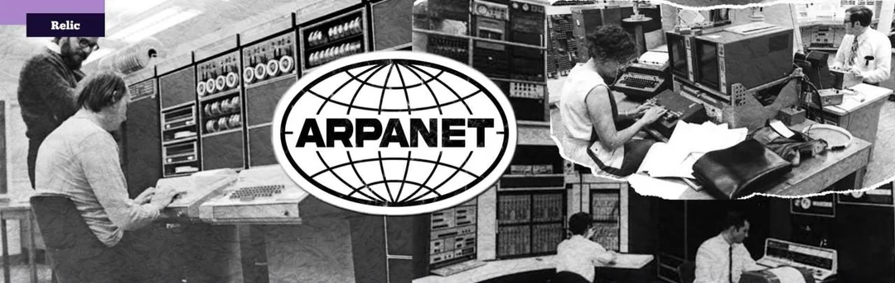
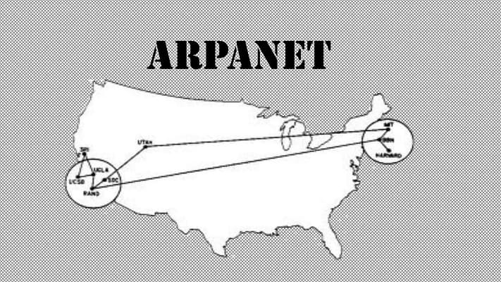
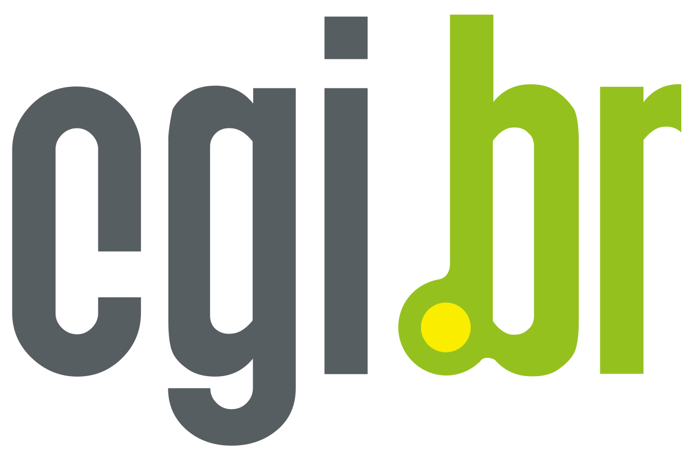
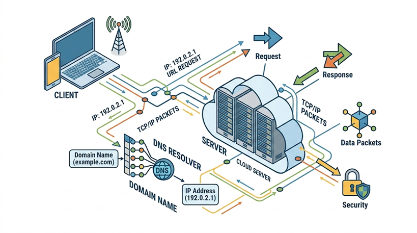
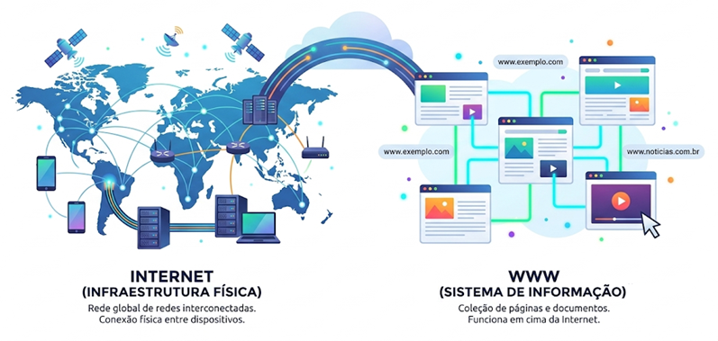
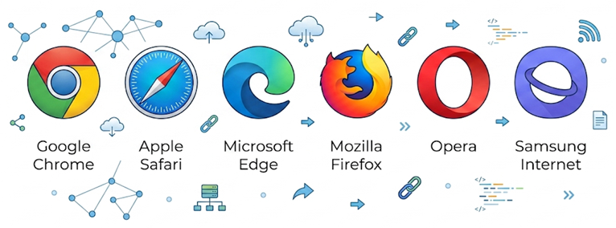
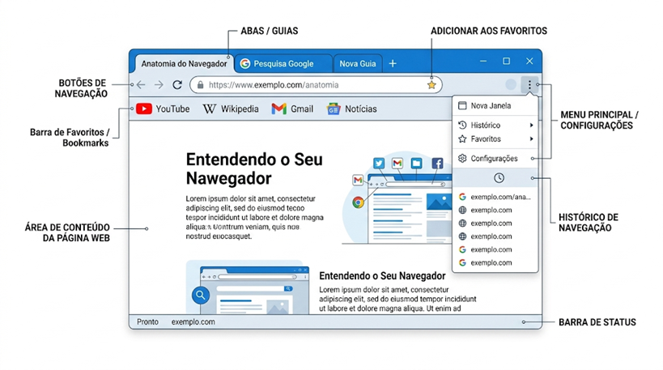
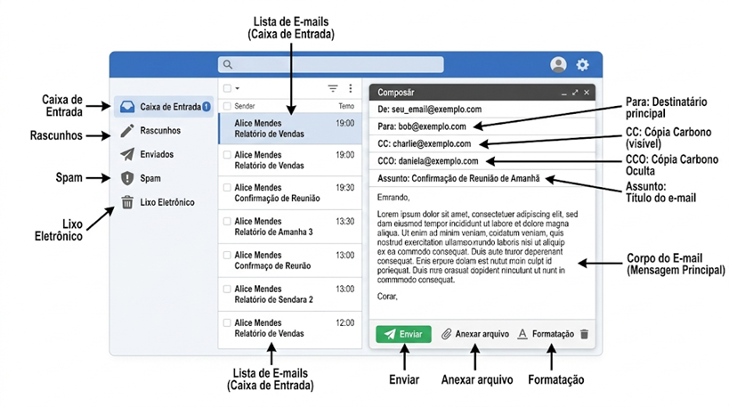
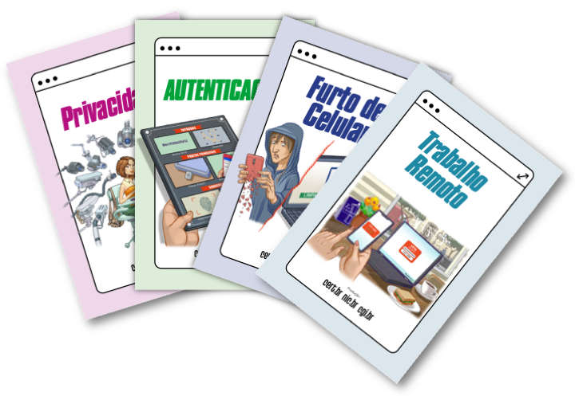
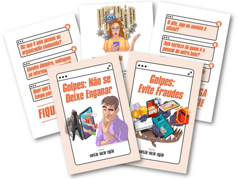

---
# --- INFORMAÇÕES DA AULA ---
title: "Internet"
subtitle: "Educação em Tecnologias Digitais"
author: "Prof. Alcemy Severino"
license: "CC BY-NC"
copyright: "© 2026 Alcemy Gabriel"
institute: "IFRN"
lang: pt-br

# --- CONFIGURAÇÃO VISUAL E TÉCNICA ---
format:
  revealjs:
    # Aparência
    theme: [default, ifrn]             # Carrega o CSS padrão + nossa personalização
    footer: "Operador de Computador" # Adiciona a nota de rodapé
    logo: img/ifrn-logo.png            # Certifique-se de ter essa imagem na pasta 'img'
    slide-number: true                 # Numeração de páginas no canto
    center: false                      # false = alinha conteúdo ao topo (melhor para aulas)
    
    # Interatividade (Lousa)
    chalkboard: 
      buttons: false                   # Botões ocultos (Use 'B' para lousa, 'C' para riscar slide)
    lightbox: true                     # Permite ampliar imagens para detalhes (útil para diagramas)
    
    # Navegação
    preview-links: auto                # Tenta abrir links dentro do slide sem sair da aula
    controls: true                     # Mostra setas de navegação
    controlsLayout: edges              # Setas grandes nas laterais esquerda/direita
    controlsTutorial: true             # Pisca a seta para indicar navegação
    touch: true                        # Melhora o uso em tablets/celulares
    
    # Código (Para suas aulas de Programação)
    code-line-numbers: true            # Permite referenciar linhas de código
    highlight-style: github            # Estilo de cores do código (claro e limpo)
---

## Objetivos da Aula

- Compreender o que é a Internet e sua história.
- Diferenciar a Internet da World Wide Web (WWW).
- Conhecer os principais navegadores e suas funções.
- Explorar serviços fundamentais: e-mail e sites de busca.
- Entender os princípios básicos de segurança na rede.

---

## O que é a Internet?{background-image="img/internet.png" background-size="cover" background-opacity="0.2"}

- A Internet é a "rede das redes".
- Uma infraestrutura global de computadores interconectados.
- Permite o compartilhamento de informações e recursos mundialmente.
- Utiliza um conjunto de protocolos padrão (TCP/IP) para comunicação.

---

## Um Breve Histórico

:::: {.columns}
::: {.column width="70%"}

- **Anos 1960:** Origem com a ARPANET (EUA) durante a Guerra Fria.
- **Objetivo inicial:** Descentralizar informações militares e acadêmicas.
- **Anos 1980/1990:** Expansão para o meio acadêmico global e comercial.
- **Hoje:** Indispensável para comunicação, trabalho, estudo e entretenimento.

:::
::: {.column width="30%"}

{width=100%}

{width=100%}

:::
::::

---

## A Internet no Brasil

:::: {.columns}
::: {.column width="60%"}

- **1988:** Primeiras conexões acadêmicas e científicas (FAPESP, LNCC).

:::
::: {.column width="40%"}

{fig-align="center" width=50%}

:::
::::

- **1995:** Abertura da Internet para fins comerciais no Brasil; Criação do Comitê Gestor da Internet no Brasil (CGI.br).
- Crescimento exponencial do acesso por banda larga e dispositivos móveis.

---

## Como a Internet Funciona?

:::: {.columns}
::: {.column width="60%"}

- **Cliente-Servidor:** Você (cliente) solicita uma informação, e um computador central (servidor) a envia.

:::
::: {.column width="40%"}

{fig-align="center"}

:::
::::

- **Endereço IP:** Cada dispositivo na rede possui uma identificação única (como um "CEP" digital).
- **DNS (Domain Name System):** Traduz nomes de sites (ex: www.google.com) para endereços IP compreensíveis pelas máquinas.

---

## Internet $\neq$ World Wide Web

- **Internet:** A infraestrutura física (cabos, roteadores, redes sem fio).
- **WWW:** Um dos serviços que rodam sobre a Internet.
  - Criada por Tim Berners-Lee em 1989.
  - Composta por páginas interligadas por hiperlinks, acessadas via navegadores.

---

## Internet $\neq$ World Wide Web

{fig-align="center" width=100%}

---

## Navegadores (Browsers)

- São softwares aplicativos usados para acessar e interagir com a WWW.
- Eles "traduzem" os códigos das páginas (HTML, CSS) para o formato visual que vemos.

{fig-align="center" width=80%}

---

## Recursos Comuns dos Navegadores

- **Barra de Endereços:** Para digitar a URL do site.
- **Abas/Guias:** Permitem abrir múltiplos sites na mesma janela.
- **Favoritos/Bookmarks:** Salvar sites para acesso rápido futuro.
- **Histórico:** Registro das páginas visitadas recentemente.

---

## Recursos Comuns dos Navegadores

{fig-align="center" width=100%}

---

## URL: O Endereço na Web

- **URL** (Uniform Resource Locator) é o endereço completo de uma página.
- **Estrutura básica:**
  - `http://` ou `https://` (Protocolo)
  - `www` (Subdomínio)
  - `meusite` (Domínio)
  - `.com.br` (Extensão/País)

---

## Correio Eletrônico (E-mail)

- Um dos serviços mais antigos e essenciais da Internet.
- Permite envio e recebimento de mensagens e arquivos (anexos).
- **Estrutura do endereço:** `nome_do_usuario @ provedor . com`
- Utilizado para comunicação formal, cadastros e recuperação de senhas.

---

## Como Funciona o E-mail

- **Caixa de Entrada (Inbox):** Onde chegam as mensagens.
- **Rascunhos:** Mensagens escritas, mas não enviadas.
- **Spam/Lixo Eletrônico:** Mensagens indesejadas (geralmente publicidade em massa ou golpes).
- **CC e CCO:** Com Cópia e Com Cópia Oculta.

---

## Como Funciona o E-mail

{fig-align="center" width=100%}

---

## Sites de Busca {background-image="img/search.png" background-size="cover" background-opacity="0.2"}

- Motores de pesquisa são sistemas projetados para encontrar informações na WWW.
- Eles rastreiam, indexam e ranqueiam as páginas da web.
- **Principal exemplo:** Google.
- **Outros:** Bing, Yahoo, DuckDuckGo.

---

## Dicas para Buscas Eficientes

- Use palavras-chave (foco no termo principal, evite frases longas).
- **Aspas duplas (" "):** Pesquisar pela frase exata.
- **Sinal de menos (-):** Excluir uma palavra da busca.
- **Tipo de arquivo (filetype:pdf):** Buscar apenas documentos em PDF.

---

## Computação na Nuvem {background-image="img/nuvens.png" background-size="cover" background-opacity="0.2"}

- Armazenamento e processamento de dados em servidores online.
- Você não precisa salvar tudo no seu pen drive ou disco rígido local.
- **Vantagem:** Acesso aos arquivos de qualquer lugar e qualquer dispositivo.
- **Ferramentas:** Google Drive, Microsoft OneDrive, Dropbox.

---

## Segurança na Internet

- **Malware:** Softwares maliciosos (vírus, cavalos de troia).
- **Phishing:** "Pescarias" digitais. E-mails ou sites falsos tentando roubar dados (senhas, cartões).
- **Engenharia Social:** Manipulação psicológica para enganar usuários.

---

## Dicas de Segurança

- **Senhas Fortes:** Misture letras maiúsculas, minúsculas, números e símbolos. Não use datas de nascimento.
- **Autenticação em Duas Etapas (2FA):** Uma camada extra de segurança (ex: código via SMS ou app).
- Mantenha sistemas operacionais, antivírus e navegadores atualizados.

---

## Cuidados com Downloads e Links

- Desconfie de e-mails urgentes ou promoções "boas demais para ser verdade".
- Verifique sempre o remetente real do e-mail.
- Faça downloads apenas de sites oficiais.
- Cuidado ao usar computadores públicos ou redes Wi-Fi abertas para acessar contas bancárias.

---

## Cartilhas CERT.br

- O CERT.br (Centro de Estudos, Resposta e Tratamento de Incidentes de Segurança no Brasil) oferece [cartilhas gratuitas](https://cartilha.cert.br/fasciculos/) sobre segurança na Internet.

:::: {.columns}
::: {.column width="50%"}

{fig-align="center"}

:::
::: {.column width="50%"}

{fig-align="center"}

:::
::::

---

## Cidadania Digital e Ética

- A Internet não é "terra sem lei".
- Tudo o que fazemos deixa um rastro digital (pegada digital).
- Respeito aos direitos autorais (evitar plágio em trabalhos acadêmicos).
- Cuidado com a disseminação de *Fake News* (Notícias Falsas); verifique a fonte antes de compartilhar.

---

## Resumo da Aula

- A Internet conecta o mundo e a Web facilita o acesso visual aos dados.
- Ferramentas como navegadores, e-mails e buscadores são a base da nossa interação digital.
- A nuvem transformou a forma como armazenamos arquivos.
- A segurança e a ética são responsabilidades de todos os usuários.

---

## Dúvidas?

- Perguntas, comentários ou contribuições?
- **Próxima aula:** Inteligência Artificial na Educação.
- **Leitura recomendada:** Cartilha de Segurança para Internet (CERT.br).
- Obrigado pela atenção!

---

## Referências utilizadas

::: {style="font-size: 0.8em;"}

- CERT.br. **Cartilha de Segurança para Internet**. Versão 4.0. CGI.br/NIC.br, 2012.
- Fustinoni, D. F. R.; Fernandes, F. C.; Leite, F. N. **Informática Básica para o Ensino Técnico Profissionalizante**. IFB, 2013.
- Borges, R. P.; Almeida, L. M. G. **Informática**. IFRN, 2014.
- Parreira, F. J. et al. **Aplicativos Computacionais Aplicados à Educação**. UFSM, 2017.
- Silveira, S. R. et al. **Metodologia do Ensino e da Aprendizagem em Informática**. UFSM, 2018.

:::

---

