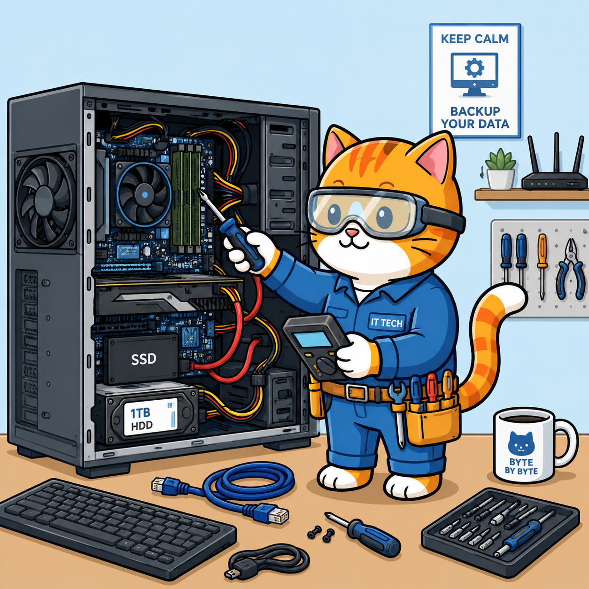

---
# --- INFORMAÇÕES DA AULA ---
title: "Manutenção de Computadores"
# subtitle: ""
author: "Prof. Alcemy Severino"
license: "CC BY-NC"
copyright: "© 2026 Alcemy Gabriel"
institute: "IFRN"
lang: pt-br

# --- CONFIGURAÇÃO VISUAL E TÉCNICA ---
format:
  revealjs:
    # Aparência
    theme: [default, ifrn]             # Carrega o CSS padrão + nossa personalização
    footer: "Manutenção de Computadores" # Adiciona a nota de rodapé
    logo: img/ifrn-logo.png            # Certifique-se de ter essa imagem na pasta 'img'
    slide-number: true                 # Numeração de páginas no canto
    center: false                      # false = alinha conteúdo ao topo (melhor para aulas)
    
    # Interatividade (Lousa)
    chalkboard: 
      buttons: false                   # Botões ocultos (Use 'B' para lousa, 'C' para riscar slide)
    
    # Navegação
    preview-links: auto                # Tenta abrir links dentro do slide sem sair da aula
    controls: true                     # Mostra setas de navegação
    controlsLayout: edges              # Setas grandes nas laterais esquerda/direita
    controlsTutorial: true             # Pisca a seta para indicar navegação
    touch: true                        # Melhora o uso em tablets/celulares
    
    # Código (Para suas aulas de Programação)
    code-line-numbers: true            # Permite referenciar linhas de código
    highlight-style: github            # Estilo de cores do código (claro e limpo)
---

## Apresentação da disciplina

:::: {.columns}
::: {.column width="55%"}

> Carga horária: **60H**

> 3INF1M: **Quintas-feiras / 7h00 às 8h30** e **Sextas-feiras / 10h20 às 12h00**

> 3INF1V: **Quintas-feiras e Sextas-feiras / 13h00 às 14h30**

> Duração: **20 semanas**

:::
::: {.column width="45%"}

{fig-align="center"}

:::
::::

---

### Ementa

::: {style="font-size: .9em"}
* Estudo de manutenção de computadores:
  * como manusear e utilizar peças e equipamentos de sistemas computacionais,
  * componentes físicos dos sistemas computacionais,
  * manutenção desses tipos de sistemas,
  * conhecimento das condições estruturais necessárias para desempenhar manutenções preventivas e corretivas em  computadores,
  * manutenções preventivas em sistemas computacionais e, se necessário, manutenções corretivas nesses sistemas,
  * suporte ao usuário (central de serviços, sistemas de chamados e softwares de suporte remoto) e
  * defeitos comuns em sistemas computacionais.
:::

---

### Objetivos

::: {style="font-size: .9em"}
* Compreender detalhes dos componentes físicos dos microcomputadores, com vista a uma utilização e manutenção mais eficientes.
* Realizar manutenções preventiva e corretiva avançadas em sistemas computacionais.
* Realizar manutenções preventiva e corretiva não convencionais em sistemas computacionais.
* Adquirir subsídios para compreender o funcionamento de outros equipamentos que surgirão e realizar sua
  manutenção.
* Manusear softwares de central de serviços e suporte ao usuário.
:::

---

### Bases científico-tecnológicas

1. Cuidados no manuseio e utilização de peças e equipamentos de sistemas computacionais.
1. Visão geral dos componentes físicos dos sistemas computacionais.
1. Manutenção de sistemas computacionais. 
    1. Ferramentas e procedimentos.
    1. Instalação dos componentes.
1. Condições reais e ideais de trabalho.
1. Manutenção preventiva em sistemas computacionais.

---

### Bases científico-tecnológicas

6. Manutenção corretiva em sistemas computacionais.
7. Manutenção preventiva e corretiva em sistemas computacionais portáteis.
8. Suporte ao usuário. 
    1. Apresentação da central de serviços e dos conceitos evento e incidente.
    1. Sistema de chamados e níveis de atendimento.
    1. Software de suporte remoto ao usuário.
9. Problemas mais comuns apresentados em sistemas computacionais e suas possíveis soluções.

---

### Métodos avaliativos

A avaliação se dará de forma contínua durante a disciplina, observando a assiduidade dos alunos em relação às aulas e a resolução de atividades.

{fig-align="center"}

---

## {background-image="img/a00_gato_duvidas.png"}

---

