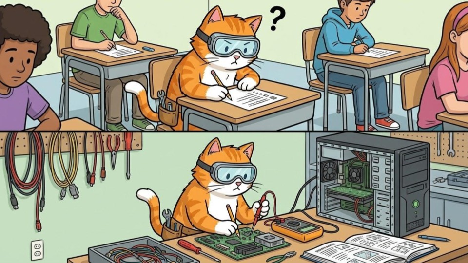

---
# --- INFORMAÇÕES DA AULA ---
title: "Organização e Manutenção de Computadores"
# subtitle: ""
author: "Prof. Alcemy Severino"
license: "CC BY-NC"
copyright: "© 2026 Alcemy Gabriel"
institute: "IFRN"
lang: pt-br

# --- CONFIGURAÇÃO VISUAL E TÉCNICA ---
format:
  revealjs:
    # Aparência
    theme: [default, ifrn]             # Carrega o CSS padrão + nossa personalização
    footer: "OMC"                      # Adiciona a nota de rodapé
    logo: img/ifrn-logo.png            # Certifique-se de ter essa imagem na pasta 'img'
    slide-number: true                 # Numeração de páginas no canto
    center: false                      # false = alinha conteúdo ao topo (melhor para aulas)
    
    # Interatividade (Lousa)
    chalkboard: 
      buttons: false                   # Botões ocultos (Use 'B' para lousa, 'C' para riscar slide)
    
    # Navegação
    preview-links: auto                # Tenta abrir links dentro do slide sem sair da aula
    controls: true                     # Mostra setas de navegação
    controlsLayout: edges              # Setas grandes nas laterais esquerda/direita
    controlsTutorial: true             # Pisca a seta para indicar navegação
    touch: true                        # Melhora o uso em tablets/celulares
    
    # Código (Para suas aulas de Programação)
    code-line-numbers: true            # Permite referenciar linhas de código
    highlight-style: github            # Estilo de cores do código (claro e limpo)
---

## Apresentação da disciplina

:::: {.columns}
::: {.column width="55%"}

> Carga horária: **60H**

> Dia da semana: **Quintas-feiras**

> Horário: **8h50 às 10h20**

> Duração: **40 semanas**

:::
::: {.column width="45%"}

{fig-align="center"}

:::
::::

---

### Ementa

**Estudo da organização de computadores:**

* organização de computadores e seus conceitos,
* unidade central de processamento e suas características,
* diversos tipos de sistemas encontrados em sistemas computacionais:
    * sistemas de memória,
    * sistema de interconexão
    * e sistemas de entrada e saída.

---

### Ementa

**Noções de montagem de computadores:**

* identificação do hardware dos sistemas computacionais,
* montagem de computadores e instalação dos componentes,
* configuração do sistema operacional,
* sistemas de backup
* e especificação de equipamentos para sistemas computacionais.

---

### Objetivos

::: {style="font-size: .9em"}
* Apreender os conceitos básicos relacionados à estrutura e funcionamento dos computadores digitais. 
* Compreender o funcionamento dos microcomputadores e periféricos. 
* Identificar os componentes físicos dos microcomputadores e compreender suas funcionalidades. 
* Executar montagem, instalação e configuração de equipamentos de informática. 
* Instalar e configurar sistemas operacionais e aplicativos em equipamentos computacionais.
:::

---

### Bases científico-tecnológicas

1. **Organização de Computadores**
    1. Introdução à organização de computadores. 
    1.  Unidade central de processamento. 
    1. Sistema de memória. 
    1. Sistema de interconexão.
    1. Sistema de entrada, saída e periféricos.

---

### Bases científico-tecnológicas

2. **Montagem de computadores**
    1. Introdução.
    1. Visão geral do hardware para computador.
    1. Identificação de componentes e montagem de computadores.
    1. Instalação e configuração do sistema operacional.
    1. Especificação de equipamentos de informática.

---

### Métodos avaliativos

A avaliação se dará de forma contínua durante a disciplina, observando a assiduidade dos alunos em relação às aulas e a resolução de atividades.

{fig-align="center"}

---

## {background-image="img/gato_duvidas.png"}

---

<small>Este material foi produzido pelo **Prof. Alcemy Gabriel** para uso educacional.</small>

::: {.callout-note icon=false}
## <i class="fa-brands fa-creative-commons"></i> Licença de Uso (CC BY-NC 4.0)

Você tem o direito de:
<ul>
  <li><i class="fa-solid fa-share-nodes"></i> <strong>Compartilhar:</strong> copiar e redistribuir o material.</li>
  <li><i class="fa-solid fa-pen-to-square"></i> <strong>Adaptar:</strong> remixar, transformar e criar a partir do material.</li>
</ul>

Sob as seguintes condições:
<ol>
  <li><strong>Atribuição:</strong> Você deve dar o crédito apropriado ao autor.</li>
  <li><strong>Não Comercial:</strong> Você <strong>não</strong> pode usar o material para fins comerciais.</li>
</ol>

:::

  

<small>Para uso comercial ou outras finalidades não listadas, entre em contato para solicitar autorização.</small>