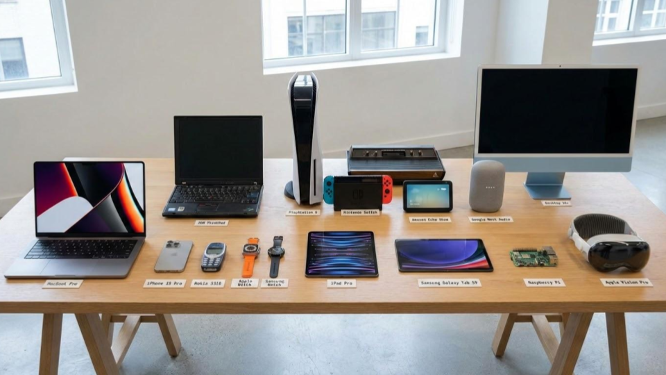
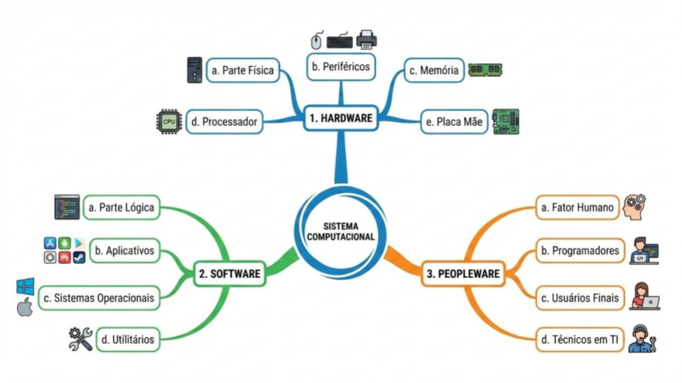
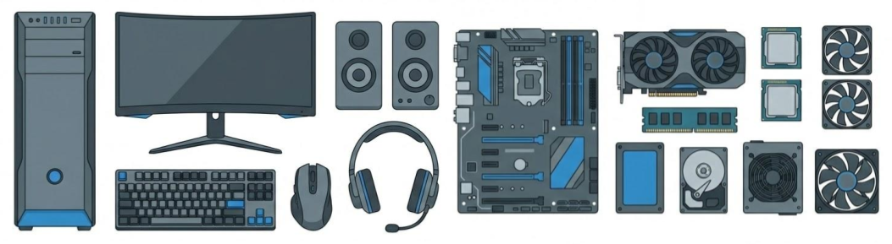
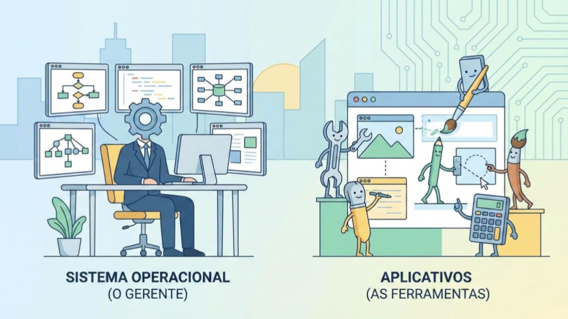
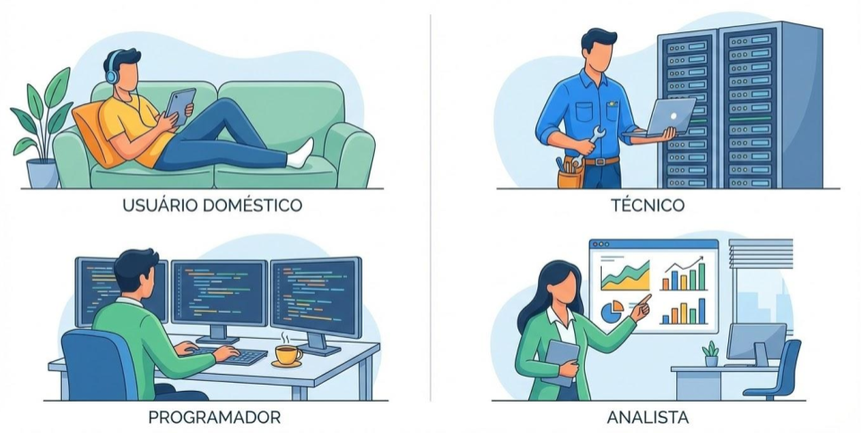
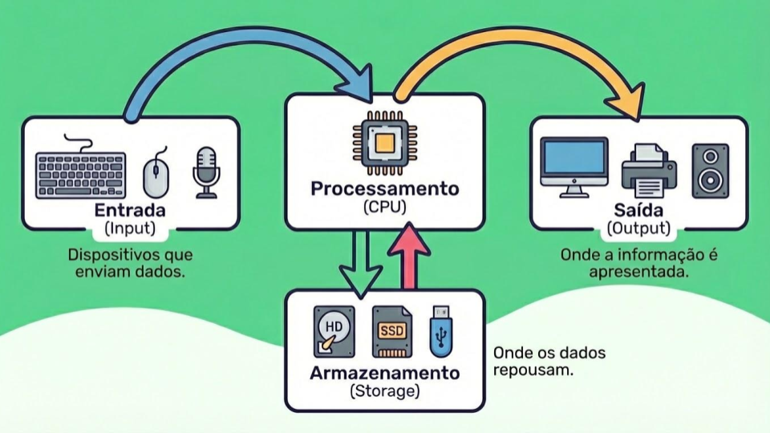
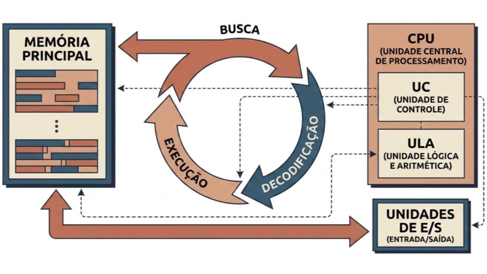
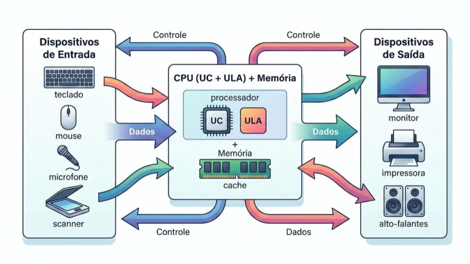
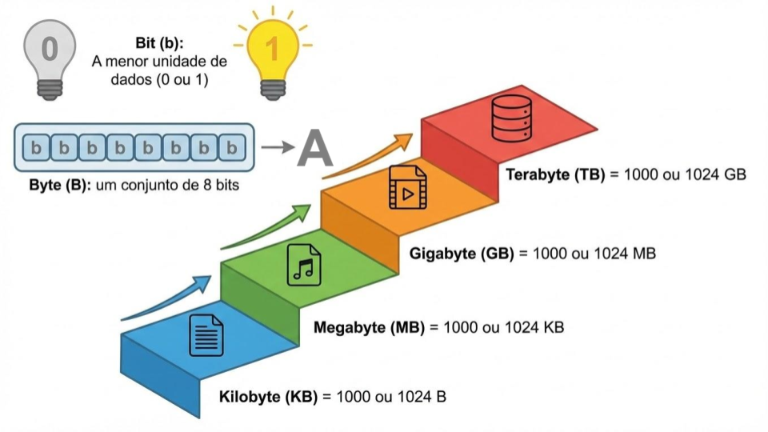

---
# --- INFORMAÇÕES DA AULA ---
title: "Introdução à organização de computadores"
subtitle: "Conceitos básicos e terminologias usadas nos sistemas de informática"
author: "Prof. Alcemy Severino"
license: "CC BY-NC"
copyright: "© 2026 Alcemy Gabriel"
institute: "IFRN"
lang: pt-br

# --- CONFIGURAÇÃO VISUAL E TÉCNICA ---
format:
  revealjs:
    # Aparência
    theme: [default, ifrn_2]            # Carrega o CSS padrão + nossa personalização
    footer: "OMC"                       # Adiciona a nota de rodapé
    logo: img/ifrn-logo.png             # Certifique-se de ter essa imagem na pasta 'img'
    slide-number: true                  # Numeração de páginas no canto
    center: false                       # false = alinha conteúdo ao topo (melhor para aulas)
    
    # Interatividade (Lousa)
    chalkboard: 
      buttons: false                   # Botões ocultos (Use 'B' para lousa, 'C' para riscar slide)
    lightbox: true                     # Permite ampliar imagens para detalhes (útil para diagramas)
    
    # Navegação
    preview-links: auto                # Tenta abrir links dentro do slide sem sair da aula
    controls: true                     # Mostra setas de navegação
    controls-layout: edges             # Setas grandes nas laterais esquerda/direita
    controls-tutorial: true            # Pisca a seta para indicar navegação
    touch: true                        # Melhora o uso em tablets/celulares
    
    # Código (Para suas aulas de Programação)
    code-line-numbers: true            # Permite referenciar linhas de código
    highlight-style: github            # Estilo de cores do código (claro e limpo)
---

## O que define um computador?

Um *smartwatch* é um computador? E uma calculadora de padaria? E um PS5?

{fig-align="center" width="80%"}

---

### Conceito

<mark>com·pu·ta·dor</mark> (sm)^[Fonte: https://michaelis.uol.com.br/moderno-portugues/busca/portugues-brasileiro/computador/]

1. Aquele ou aquilo que calcula baseado em valores digitais; calculador, calculista.
2. Inform Máquina destinada ao recebimento, armazenamento e/ou processamento de dados, em pequena ou grande escala, de forma rápida, conforme um programa específico; computador eletrônico.

---

### O computador 🖥️

:::: {.columns}
::: {.column width="40%"}

> Então, podemos concluir que o computador é qualquer máquina eletrônica programável que recebe dados, processa-os e devolve informação.

:::
::: {.column width="60%"}

](https://images.unsplash.com/photo-1651570095137-500ac393a2d9?q=80&w=2070&auto=format&fit=crop&ixlib=rb-4.1.0&ixid=M3wxMjA3fDB8MHxwaG90by1wYWdlfHx8fGVufDB8fHx8fA%3D%3D){fig-align="center"}

:::
::::

---

### A tríade do sistema computacional

---

#### *Hardware*

> **Definição:** Tudo o que é tangível. Componentes elétricos, eletrônicos e mecânicos.

---

#### *Software*

> **Definição:** Conjunto de instruções que dizem ao hardware o que fazer.

{fig-align="center" width="75%"}

* Onde fica o software quando o PC está desligado?

---

#### *Peopleware*

> **Definição:** O fator humano. Usuários domésticos, técnicos, programadores, analistas. Sem o humano, o computador não tem propósito.

{fig-align="center" width="80%"}

---

{fig-align="center"}

---

### O ciclo de processamento de dados

{fig-align="center"}

---

#### Arquitetura de Von Neumann

{fig-align="center"}

---

{fig-align="center"}

---

#### Dados *vs* Informação

* **Dado**: Elemento bruto.
  * Ex: as notas 5, 8, 7.
* **Processamento**: Cálculo da média.
* **Informação**: Resultado útil.
  * Ex: aluno aprovado com média 6.6.

---

#### Unidades de medida

{fig-align="center"}

---

## {background-image="img/fry_1.png"}

---

