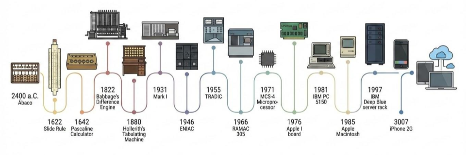
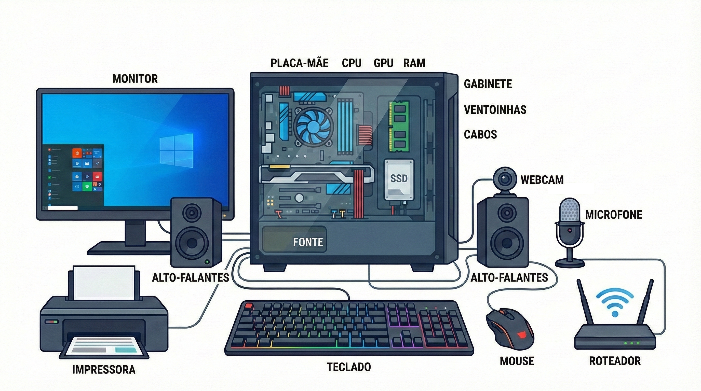
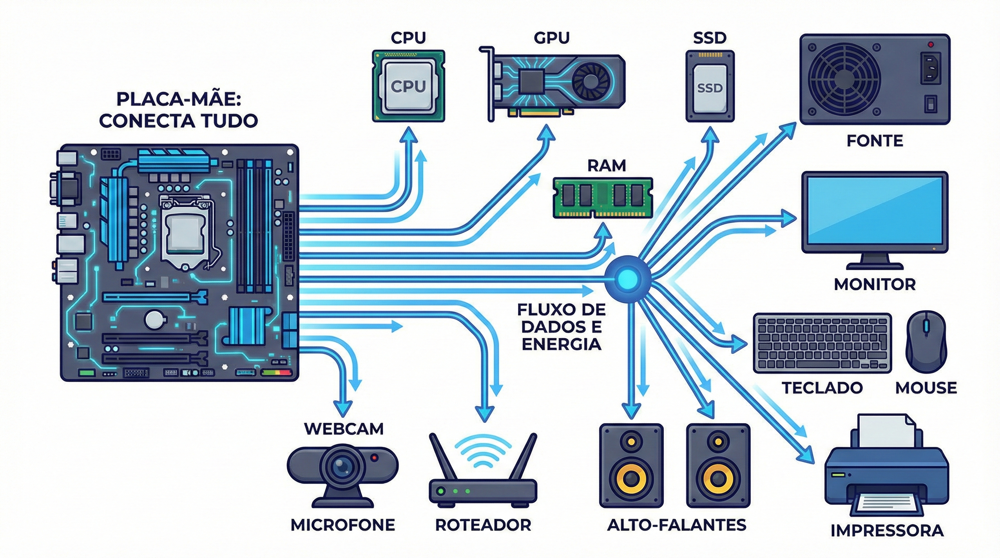
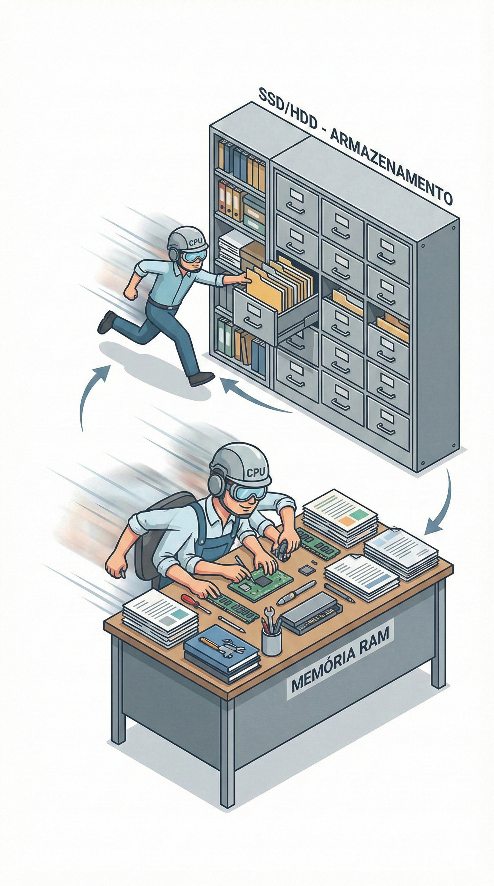
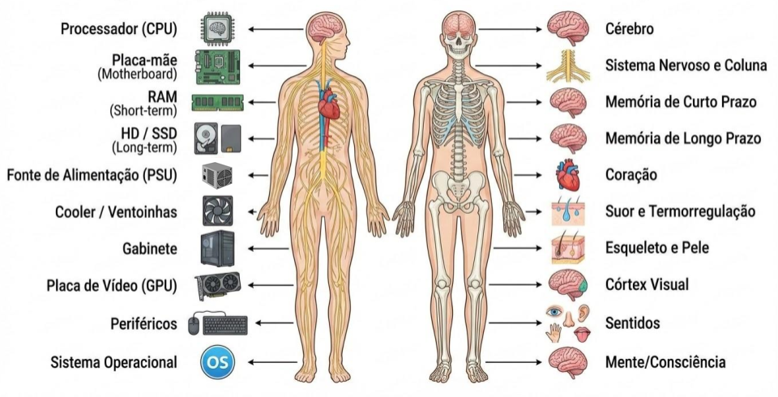

---
# --- INFORMAÇÕES DA AULA ---
draft: true             # Indica que é um rascunho
title: "Introdução à organização de computadores"
subtitle: "Evolução histórica dos componentes internos e externos do computador"
author: "Prof. Alcemy Severino"
license: "CC BY-NC"
copyright: "© 2026 Alcemy Gabriel"
institute: "IFRN"
lang: pt-br

# --- CONFIGURAÇÃO VISUAL E TÉCNICA ---
format:
  revealjs:
    # Aparência
    theme: [default, ifrn]             # Carrega o CSS padrão + nossa personalização
    footer: "OMC"                      # Adiciona a nota de rodapé
    logo: img/ifrn-logo.png            # Certifique-se de ter essa imagem na pasta 'img'
    slide-number: true                 # Numeração de páginas no canto
    center: false                      # false = alinha conteúdo ao topo (melhor para aulas)
    
    # Interatividade (Lousa)
    chalkboard: 
      buttons: false                   # Botões ocultos (Use 'B' para lousa, 'C' para riscar slide)
    
    # Navegação
    preview-links: auto                # Tenta abrir links dentro do slide sem sair da aula
    controls: true                     # Mostra setas de navegação
    controlsLayout: edges              # Setas grandes nas laterais esquerda/direita
    controlsTutorial: true             # Pisca a seta para indicar navegação
    touch: true                        # Melhora o uso em tablets/celulares
    
    # Código (Para suas aulas de Programação)
    code-line-numbers: true            # Permite referenciar linhas de código
    highlight-style: github            # Estilo de cores do código (claro e limpo)
---

## Anatomia e evolução do *hardware*

{fig-align="center"}

> Do que é feito um PC e como ele diminuiu tanto?

---

### O que temos dentro da caixa?

{fig-align="center"}

---

#### Placa mãe

:::: {.columns}
::: {.column width="50%"}

É a placa principal do computador. Ela conecta os componentes de hardware e permite que eles se comuniquem entre si, pois é nela que os dados trafegam pelos barramentos. Além disso, a placa-mãe concentra os principais encaixes e conexões do equipamento.

:::
::: {.column width="50%"}

](https://images.unsplash.com/photo-1712701815718-29f5fe510c0e?q=80&w=1974&auto=format&fit=crop&ixlib=rb-4.1.0&ixid=M3wxMjA3fDB8MHxwaG90by1wYWdlfHx8fGVufDB8fHx8fA%3D%3D){fig-align="center"}

:::
::::

---

#### Placa mãe

{fig-align="center"}

---

#### Processador vs Memória Principal

:::: {.columns}
::: {.column width="63%"}

**Processador:** “cérebro” do computador. Executa instruções e faz os cálculos que controlam programas e o sistema operacional. 

**Memória principal:** memória rápida e temporária usada enquanto o computador está ligado. Guarda dados e programas “em uso” para acesso rápido pelo processador. Ao desligar, o conteúdo é perdido.

:::
::: {.column width="37%"}

:::
::::

---

#### Disco rígido *vs* SDD

**Disco rígido:** armazenamento permanente (não perde dados ao desligar) que usa discos magnéticos girando. Em geral é mais barato e com grande capacidade, porém mais lento e sensível a impactos.

**SSD (*Solid State Drive*):** armazenamento permanente como o HD, mas feito com memória *flash* (sem partes móveis). É muito mais rápido, silencioso e resistente a impactos do que disco rígido.

---

### Comparando com o corpo humano

{fig-align="center"}

---

