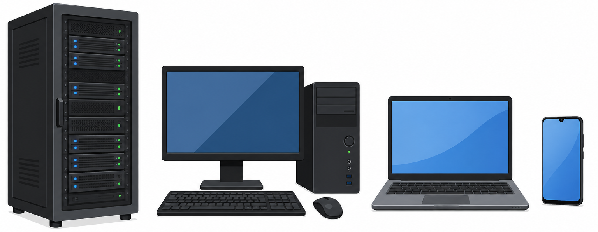
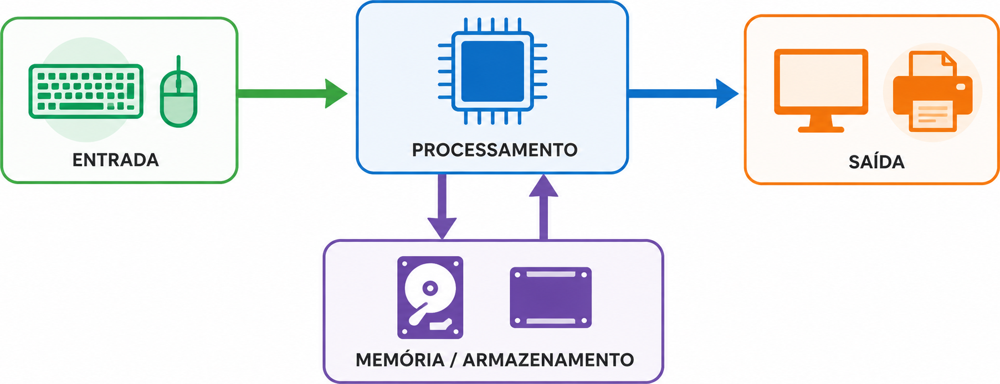
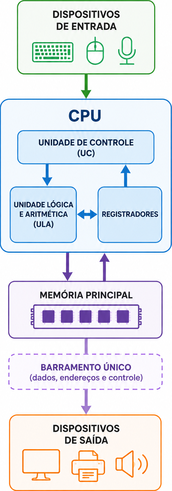
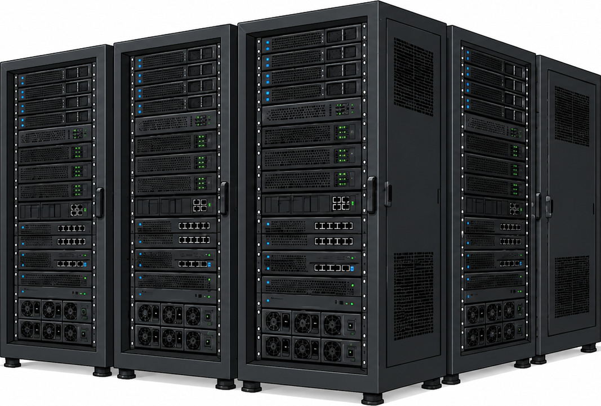
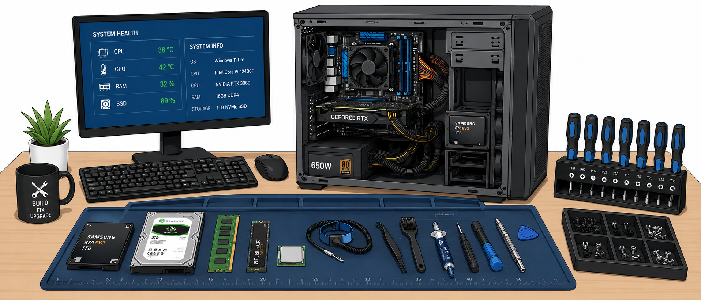
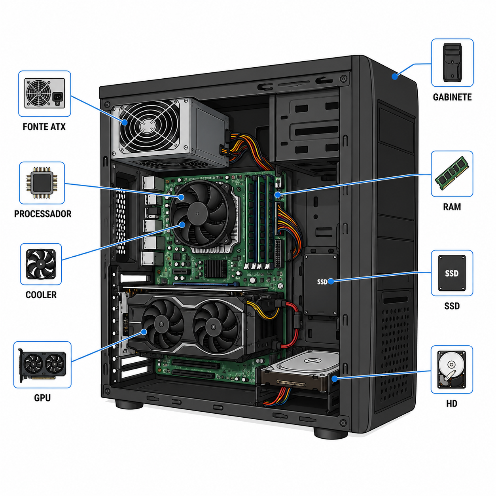
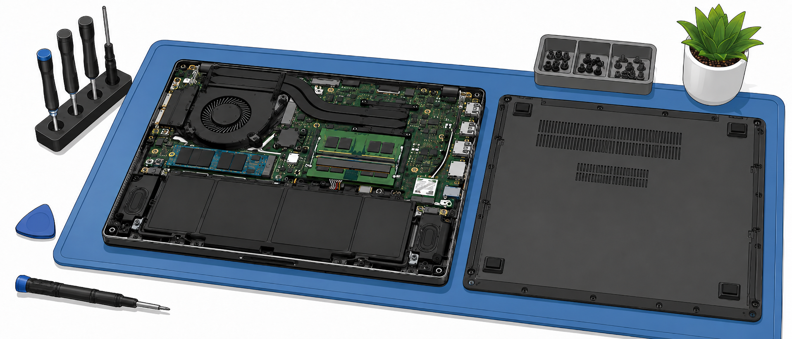
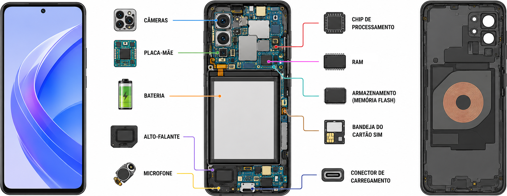
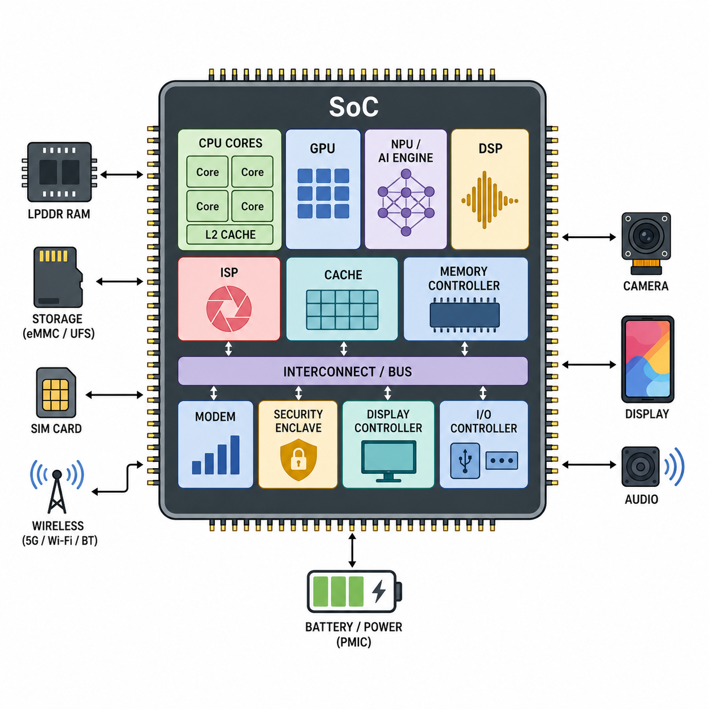

---
# --- INFORMAÇÕES DA AULA ---
draft: true             # Indica que é um rascunho
title: "Diferenças entre o hardware para Servidores, Desktops e Notebooks"
subtitle: "Introdução à organização de computadores"
author: "Prof. Alcemy Severino"
license: "CC BY-NC"
copyright: "© 2026 Alcemy Gabriel"
institute: "IFRN"
lang: pt-br

# --- CONFIGURAÇÃO VISUAL E TÉCNICA ---
format:
  revealjs:
    # Aparência
    theme: [default, ifrn_2]            # Carrega o CSS padrão + nossa personalização
    footer: "OMC" # Adiciona a nota de rodapé
    logo: img/ifrn-logo.png             # Certifique-se de ter essa imagem na pasta 'img'
    slide-number: true                  # Numeração de páginas no canto
    center: false                       # false = alinha conteúdo ao topo (melhor para aulas)

    # Interatividade (Lousa)
    chalkboard:
      buttons: false                   # Botões ocultos (Use 'B' para lousa, 'C' para riscar slide)
    lightbox: true                     # Permite ampliar imagens para detalhes (útil para diagramas)

    # Navegação
    preview-links: auto                # Tenta abrir links dentro do slide sem sair da aula
    controls: true                     # Mostra setas de navegação
    controls-layout: edges             # Setas grandes nas laterais esquerda/direita
    controls-tutorial: true            # Pisca a seta para indicar navegação
    touch: true                        # Melhora o uso em tablets/celulares

    # Código (Para suas aulas de Programação)
    code-line-numbers: true            # Permite referenciar linhas de código
    highlight-style: github            # Estilo de cores do código (claro e limpo)
---

## Arquitetura geral dos computadores

:::: {.columns}
::: {.column width="60%"}
::: {.box}
**Pergunta norteadora:** o que muda por dentro quando comparamos um servidor, um desktop, um notebook e um smartphone?
:::
:::
::: {.column width="40%"}
> A aparência muda bastante, mas a lógica básica de funcionamento permanece semelhante.
:::
::::

{fig-align="center" width="65%"}

---

### Objetivos da aula

Ao final desta aula, você deverá ser capaz de:

- explicar a arquitetura geral de um sistema computacional;
- relacionar entrada, processamento, memória, armazenamento e saída;
- diferenciar servidores, desktops, notebooks e dispositivos móveis;
- identificar vantagens, limitações e contextos de uso de cada tipo de equipamento;
- justificar escolhas de equipamentos de acordo com uma necessidade real.

---

### A função do computador

Um computador recebe **dados**, executa **instruções**, armazena resultados e apresenta **informações** ao usuário ou a outro sistema.

::: {.box .small}
**Entrada → processamento → armazenamento/memória → saída**
:::

Mesmo equipamentos muito diferentes seguem essa lógica.

{fig-align="center" width="70%"}

---

### Componentes da arquitetura geral 

::: {.Tiny}
| Parte | Função principal | Exemplos |
|---|---|---|
| Entrada | Receber dados e comandos | teclado, mouse, tela sensível ao toque, câmera |
| Processamento | Executar instruções e cálculos | CPU, GPU, NPU, SoC |
| Memória principal | Guardar dados temporários em uso | RAM |
| Armazenamento | Guardar dados permanentemente | HD, SSD, eMMC |
| Saída | Apresentar resultados | monitor, alto-falantes, impressora |
| Interconexão | Permitir comunicação interna | placa-mãe, barramentos, controladores |
:::

---

### Arquitetura de Von Neumann

:::: {.columns}
::: {.column width="78%"}

Na arquitetura clássica de computadores, **dados e instruções ficam armazenados na memória** e são buscados pela unidade de processamento.

A CPU executa um ciclo básico:

1. busca uma instrução na memória;
2. decodifica o que deve ser feito;
3. executa a operação;
4. grava ou envia o resultado.

:::
::: {.column width="22%"}

:::
::::

---

### Um computador como sistema

::: {.box}
Um computador não é apenas um conjunto de peças. Ele é um **sistema** em que cada componente depende dos demais para funcionar corretamente.
:::

Exemplo:

- um processador rápido precisa de memória suficiente;
- um SSD NVMe precisa de interface compatível;
- uma GPU dedicada precisa de energia e refrigeração adequadas;
- um notebook potente precisa equilibrar desempenho, bateria e temperatura.

---

### Comparando os tipos de computadores

::: {.Tiny}
| Tipo | Prioridade comum | Característica marcante |
|---|---|---|
| Servidor | disponibilidade, segurança e processamento contínuo | funciona para atender outros computadores ou usuários |
| Desktop | desempenho, expansão e manutenção | gabinete com componentes substituíveis |
| Notebook | portabilidade e integração | tela, teclado, bateria e hardware no mesmo corpo |
| Dispositivo móvel | mobilidade extrema e autonomia | uso de SoC e forte integração dos componentes |
:::

---

## Servidores

::: {.box .center}
Servidor é um computador projetado para fornecer serviços, dados ou recursos para outros computadores, sistemas ou usuários.
:::

{fig-align="center" width="50%"}

---

### Onde encontramos servidores?

- armazenamento de arquivos de uma instituição;
- sistemas acadêmicos, administrativos e financeiros;
- hospedagem de sites e aplicações web;
- bancos de dados;
- autenticação de usuários;
- backups corporativos;
- virtualização de vários sistemas em uma mesma máquina física.

---

### Características comuns em servidores

:::: {.columns}
::: {.column width="50%"}

**Hardware**

- processadores voltados para carga contínua;
- grande quantidade de RAM;
- armazenamento redundante;
- fontes redundantes em alguns modelos;
- placas de rede de maior desempenho.

:::
::: {.column width="50%"}

**Operação**

- funcionamento 24/7;
- foco em estabilidade;
- monitoramento constante;
- manutenção planejada;
- maior controle de acesso físico e lógico.

:::
::::

---

### Servidor não é apenas “um PC potente”

::: {.warning}
Um servidor pode até parecer um computador comum, mas sua finalidade muda os critérios de escolha.
:::

No servidor, normalmente são mais importantes:

- confiabilidade;
- disponibilidade;
- redundância;
- segurança;
- capacidade de atendimento simultâneo;
- facilidade de manutenção.

---

## Desktops

::: {.box .center}
Desktop é o computador de mesa tradicional, geralmente formado por gabinete, monitor, teclado, mouse e periféricos.
:::

{fig-align="center" width="80%"}

---

### Por que o desktop ainda é importante?

- facilita a substituição de peças;
- permite melhor refrigeração;
- oferece mais opções de expansão;
- costuma ter melhor custo-desempenho;
- é adequado para laboratórios, escritórios, manutenção, jogos, edição e programação.

::: {.box}
Para a disciplina de montagem, o desktop é o principal equipamento de estudo, porque permite visualizar e manipular melhor os componentes internos.
:::

---

### Componentes típicos de um desktop

:::: {.columns}
::: {.column width="35%"}

- gabinete;
- placa-mãe;
- processador;
- cooler;
- RAM;
- fonte ATX;
- SSD ou HD;
- placas de expansão.

:::
::: {.column width="65%"}

{fig-align="center" width="90%"}

:::
::::

---

### Desktop: vantagens e limitações

:::: {.columns}
::: {.column width="50%"}

**Vantagens**

- maior facilidade de manutenção;
- melhor possibilidade de upgrade;
- maior variedade de peças;
- boa refrigeração;
- custo geralmente mais flexível.

:::
::: {.column width="50%"}

**Limitações**

- pouca mobilidade;
- ocupa mais espaço;
- depende de energia elétrica constante;
- exige periféricos externos.

:::
::::

---

## Notebooks

::: {.box .center}
Notebook é um computador portátil que integra tela, teclado, touchpad, bateria, placa-mãe, memória, armazenamento e interfaces em um único equipamento.
:::

{fig-align="center" width="80%"}

---

### O que muda no notebook?

Em um notebook, o projeto precisa equilibrar:

:::: {.columns}
::: {.column width="50%"}
- desempenho;
- consumo de energia;
- autonomia de bateria;
- peso;
:::
::: {.column width="50%"}
- espessura;
- aquecimento;
- ruído;
- possibilidade de manutenção.
:::
::::

::: {.warning}
Quanto mais compacto o equipamento, maior tende a ser a integração dos componentes e menor a liberdade de substituição.
:::

---

### Componentes em notebooks

::: {.small}
| Componente | Como aparece no notebook |
|---|---|
| Processador | geralmente soldado ou integrado à placa-mãe |
| RAM | pode ser soldada, removível ou mista |
| Armazenamento | SSD M.2, SSD SATA, HD em modelos antigos |
| Placa de vídeo | integrada ou dedicada em alguns modelos |
| Tela | integrada ao equipamento |
| Bateria | interna ou removível, dependendo do modelo |
| Refrigeração | heatpipes, ventoinhas e dissipadores compactos |
:::

---

### Notebook: vantagens e limitações

:::: {.columns}
::: {.column width="50%"}

**Vantagens**

- portabilidade;
- bateria integrada;
- ocupa pouco espaço;
- já inclui tela, teclado, touchpad, câmera e rede sem fio.

:::
::: {.column width="50%"}

**Limitações**

- manutenção mais delicada;
- menor possibilidade de upgrade;
- refrigeração limitada;
- peças específicas por modelo;
- maior risco de dano em quedas e transporte.

:::
::::

---

## Dispositivos móveis

::: {.box .center}
Smartphones e tablets são computadores altamente integrados, projetados para mobilidade, conectividade e baixo consumo de energia.
:::

{fig-align="center" width="80%"}

---

### O papel do SoC

Nos dispositivos móveis, muitos componentes ficam reunidos em um único chip chamado **SoC** (*System-on-a-Chip*).

:::: {.columns}
::: {.column width="50%"}

Um SoC pode integrar:

- CPU;
- GPU;
- NPU;
- controladores de memória;
- módulos de comunicação;
- processamento de imagem;
- recursos de segurança.

:::
::: {.column width="50%"}

{fig-align="center" width="99%"}

:::
::::

---

### Por que o celular esquenta?

::: {.box}
Todo computador transforma parte da energia elétrica em calor. Em dispositivos móveis, o espaço para dissipar esse calor é muito limitado.
:::

Quando o aparelho executa tarefas pesadas, como jogos, gravação de vídeo, chamadas longas ou uso intenso de rede, o sistema pode reduzir o desempenho para controlar a temperatura.

Esse comportamento é chamado de **limitação térmica** ou *thermal throttling*.

---

### Dispositivos móveis: vantagens e limitações

:::: {.columns}
::: {.column width="50%"}

**Vantagens**

- alta mobilidade;
- bateria de longa duração;
- câmera, sensores e conectividade integrados;
- interface por toque;
- uso imediato em qualquer lugar.

:::
::: {.column width="50%"}

**Limitações**

- pouca manutenção pelo usuário;
- componentes fortemente integrados;
- armazenamento e memória geralmente não substituíveis;
- menor capacidade de refrigeração;
- maior dependência do ecossistema do fabricante.

:::
::::

---

### Comparação técnica: o que observar?

::: {.Tiny}
| Critério | Servidor | Desktop | Notebook | Dispositivo móvel |
|---|---|---|---|---|
| Portabilidade | baixa | baixa | alta | muito alta |
| Expansão | alta | alta | média/baixa | muito baixa |
| Manutenção | técnica especializada | mais acessível | delicada | muito restrita |
| Consumo | alto | médio/alto | médio/baixo | baixo |
| Refrigeração | robusta | boa | compacta | muito limitada |
| Uso principal | serviços contínuos | produtividade e desempenho | mobilidade | comunicação e uso cotidiano |
:::

---

### Escolher um computador é entender o uso

::: {.box}
Não existe “o melhor computador” de forma absoluta. Existe o equipamento mais adequado para uma necessidade, um orçamento e um contexto de uso.
:::

Antes de escolher, pergunte:

:::: {.columns}
::: {.column width="50%"}
- Quem vai usar?
- Para quais tarefas?
- Onde será usado?
- Precisa ser transportado?

:::
::: {.column width="50%"}
- Precisa durar muitos anos?
- Será fácil fazer manutenção?
- O orçamento é limitado?

:::
::::

---

### Estudo de caso 1

Uma escola precisa comprar computadores para um laboratório de informática usado em aulas de programação, edição de documentos, navegação e atividades de manutenção básica.

::: {.callout-tip}
**Pergunta:** desktop, notebook ou dispositivo móvel? Justifique tecnicamente.
:::

::: {.fragment .answer}
Resposta esperada: desktops tendem a ser mais adequados pela facilidade de manutenção, expansão, substituição de peças e uso em laboratório fixo.
:::

---

### Estudo de caso 2

Uma equipe administrativa precisa acessar sistemas institucionais, produzir documentos, participar de reuniões on-line e transportar o equipamento entre setores e reuniões.

::: {.callout-tip}
**Pergunta:** desktop, notebook ou servidor? Justifique tecnicamente.
:::

::: {.fragment .answer}
Resposta esperada: notebooks podem ser mais adequados pela mobilidade, bateria e integração de câmera, microfone, teclado, tela e rede sem fio.
:::

---

### Estudo de caso 3

Uma instituição precisa hospedar um sistema interno usado por muitos usuários ao mesmo tempo, armazenar dados com segurança e manter o serviço disponível continuamente.

::: {.callout-tip}
**Pergunta:** por que um servidor é mais adequado que um desktop comum?
:::

::: {.fragment .answer}
Resposta esperada: o servidor é projetado para disponibilidade, acesso simultâneo, redundância, segurança, monitoramento e operação contínua.
:::

---

### Atividade: classifique o equipamento

Em dupla, escolha um equipamento que você usa no cotidiano e registre:

1. tipo: servidor, desktop, notebook, tablet ou smartphone;
2. principais componentes de entrada;
3. principais componentes de saída;
4. forma de armazenamento;
5. vantagens do equipamento;
6. limitações do equipamento.

> Tempo sugerido: 10 minutos.

---

### Atividade prática: tabela comparativa

Preencha a tabela a seguir com base em pesquisa, observação ou conhecimento prévio.

::: {.Tiny}
| Equipamento | Uso principal | Pontos fortes | Limitações | Exemplo de aplicação |
|---|---|---|---|---|
| Servidor |  |  |  |  |
| Desktop |  |  |  |  |
| Notebook |  |  |  |  |
| Smartphone/tablet |  |  |  |  |
:::

---

### Síntese da aula

- A arquitetura geral envolve entrada, processamento, memória, armazenamento, saída e interconexão.
- Servidores priorizam disponibilidade, segurança e atendimento simultâneo.
- Desktops priorizam expansão, manutenção e desempenho com bom custo.
- Notebooks priorizam portabilidade e integração.
- Dispositivos móveis priorizam mobilidade, autonomia e baixo consumo.
- A escolha técnica depende do perfil de uso, das limitações e do contexto.

---

## {background-image="img/fry_1.png"}

---


