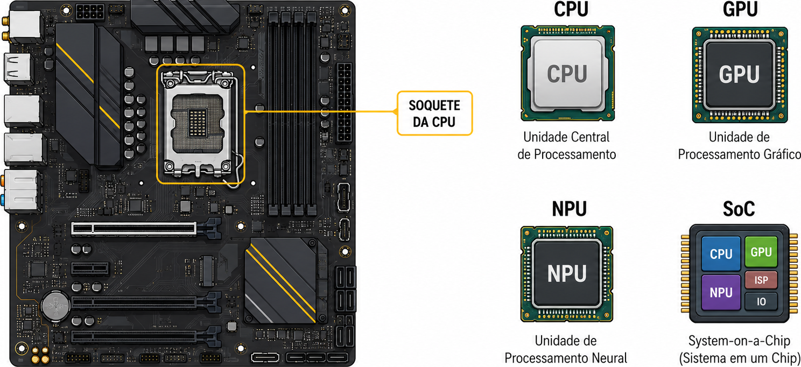
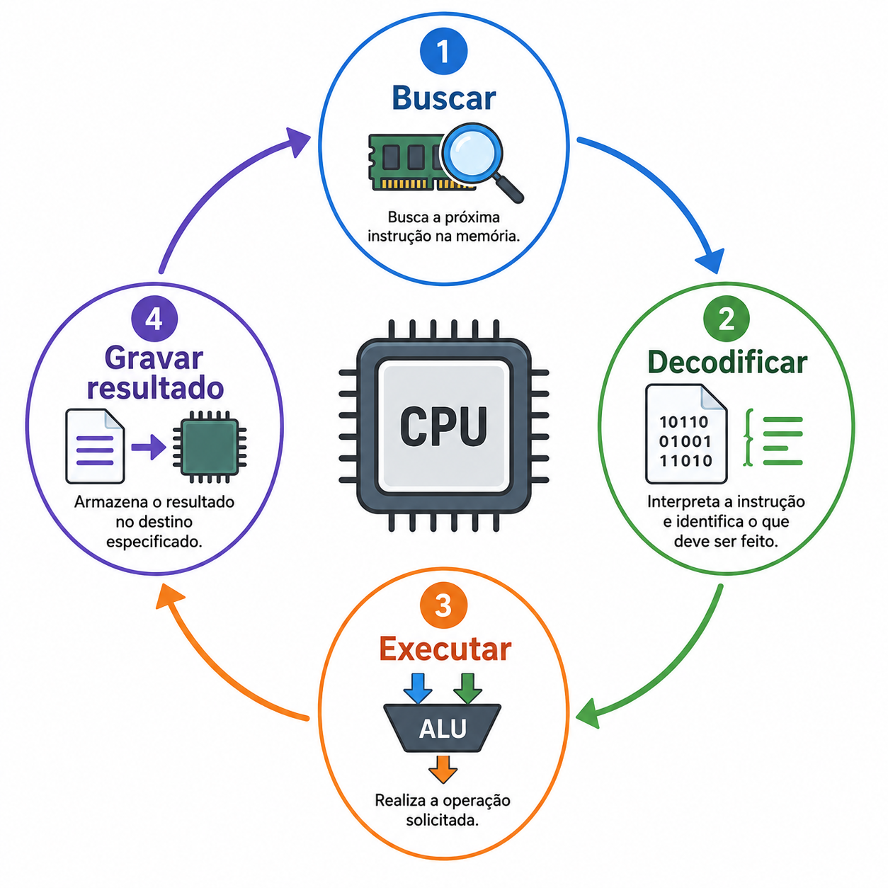
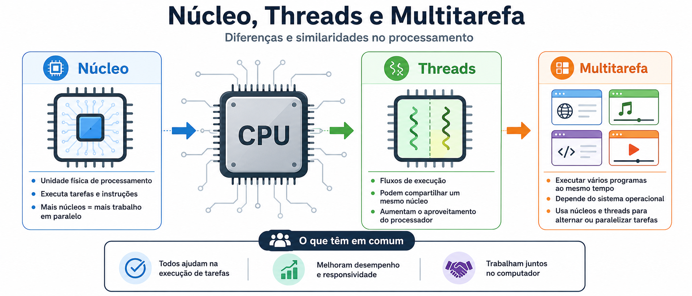
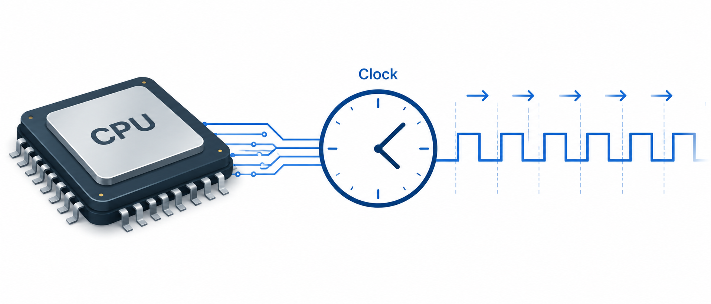
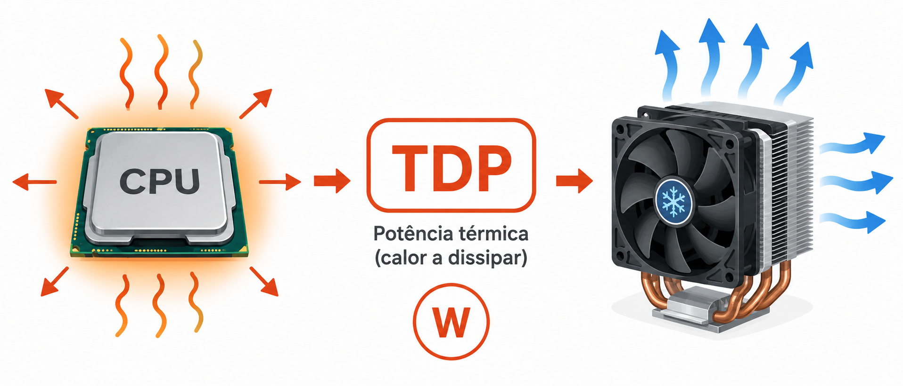
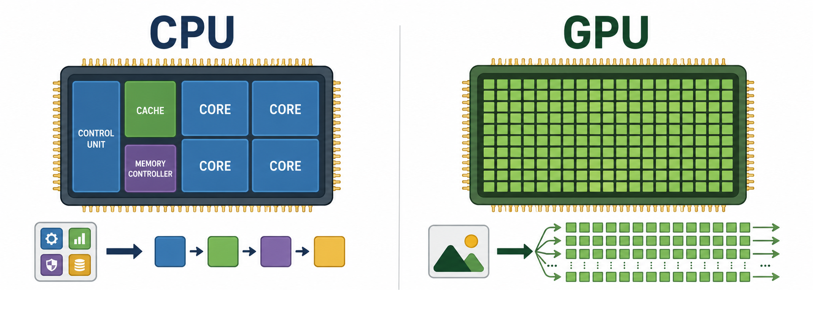
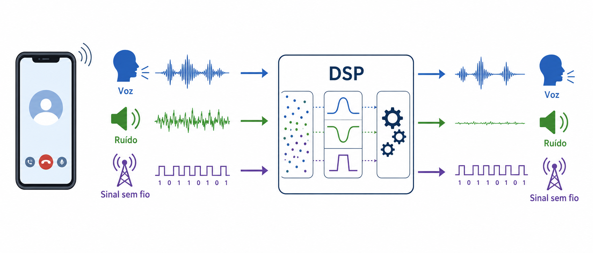
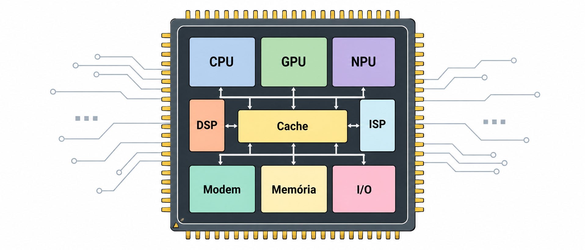

---
# --- INFORMAÇÕES DA AULA ---
draft: true
title: "Tipos de Processadores"
subtitle: "Unidade Central de Processamento"
author: "Prof. Alcemy Severino"
license: "CC BY-NC"
copyright: "© 2026 Alcemy Gabriel"
institute: "IFRN"
lang: pt-br

# --- CONFIGURAÇÃO VISUAL E TÉCNICA ---
format:
  revealjs:
    # Aparência
    theme: [default, ifrn_2]
    footer: "OMC"
    logo: img/ifrn-logo.png
    slide-number: true
    center: false

    # Interatividade (Lousa)
    chalkboard:
      buttons: false
    lightbox: true

    # Navegação
    preview-links: auto
    controls: true
    controls-layout: edges
    controls-tutorial: true
    touch: true

    # Código
    code-line-numbers: true
    highlight-style: github
---

## Unidade Central de Processamento

:::: {.columns}
::: {.column width="60%"}
::: {.box}
**Pergunta norteadora:** por que computadores, celulares, videogames e equipamentos inteligentes usam processadores diferentes?
:::
:::
::: {.column width="40%"}
> Processar não significa fazer sempre a mesma coisa. Cada tipo de tarefa pode exigir um tipo de processador ou acelerador especializado.
:::
::::

{fig-align="center" width="50%"}

---

### Objetivos da aula

Ao final desta aula, você deverá ser capaz de:

- explicar a função da unidade central de processamento em um computador;
- diferenciar processador, núcleo, clock, cache e barramento;
- reconhecer diferentes tipos de processadores e aceleradores: **CPU, APU, GPU, DSP, NPU e SoC**;
- relacionar cada tipo de processador ao seu contexto de uso;
- interpretar especificações básicas de processadores em desktops, notebooks e dispositivos móveis;
- justificar a escolha de um processador de acordo com uma necessidade real.

---

### Onde entra o processamento?

Um sistema computacional realiza, de forma simplificada, o seguinte fluxo:

::: {.formula}
Entrada → Processamento → Memória/Armazenamento → Saída
:::

A etapa de **processamento** é responsável por executar instruções, realizar cálculos, tomar decisões lógicas e coordenar a comunicação com outros componentes.

---

### O que é a CPU?

:::: {.columns}
::: {.column width="60%"}

A **CPU** (*Central Processing Unit*) é a unidade responsável por executar instruções de programas e coordenar grande parte das operações do computador.

:::
::: {.column width="40%"}

{fig-align="center" width="95%"}

:::
::::

::: {.box}
Ela é frequentemente chamada de “cérebro” do computador, mas é melhor entendê-la como o **centro de controle e execução geral** do sistema.
:::

---

### O que é a CPU?

A CPU executa tarefas como:

- cálculos aritméticos;
- comparações lógicas;
- controle de fluxo de programas;
- comunicação com memória e dispositivos;
- gerenciamento de processos em conjunto com o sistema operacional.

---

### CPU não trabalha sozinha

A CPU depende de outros componentes para executar bem suas tarefas.

::: {.Tiny}
| Componente | Relação com a CPU |
|---|---|
| RAM | armazena temporariamente dados e instruções em uso |
| Cache | reduz o tempo de acesso a dados usados com frequência |
| Placa-mãe | fornece soquete, alimentação e trilhas de comunicação |
| Chipset/controladores | intermediam comunicação com periféricos e armazenamento |
| Sistema de refrigeração | mantém a temperatura de operação segura |
| Fonte de alimentação | fornece energia estável para o processador e demais componentes |
:::

---

### O ciclo básico da CPU

:::: {.columns}
::: {.column width="55%"}

Durante a execução de um programa, a CPU repete continuamente um ciclo básico:

1. **Buscar** uma instrução na memória;
2. **Decodificar** o que a instrução significa;
3. **Executar** a operação;
4. **Armazenar ou enviar** o resultado.

:::
::: {.column width="45%"}

{fig-align="center" width="95%"}

:::
::::

---

### Partes internas da CPU

**Principais blocos funcionais**

- **Unidade de controle:** coordena a execução das instruções.
- **ULA:** executa operações aritméticas e lógicas.
- **Registradores:** guardam dados temporários dentro da CPU.
- **Cache:** memória rápida próxima aos núcleos.
- **Barramentos internos:** permitem comunicação entre blocos.

---

### Núcleos, threads e multitarefa

Um processador moderno pode ter vários **núcleos**.

- **Núcleo:** unidade capaz de executar instruções.
- **Thread:** linha de execução de um programa.
- **Multitarefa:** capacidade de lidar com vários processos em execução.

{fig-align="center" width="60%"}

---

### Núcleos, threads e multitarefa

::: {.warning}
Mais núcleos não significam automaticamente mais desempenho em qualquer tarefa. O programa precisa conseguir dividir o trabalho.
:::

Exemplo: renderização, compilação, máquinas virtuais e edição de vídeo costumam aproveitar mais núcleos do que tarefas simples de navegação.

---

### Clock: velocidade de operação

O **clock** indica a frequência de operação do processador, geralmente medida em **GHz**.

::: {.box}
De forma simplificada, quanto maior o clock, maior pode ser a quantidade de ciclos executados por segundo.
:::

{fig-align="center" width="70%"}

---

### Clock: velocidade de operação

Mas o desempenho real também depende de:

- arquitetura do processador;
- quantidade de núcleos;
- cache;
- consumo de energia;
- temperatura;
- otimização do software;
- velocidade da memória.

---

### Cache: memória muito rápida

A **cache** é uma memória pequena e rápida, localizada dentro ou muito próxima da CPU.

Ela guarda dados e instruções usados com frequência, evitando acessos repetidos à RAM.

::: {.Tiny}
| Nível de cache | Característica geral |
|---|---|
| L1 | menor e mais rápida; próxima a cada núcleo |
| L2 | intermediária; geralmente maior que L1 |
| L3 | maior, compartilhada entre núcleos em muitos processadores |
:::

::: {.box .small}
A cache ajuda a reduzir o “tempo de espera” da CPU ao buscar dados.
:::

---

### TDP, consumo e temperatura

Processadores consomem energia e produzem calor.

::: {.box}
O **TDP** é uma referência térmica usada para indicar a capacidade de dissipação de calor que o sistema de refrigeração deve suportar.
:::

{fig-align="center" width="70%"}

---

### TDP, consumo e temperatura

Na prática, isso influencia:

- tamanho do cooler;
- ruído das ventoinhas;
- autonomia de bateria em notebooks;
- desempenho sustentado;
- possibilidade de redução automática de desempenho por temperatura.

::: {.warning}
Um processador potente sem refrigeração adequada pode reduzir o desempenho para evitar superaquecimento.
:::

---

## Tipos de processadores e aceleradores {background-image="img/a04_background.png" background-size="cover" background-position="center"}

::: {.box .center}
Nem todo processamento é feito do mesmo jeito. Por isso, computadores modernos combinam unidades de processamento **gerais** e **especializadas**.

::: {.Tiny}
| Tipo | Ideia central |
|---|---|
| CPU | processamento geral |
| GPU | processamento paralelo gráfico e matemático |
| APU | CPU + GPU integradas no mesmo chip/pacote |
| DSP | processamento eficiente de sinais |
| NPU | aceleração de tarefas de inteligência artificial |
| SoC | vários blocos integrados em um único chip |
:::
:::

---

## CPU: processador de uso geral

A **CPU** é projetada para executar uma grande variedade de tarefas.

Exemplos:

:::: {.columns}
::: {.column width="50%"}

- abrir programas;
- executar o sistema operacional;
- processar planilhas e documentos;

:::
::: {.column width="50%"}

- compilar código;
- controlar periféricos;
- coordenar outras unidades, como GPU e armazenamento.

:::
::::

::: {.box .small}
A principal força da CPU é a **versatilidade**.
:::

---

### CPU em desktops, notebooks e servidores

::: {.Tiny}
| Ambiente | Característica comum da CPU |
|---|---|
| Desktop | maior margem térmica, melhor upgrade e bom desempenho sustentado |
| Notebook | equilíbrio entre desempenho, consumo, bateria e aquecimento |
| Servidor | foco em estabilidade, muitos núcleos, cache maior e operação contínua |
| Dispositivo móvel | normalmente integrada em um SoC, com baixo consumo |
:::

:::: {.columns}
::: {.column width="31%"}

{fig-align="center" width="95%"}

:::
::: {.column width="34%"}

{fig-align="center" width="95%"}

:::
::: {.column width="34%"}

{fig-align="center" width="95%"}

:::
::::

---

## GPU: processamento gráfico e paralelo

A **GPU** (*Graphics Processing Unit*) surgiu para processar gráficos, imagens e vídeo com alta eficiência.

Hoje, também é usada em tarefas paralelas, como:

- renderização 3D;
- jogos;
- edição de vídeo;
- simulações;
- mineração e cálculo paralelo;
- treinamento e execução de modelos de IA.

::: {.box}
Enquanto a CPU é muito versátil, a GPU é forte em executar muitas operações semelhantes ao mesmo tempo.
:::

---

### CPU versus GPU

::: {.Tiny}
| Critério | CPU | GPU |
|---|---|---|
| Perfil | uso geral | processamento paralelo |
| Núcleos | menos núcleos, mais complexos | muitos núcleos menores |
| Tarefas comuns | sistema operacional, lógica, controle | gráficos, matrizes, vídeo, IA |
| Força principal | versatilidade | paralelismo |
| Exemplo cotidiano | abrir programas e gerenciar tarefas | renderizar jogo ou acelerar edição de vídeo |
:::

{fig-align="center" width="70%"}

---

## APU: CPU e GPU integradas

**APU** (*Accelerated Processing Unit*) é um termo popularizado para indicar um processador que integra **CPU e GPU** em uma mesma solução.

Em termos práticos, uma APU permite:

:::: {.columns}
::: {.column width="55%"}

- usar vídeo sem placa de vídeo dedicada;
- reduzir custo e consumo;
- montar computadores compactos;
- atender bem tarefas de escritório, estudo, navegação e mídia.

:::
::: {.column width="45%"}

::: {.warning}
A GPU integrada de uma APU geralmente não substitui uma GPU dedicada em jogos pesados, modelagem 3D ou edição profissional intensa.
:::

:::
::::

---

### Onde uma APU faz sentido?

:::: {.columns}
::: {.column width="50%"}

**Boa escolha para:**

- laboratório escolar;
- computador administrativo;
- computador doméstico;
- navegação e estudos;
- reprodução de vídeos;
- jogos leves.

:::
::: {.column width="50%"}

**Pode ser limitada para:**

- jogos pesados;
- renderização 3D complexa;
- edição de vídeo profissional;
- aplicações que exigem muita memória gráfica dedicada.

:::
::::

---

## DSP: processador de sinais digitais

O **DSP** (*Digital Signal Processor*) é especializado no processamento de sinais, como áudio, voz, imagem, sensores e telecomunicações.

Exemplos de uso:

:::: {.columns}
::: {.column width="45%"}

- cancelamento de ruído;
- processamento de áudio;
- compressão de voz;

:::
::: {.column width="55%"}

- modem e comunicação sem fio;
- tratamento de sinais de sensores;
- processamento em tempo real.

:::
::::

---

### Exemplo: DSP no cotidiano

Quando um smartphone reduz ruído em uma chamada, melhora o áudio gravado ou processa sinais de comunicação, pode haver participação de um DSP ou de blocos especializados semelhantes.

{fig-align="center" width="90%"}

---

## NPU: aceleração para IA

A **NPU** (*Neural Processing Unit*) é uma unidade especializada em acelerar operações usadas em inteligência artificial e redes neurais.

Ela pode ser usada para:

:::: {.columns}
::: {.column width="50%"}

- reconhecimento facial;
- melhoria de fotos;
- transcrição de voz;
- tradução em tempo real;

:::
::: {.column width="50%"}

- filtros inteligentes;
- detecção de objetos;
- recursos de IA local no dispositivo.

:::
::::

---

### Por que usar NPU?

:::: {.columns}
::: {.column width="50%"}

**Sem NPU**

- CPU ou GPU executam a tarefa;
- maior consumo em alguns cenários;
- possível aquecimento;
- menor eficiência para operações de IA específicas.

:::
::: {.column width="50%"}

**Com NPU**

- IA executada em hardware especializado;
- menor consumo;
- resposta mais rápida em tarefas locais;
- melhora em recursos de câmera, voz e produtividade.

:::
::::

---

## SoC

Um **SoC** (*System-on-a-Chip*) reúne vários componentes de um sistema computacional em um único chip.

Um SoC pode incluir:

:::: {.columns}
::: {.column width="20%"}

- CPU;
- GPU;
- NPU;
- DSP;

:::
::: {.column width="40%"}

- controladores de memória;
- processador de imagem;
- segurança;

:::
::: {.column width="40%"}

- modem ou conectividade;
- controladores de entrada e saída.

:::
::::

{fig-align="center" width="60%"}

---

### Por que SoC é comum em celulares?

Dispositivos móveis precisam equilibrar:

:::: {.columns}
::: {.column width="50%"}

- tamanho reduzido;
- baixo consumo de energia;
- autonomia de bateria;
- baixa geração de calor;

:::
::: {.column width="50%"}

- conectividade integrada;
- câmera, sensores e áudio;
- alto desempenho em tarefas específicas.

:::
::::

::: {.box}
O SoC reduz espaço, consumo e complexidade, integrando funções que em um desktop podem estar separadas em diferentes placas e chips.
:::

---

### SoC não é exclusividade de smartphone

Embora seja muito comum em smartphones e tablets, a ideia de SoC também aparece em:

:::: {.columns}
::: {.column width="50%"}

- placas de desenvolvimento;
- roteadores;
- smart TVs;
- videogames;

:::
::: {.column width="50%"}

- dispositivos IoT;
- computadores compactos;
- sistemas embarcados industriais.

:::
::::

::: {.box .small}
Sempre que há pouco espaço, baixo consumo e necessidade de integração, o SoC pode ser uma solução adequada.
:::

---

### Outros blocos especializados

Além de CPU, GPU, DSP e NPU, sistemas modernos podem ter outros blocos:

::: {.Tiny}
| Bloco | Função comum |
|---|---|
| ISP | processamento de imagem da câmera |
| Codec de vídeo | codificação e decodificação de vídeo |
| PMIC | gerenciamento de energia |
| Secure Enclave / módulo de segurança | proteção de chaves, biometria e dados sensíveis |
| Controlador de memória | comunicação entre processador e RAM |
| Controlador de I/O | comunicação com USB, armazenamento, tela e periféricos |
:::

---

### Comparação geral

::: {.Tiny}
| Tipo | Especialidade | Onde aparece com frequência | Exemplo de tarefa |
|---|---|---|---|
| CPU | processamento geral | PCs, servidores, notebooks, SoCs | executar sistema operacional |
| GPU | gráficos e paralelismo | placas de vídeo, APUs, SoCs | renderizar gráficos |
| APU | CPU + GPU integradas | desktops e notebooks | computador sem GPU dedicada |
| DSP | sinais digitais | celulares, áudio, redes, embarcados | filtrar ruído de áudio |
| NPU | inteligência artificial | smartphones, notebooks, SoCs | reconhecimento de imagem |
| SoC | integração de sistema | celulares, tablets, IoT | reunir CPU, GPU, NPU e controladores |
:::

---

### Como interpretar uma especificação?

Ao observar um CPU, não olhe apenas para o nome comercial.

:::: {.columns}
::: {.column width="50%"}

Verifique:

- geração e arquitetura;
- número de núcleos e threads;
- clock base e overclock;
- cache;

:::
::: {.column width="50%"}

- presença de GPU integrada;
- consumo/TDP;
- soquete ou tipo de integração;
- suporte de memória;
- finalidade do equipamento.

:::
::::

::: {.warning}
Dois processadores com nomes parecidos podem ter desempenho, consumo e compatibilidade muito diferentes.
:::

---

### Processador e compatibilidade

Para escolher ou substituir um processador, é necessário verificar compatibilidade com:

:::: {.columns}
::: {.column width="50%"}

- soquete da placa-mãe;
- chipset;
- versão da BIOS/UEFI;
- tipo e velocidade da RAM;
- sistema de refrigeração;

:::
::: {.column width="50%"}

- fonte de alimentação;
- gabinete;
- necessidade de GPU dedicada;
- sistema operacional;
- finalidade de uso.

:::
::::

---

### Erros comuns ao escolher processador

- comprar apenas pelo clock;
- ignorar geração e arquitetura;
- não verificar o soquete;
- esquecer a necessidade de atualização de BIOS/UEFI;
- escolher CPU sem vídeo integrado quando não há GPU dedicada;
- usar cooler inadequado;
- comparar processadores de desktop e notebook como se fossem equivalentes;
- ignorar o consumo e o aquecimento.

---

### Estudo de caso 1

Uma escola precisa montar computadores para laboratório de programação, navegação, edição de texto e manutenção básica. O orçamento é limitado e não há necessidade de jogos pesados.

::: {.callout-tip}
**Pergunta:** faz sentido usar processadores com GPU integrada ou APU? Justifique.
:::

::: {.fragment .answer}
Resposta esperada: sim. Para tarefas de laboratório básico, uma CPU com vídeo integrado ou APU reduz custo, consumo e complexidade, dispensando GPU dedicada.
:::

---

### Estudo de caso 2

Um aluno quer montar um computador para jogos recentes, edição de vídeo e modelagem 3D. Ele escolheu uma CPU forte, mas não incluiu placa de vídeo dedicada.

::: {.callout-tip}
**Pergunta:** qual componente provavelmente será o gargalo? Por quê?
:::

::: {.fragment .answer}
Resposta esperada: a GPU. Jogos e renderização gráfica exigem forte processamento paralelo e memória gráfica; a GPU integrada pode ser insuficiente.
:::

---

### Estudo de caso 3

Um smartphone executa reconhecimento facial, melhoria automática de fotos, redução de ruído em chamadas e tradução por voz.

::: {.callout-tip}
**Pergunta:** quais unidades especializadas podem participar dessas tarefas?
:::

::: {.fragment .answer}
Resposta esperada: NPU para IA, ISP para imagem, DSP para áudio/sinais, GPU para algumas operações paralelas e CPU para coordenação geral.
:::

---

### Atividade rápida: associe o tipo de processador

Associe cada situação ao tipo de processador ou acelerador mais relacionado.

::: {.Tiny}
| Situação | CPU | GPU | APU | DSP | NPU | SoC |
|---|:---:|:---:|:---:|:---:|:---:|:---:|
| Executar o sistema operacional |  |  |  |  |  |  |
| Renderizar gráficos 3D |  |  |  |  |  |  |
| Filtrar ruído de uma chamada |  |  |  |  |  |  |
| Reconhecer objetos em uma imagem |  |  |  |  |  |  |
| Integrar vários blocos em um chip móvel |  |  |  |  |  |  |
| Usar vídeo sem placa dedicada |  |  |  |  |  |  |
:::

<!---
---

### Atividade prática: leitura de especificações

Em dupla, pesquise a ficha técnica de dois equipamentos:

1. um notebook ou desktop;
2. um smartphone ou tablet.

Registre:

- nome do processador;
- quantidade de núcleos;
- presença de GPU integrada;
- presença de NPU, quando informada;
- tipo de equipamento;
- principal finalidade de uso;
- uma limitação técnica provável.

---

### Discussão em sala

Depois da pesquisa, responda:

::: {.box}
O processador escolhido pelo fabricante parece adequado ao tipo de equipamento? Por quê?
:::

Use argumentos técnicos:

- desempenho necessário;
- consumo de energia;
- temperatura;
- portabilidade;
- necessidade de gráficos;
- uso de inteligência artificial;
- possibilidade de manutenção ou upgrade.

---

### Síntese da aula

- A CPU executa instruções gerais e coordena operações do sistema.
- Núcleos, threads, clock, cache e TDP ajudam a entender o comportamento do processador.
- GPU é forte em gráficos e processamento paralelo.
- APU integra CPU e GPU, reduzindo custo e complexidade em muitos cenários.
- DSP processa sinais digitais com eficiência.
- NPU acelera tarefas de inteligência artificial.
- SoC integra vários blocos em um único chip, sendo comum em dispositivos móveis e sistemas compactos.
- A escolha do processador depende do uso, da compatibilidade, do consumo e da refrigeração.

--->

## {background-image="img/fry_1.png"}

---


