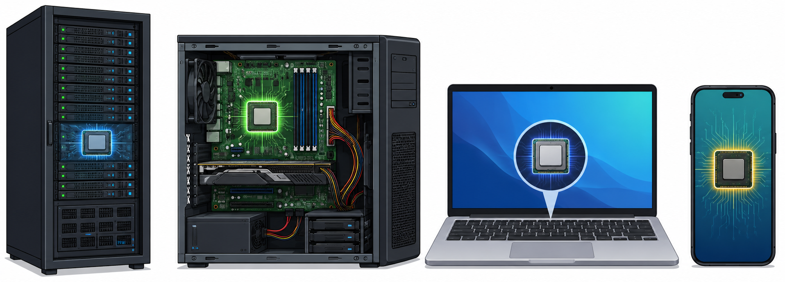
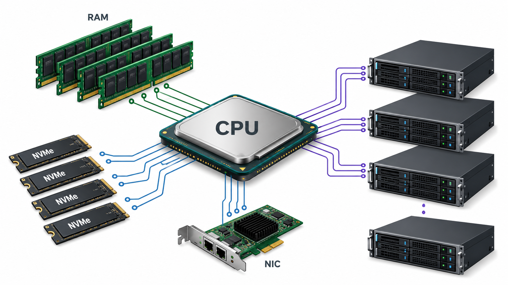
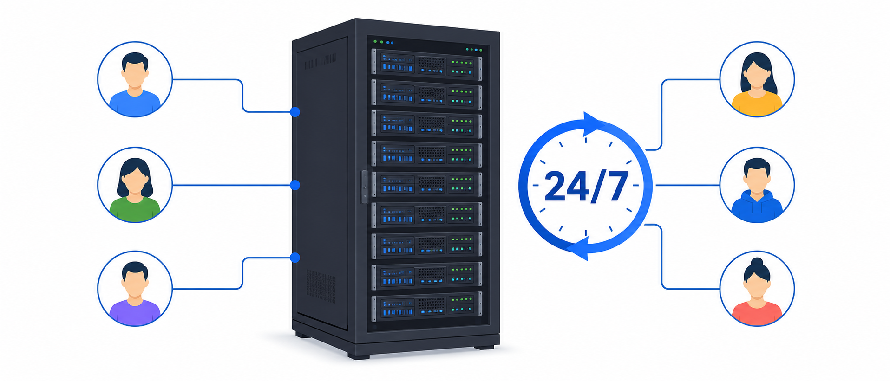
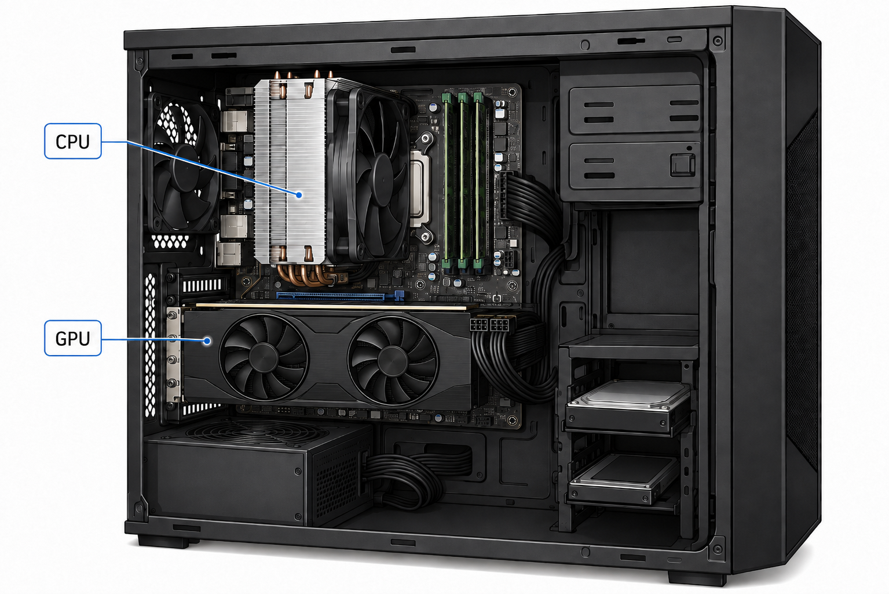
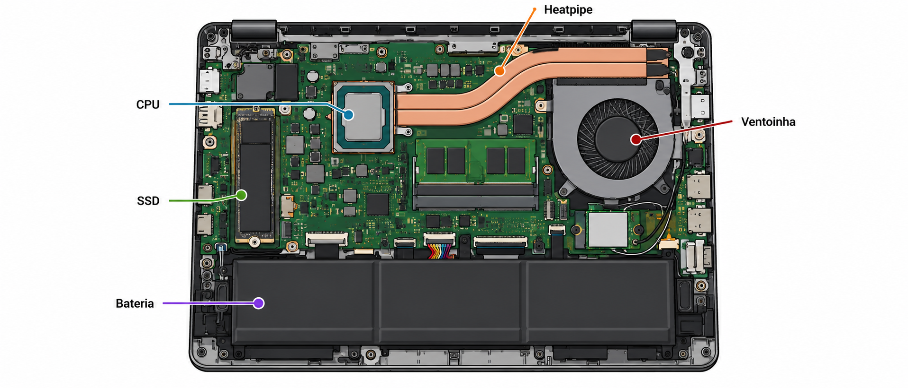
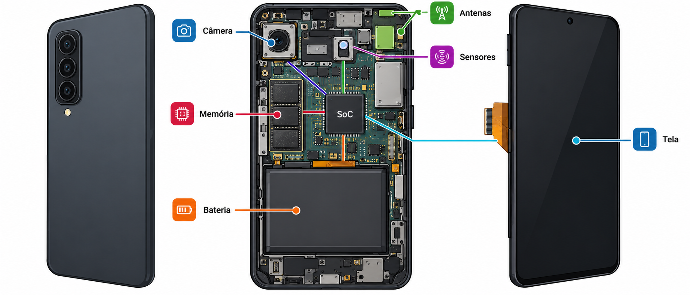

---
# --- INFORMAÇÕES DA AULA ---
draft: true
title: "Processadores para servidores, desktops, notebooks e dispositivos móveis"
subtitle: "Unidade Central de Processamento"
author: "Prof. Alcemy Severino"
license: "CC BY-NC"
copyright: "© 2026 Alcemy Gabriel"
institute: "IFRN"
lang: pt-br

# --- CONFIGURAÇÃO VISUAL E TÉCNICA ---
format:
  revealjs:
    # Aparência
    theme: [default, ifrn_2]
    footer: "OMC"
    logo: img/ifrn-logo.png
    slide-number: true
    center: false

    # Interatividade (Lousa)
    chalkboard:
      buttons: false
    lightbox: true

    # Navegação
    preview-links: auto
    controls: true
    controls-layout: edges
    controls-tutorial: true
    touch: true

    # Código
    code-line-numbers: true
    highlight-style: github
---

## Unidade Central de Processamento

:::: {.columns}
::: {.column width="58%"}

::: {.box}
**Pergunta norteadora:** por que um servidor, um desktop, um notebook e um smartphone não usam o mesmo tipo de processador?
:::

:::
::: {.column width="42%" .fragment}

> A função básica é processar dados e instruções. O que muda é o **contexto de uso**: desempenho, consumo, temperatura, espaço físico, bateria, confiabilidade e possibilidade de expansão.

:::
::::

{fig-align="center" width="60%"}

---

### Objetivos da aula

Ao final desta aula, você deverá ser capaz de:

- diferenciar processadores usados em **servidores, desktops, notebooks e dispositivos móveis**;
- relacionar processador com **uso, consumo, temperatura, memória e expansão**;
- compreender por que processadores de servidor priorizam disponibilidade e confiabilidade;
- compreender por que notebooks e dispositivos móveis precisam equilibrar desempenho e autonomia;
- interpretar especificações básicas para escolher processadores de acordo com cenários reais.

---

### Retomando: o que o processador faz?

O processador é o componente que executa instruções de programas, realiza cálculos, toma decisões lógicas e coordena a comunicação com outros componentes.

::: {.formula}
Entrada → Processamento → Memória/Armazenamento → Saída
:::

::: {.box}
A lógica geral é parecida em vários equipamentos, mas o projeto do processador muda conforme o ambiente em que ele será usado.
:::

---

### O que muda entre os equipamentos?

::: {.Tiny}
| Fator | Servidor | Desktop | Notebook | Dispositivo móvel |
|---|---|---|---|---|
| Prioridade | continuidade e carga pesada | desempenho e custo-benefício | equilíbrio e bateria | baixo consumo e integração |
| Refrigeração | robusta e contínua | ampla, com upgrade | limitada pelo chassi | passiva ou muito restrita |
| Energia | fonte dedicada e estável | fonte ATX | bateria + carregador | bateria pequena |
| Expansão | alta | média/alta | baixa | quase nenhuma |
| Manutenção | planejada | relativamente simples | mais limitada | geralmente especializada |
:::

---

## Processadores para servidores

Servidores são computadores projetados para fornecer serviços a outros computadores, usuários ou sistemas.

Exemplos de serviços:

:::: {.columns}
::: {.column width="50%"}

- sites e sistemas web;
- banco de dados;
- arquivos em rede;
- autenticação de usuários;

:::
::: {.column width="50%"}

- virtualização;
- aplicações corporativas;
- processamento científico ou de IA.

:::
::::

::: {.box .small}
Em servidores, o processador costuma trabalhar por longos períodos e com muitos usuários ou processos ao mesmo tempo.
:::

---

### Características comuns em CPUs de servidor

- muitos núcleos e muitas threads;
- maior quantidade de cache;
- suporte a grande volume de RAM;
- suporte a memória com correção de erros, como ECC;
- mais linhas PCIe para placas de rede, controladoras, SSDs NVMe e GPUs;
- foco em estabilidade e operação contínua;
- possibilidade de uso em placas com mais de um soquete, dependendo da plataforma.

---

### Características comuns em CPUs de servidor

{fig-align="center" width="80%"}

---

### Servidor: desempenho sustentado

Em um servidor, não basta ser rápido por alguns segundos.

::: {.box}
O processador precisa manter desempenho estável durante muitas horas ou dias, com controle de temperatura, energia e falhas.
:::

Situações típicas:

- muitos usuários acessando um sistema ao mesmo tempo;
- várias máquinas virtuais rodando no mesmo servidor;
- banco de dados recebendo consultas continuamente;
- serviços que não podem parar.

---

### Confiabilidade: por que importa?

Em um computador pessoal, uma falha pode atrapalhar um usuário. Em um servidor, uma falha pode afetar uma turma, uma empresa, um hospital, um banco ou um sistema público.

::: {.warning}
Plataformas de servidor costumam priorizar estabilidade, redundância, monitoramento e compatibilidade com componentes próprios para operação contínua.
:::

{fig-align="center" width="50%"}

---

### Exemplo: quando usar CPU de servidor?

Uma CPU de servidor faz sentido quando precisamos:

- atender muitos usuários simultaneamente;
- executar várias máquinas virtuais;
- armazenar e processar grandes bases de dados;
- manter serviços ativos continuamente;
- conectar muitos dispositivos de alta velocidade.

::: {.box}
A escolha não depende apenas de “ser mais potente”, mas do tipo de carga e da necessidade de confiabilidade.
:::

---

## Processadores para desktops

Desktops são computadores de mesa usados em residências, laboratórios, escritórios e estações de trabalho. Eles costumam oferecer bom equilíbrio entre:

:::: {.columns}
::: {.column width="50%"}

- desempenho;
- custo;
- possibilidade de upgrade;

:::
::: {.column width="50%"}

- refrigeração;
- manutenção;
- variedade de placas-mãe e componentes.

:::
::::

::: {.box .Small}
O desktop é geralmente o ambiente mais flexível para montagem, substituição e expansão de componentes.
:::

---

### Características comuns em CPUs de desktop

- bom desempenho por núcleo;
- vários núcleos para multitarefa;
- modelos com ou sem gráficos integrados;
- soquete em placa-mãe, facilitando substituição em algumas plataformas;
- TDP maior que o de notebooks, em muitos casos;
- maior liberdade para usar coolers maiores;
- possibilidade de combinar CPU com GPU dedicada.

---

### Características comuns em CPUs de desktop

{fig-align="center" width="75%"}

---

### Desktop: desempenho e expansão

O desktop permite escolher componentes de acordo com o perfil do usuário.

::: {.Tiny}
| Perfil | Processador indicado |
|---|---|
| Escritório e estudo | CPU básica ou intermediária, preferencialmente com vídeo integrado |
| Programação | CPU intermediária, boa RAM e SSD rápido |
| Jogos | CPU equilibrada + GPU dedicada |
| Edição de vídeo | mais núcleos, bom clock e GPU adequada |
| CAD/3D | CPU forte + GPU dedicada + boa refrigeração |
:::

---

### Cuidado: CPU forte nem sempre resolve tudo

Um desktop lento pode ter vários gargalos:

:::: {.columns}
::: {.column width="50%"}

- pouca RAM;
- HD lento;
- GPU fraca para jogos ou 3D;
- fonte inadequada;

:::
::: {.column width="50%"}

- refrigeração ruim;
- placa-mãe limitada;
- sistema operacional mal configurado.

:::
::::

::: {.warning}
Escolher processador exige analisar o conjunto completo do computador.
:::

---

## Processadores para notebooks

Notebooks precisam entregar desempenho dentro de um espaço físico pequeno. Por isso, o processador precisa equilibrar:

:::: {.columns}
::: {.column width="50%"}

- desempenho;
- consumo de energia;
- aquecimento;

:::
::: {.column width="50%"}

- autonomia de bateria;
- espessura do equipamento;
- custo.

:::
::::

::: {.box .Small}
Em notebooks, o mesmo nome comercial de uma família de processadores pode aparecer em versões com limites térmicos e energéticos diferentes.
:::

---

### Características comuns em CPUs de notebook

- menor consumo que muitos processadores de desktop;
- GPU integrada em grande parte dos modelos;
- foco em eficiência energética;
- funcionamento com limites de temperatura mais restritos;
- variação de desempenho conforme refrigeração e bateria;
- menor possibilidade de troca do processador;
- dependência forte do projeto térmico do fabricante.

---

### Características comuns em CPUs de notebook

{fig-align="center" width="95%"}

---

### Desempenho de pico e sustentado

Um notebook pode atingir alto desempenho por alguns instantes, mas reduzir a velocidade se aquecer muito.

::: {.formula}
Mais calor → menor margem térmica → possível redução de desempenho
:::

Esse comportamento pode ocorrer em:

:::: {.columns}
::: {.column width="50%"}

- jogos;
- edição de vídeo;
- compilação longa;

:::
::: {.column width="50%"}

- muitas abas e aplicações abertas;
- uso em superfície que bloqueia a ventilação.

:::
::::

---

### Categorias práticas de notebooks

::: {.small}
| Tipo de notebook | Tendência do processador |
|---|---|
| Básico | baixo consumo, tarefas leves, maior foco em custo |
| Fino e leve | eficiência, bateria e portabilidade |
| Intermediário | equilíbrio para estudo, programação e trabalho |
| Gamer | CPU de maior potência + GPU dedicada |
| Workstation móvel | foco em cargas profissionais e maior refrigeração |
:::

---

## Processadores para dispositivos móveis

Smartphones e tablets geralmente usam um SoC que integra vários blocos em um único chip, como:

:::: {.columns}
::: {.column width="30%"}

- CPU;
- GPU;
- NPU;

:::
::: {.column width="30%"}

- DSP;
- ISP;
- modem;

:::
::: {.column width="40%"}

- controladores de memória;
- controladores de entrada e saída.

:::
::::

::: {.box}
A grande prioridade é entregar muitas funções com baixo consumo de energia e pouco aquecimento.
:::

---

### Por que usar SoC em celulares e tablets?

Dispositivos móveis têm limitações severas:

- bateria pequena;
- pouco espaço interno;
- refrigeração limitada;
- necessidade de conexão sem fio;
- câmera, áudio, sensores e tela integrados;
- funcionamento silencioso;
- alta integração entre hardware e sistema operacional.

---

### Por que usar SoC em celulares e tablets?

{fig-align="center" width="95%"}

---

### Blocos especializados em um SoC

::: {.small}
| Bloco | Função prática |
|---|---|
| CPU | executa sistema e aplicativos gerais |
| GPU | gráficos, interface, jogos e algumas tarefas paralelas |
| NPU | recursos de inteligência artificial local |
| DSP | áudio, voz, sensores e sinais digitais |
| ISP | processamento de imagem da câmera |
| Modem | comunicação 4G, 5G, Wi-Fi ou outras conexões |
| I/O | comunicação com tela, USB, sensores e periféricos |
:::

---

### Eficiência antes de força bruta

Em celulares, o melhor processador não é apenas o que atinge maior velocidade.

::: {.box .Small}
O melhor projeto é aquele que entrega desempenho suficiente com baixo consumo, baixa temperatura e boa integração com câmera, tela, rede e bateria.
:::

Exemplos de tarefas:

:::: {.columns}
::: {.column width="50%"}

- abrir aplicativos rapidamente;
- gravar vídeo;
- reconhecer rosto ou voz;

:::
::: {.column width="50%"}

- jogar com baixo aquecimento;
- manter conexão de rede estável.

:::
::::

---

## Comparação geral

::: {.Tiny}
| Critério | Servidor | Desktop | Notebook | Móvel |
|---|---|---|---|---|
| Projeto | robustez e escala | flexibilidade | equilíbrio | integração |
| CPU | muitos núcleos e recursos | variada | eficiente | integrada ao SoC |
| GPU | opcional/especializada | integrada ou dedicada | integrada ou dedicada | integrada ao SoC |
| Memória | muita RAM, ECC em muitos casos | RAM expansível | expansão limitada | integrada/soldada |
| Energia | contínua | fonte ATX | bateria + fonte externa | bateria |
| Upgrade | planejado | comum | restrito | praticamente inexistente |
:::

---

### A mesma tarefa muda conforme o equipamento

::: {.Tiny}
| Tarefa | Servidor | Desktop | Notebook | Smartphone |
|---|---|---|---|---|
| Navegação web | hospeda sites | acessa sites | acessa sites | acessa sites com baixo consumo |
| Vídeo | distribui conteúdo | edita/reproduz | reproduz/edita com limite térmico | grava/reproduz com ISP/GPU |
| IA | pode treinar modelos | pode executar com GPU | executa IA moderada | usa NPU para IA local |
| Armazenamento | grande volume e redundância | SSD/HD local | SSD compacto | armazenamento integrado |
:::

---

### Como escolher o processador adequado?

Para escolher um processador, pergunte:

1. Qual será o uso principal?
2. Quantas tarefas ocorrerão ao mesmo tempo?
3. Há necessidade de GPU dedicada?
4. O equipamento precisa ficar ligado 24/7?
5. A bateria é importante?
6. Há possibilidade de upgrade?
7. A refrigeração suporta o processador?
8. A placa-mãe é compatível?

---

### Estudo de caso 1: laboratório escolar

O campus deseja comprar computadores para programação básica, internet, suíte de escritório e aulas de manutenção.

::: {.callout-tip}
**Pergunta:** faz sentido escolher desktops com CPU intermediária e vídeo integrado? Justifique.
:::

::: {.fragment .answer}
Resposta esperada: sim. Para esse cenário, vídeo integrado reduz custo e complexidade; o mais importante é equilibrar CPU, RAM, SSD e possibilidade de manutenção.
:::

---

### Estudo de caso 2: servidor de sistemas internos

Uma instituição precisa hospedar sistema acadêmico, banco de dados e arquivos de vários setores.

::: {.callout-tip}
**Pergunta:** por que um desktop comum pode não ser a melhor escolha para funcionar como servidor principal?
:::

::: {.fragment .answer}
Resposta esperada: porque servidores exigem operação contínua, maior confiabilidade, suporte a mais memória, melhor gerenciamento, maior capacidade de expansão e componentes próprios para carga constante.
:::

---

### Estudo de caso 3: notebook para aluno de informática

Um estudante quer um notebook para estudar, programar, usar máquinas virtuais leves e levar para a escola.

::: {.callout-tip}
**Pergunta:** quais características do processador e do equipamento devem ser observadas?
:::

::: {.fragment .answer}
Resposta esperada: processador intermediário eficiente, boa quantidade de RAM, SSD, autonomia de bateria, boa refrigeração, peso adequado e portas suficientes.
:::

---

### Estudo de caso 4: smartphone moderno

Um smartphone promete fotos melhores, reconhecimento facial, tradução por voz e economia de bateria.

::: {.callout-tip}
**Pergunta:** por que não devemos analisar apenas a CPU?
:::

::: {.fragment .answer}
Resposta esperada: porque o SoC inclui GPU, NPU, DSP, ISP, modem e outros blocos que influenciam câmera, IA, áudio, rede, consumo e desempenho geral.
:::

---

### Atividade rápida: associe o contexto

Associe cada característica ao equipamento mais provável.

::: {.Tiny}
| Característica | Servidor | Desktop | Notebook | Móvel |
|---|:---:|:---:|:---:|:---:|
| Operação contínua 24/7 |  |  |  |  |
| Maior facilidade de upgrade |  |  |  |  |
| Forte dependência da bateria |  |  |  |  |
| SoC com modem, ISP e NPU |  |  |  |  |
| Muitos usuários simultâneos |  |  |  |  |
| Refrigeração limitada pelo chassi |  |  |  |  |
:::

> Tempo sugerido: 5 minutos.

---

### Síntese da aula

- Servidores priorizam continuidade, muitos usuários, expansão e confiabilidade.
- Desktops priorizam flexibilidade, manutenção, custo-benefício e desempenho.
- Notebooks equilibram desempenho, bateria, temperatura, peso e ruído.
- Dispositivos móveis usam SoC para integrar CPU, GPU, NPU, DSP, ISP, modem e I/O.
- A escolha do processador depende do uso real, do projeto térmico e do conjunto completo do equipamento.

---

## {background-image="img/fry_1.png"}

---


